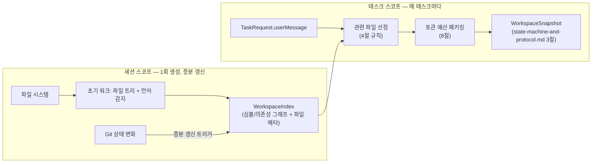

# Context Engine 설계

status: draft
관련: [state-machine-and-protocol.md](./state-machine-and-protocol.md) — `WorkspaceSnapshot`(3절), `ScriptIndex`(8절), Artifact GC(11절)의 "스냅샷은 태스크 전용" 가정

## 1. 설계 목표

- 매 태스크마다 전체 리포지토리를 두 모델에 다시 보내면 비용·지연시간이 리포 크기에 비례해 폭발한다. Context Engine은 **"관련성 높은 파일만, 토큰 예산 안에서"** 패키징하는 책임을 오케스트레이터/Provider에서 분리한다.
- OpenAI와 Claude는 **동일한 기준 스냅샷**을 받아야 한다 — 그렇지 않으면 코드 상태 차이가 모델 간 불일치처럼 보인다(원 아키텍처 제안서의 핵심 요구사항).
- 리포 전체를 매 태스크마다 다시 훑는 것(파일 트리 워크, 심볼 인덱싱)은 낭비다. **비싼 인덱싱은 세션 단위로 한 번 하고 증분 갱신**하며, **각 태스크는 그 인덱스에서 선택(selection)만** 수행한다 — 이게 2절 미해결이었던 "스냅샷을 태스크마다 새로 만들지 재사용할지" 질문의 답이다(3절에서 결론과 근거).
- 시크릿·대용량·바이너리 파일은 애초에 인덱스에 들어가지 않는다 — 이후 유출 여부를 반복 체크하는 게 아니라 진입 자체를 막는다.

## 2. 두 계층 구조: WorkspaceIndex(세션) vs WorkspaceSnapshot(태스크)

핵심 설계 결정: **`WorkspaceIndex`는 세션 스코프의 지속 상태**(파일 트리, 심볼/의존성 그래프, git 메타데이터 캐시)이고, `WorkspaceSnapshot`(기존 프로토콜 타입)은 **태스크마다 그 인덱스에서 값싸게 생성되는 선택 결과**다.



- `WorkspaceIndex`는 워크스페이스가 처음 열릴 때(또는 세션 시작 시) 1회 전체 구축되고, 이후 파일 변경 시 6절의 트리거로 증분 갱신된다. 로컬 코어 프로세스 메모리 + SQLite에 캐시되며, 앱 재시작 시 git HEAD가 같으면 캐시를 그대로 재사용한다(git HEAD가 바뀌었으면 증분 갱신, 워크스페이스 루트가 바뀌었으면 전체 재구축).
- `WorkspaceSnapshot`은 `TRIAGE` 이전 `SNAPSHOTTING` 단계(상태 머신 2절)에서 매 태스크마다 생성되지만, 비싼 작업(파일 트리 워크, 심볼 파싱)이 아니라 **이미 구축된 `WorkspaceIndex`에서 관련 파일을 고르고 파일 내용을 읽어 패키징하는 것**뿐이므로 태스크당 비용이 낮다.
- state-machine-and-protocol.md 11절의 "스냅샷은 태스크 전용이라 dangling reference 걱정 없음"이라는 GC 가정은 **`WorkspaceSnapshot`(선택 결과, artifact로 저장되는 것)에는 그대로 유효**하다 — `WorkspaceIndex`는 애초에 태스크별 artifact가 아니라 워크스페이스별 캐시이므로 태스크 GC 대상이 아니다. 이 구분을 명확히 하기 위해 state-machine-and-protocol.md 11절에 각주를 추가할 것(11절 참조).

```typescript
interface WorkspaceIndex {
  workspaceId: string;
  gitHeadAtIndex: string;
  fileTree: { path: string; language: string | null; sizeBytes: number; sha256: string }[];
  symbols: SymbolEntry[];
  dependencyEdges: DependencyEdge[]; // import/require 그래프
  projectMeta: {
    languages: string[];
    buildCommand?: string;
    testCommand?: string;
    lintCommand?: string;
    agentsMdPresent: boolean;
    agentsMdContent?: string; // 우선 탐색 대상, 존재하면 항상 스냅샷에 포함
  };
  scriptIndex: unknown; // state-machine-and-protocol.md 8절 ScriptIndex — Context Engine이 함께 관리
  builtAt: ISODateTime;
  lastIncrementalUpdateAt: ISODateTime;
}

interface SymbolEntry {
  id: string;
  name: string;
  kind: "function" | "class" | "method" | "interface" | "type" | "const" | "export";
  filePath: string;
  startLine: number;
  endLine: number;
  language: string;
}

interface DependencyEdge {
  fromFile: string;
  toFile: string;
  kind: "import" | "require" | "reference"; // 언어별 상세는 language-adapter가 정규화
}
```

## 3. 세션 재사용 결정 근거

세 가지 대안을 비교했다.

| 전략 | 장점 | 단점 |
|---|---|---|
| A. 태스크마다 전체 재구축 | 항상 최신, 구현 단순 | 리포가 크면 태스크당 지연시간이 수 초~수십 초로 커짐. 원 설계 문서 11절의 GC 가정과 충돌(태스크마다 새 인덱스면 GC 대상이 계속 쌓임) |
| B. 세션 내내 고정(최초 1회만) | 가장 빠름 | 세션이 길어지면(특히 이 태스크가 만든 변경사항이나 사용자의 외부 편집 반영이 안 됨) 스테일 컨텍스트로 잘못된 판단 유도 위험 — 안전 원칙과 충돌 |
| **C. 세션 스코프 인덱스 + 증분 갱신 (채택)** | 첫 태스크만 느리고 이후는 빠름, 항상 최신에 가까움 | 증분 갱신 로직이 필요해 구현 복잡도가 A/B보다 높음 |

C를 채택한 이유: 원 아키텍처 제안서가 명시한 "두 모델에 동일한 기준 스냅샷 제공"과 "변경된 파일 중심의 증분 업데이트"라는 두 요구사항을 동시에 만족하는 유일한 옵션이다. B는 안전 원칙("결정론적 검증이 모델 의견보다 우선")과 정면으로 충돌한다 — 스테일 컨텍스트로 인한 오류를 VERIFYING이 잡아내긴 하겠지만, 애초에 피할 수 있는 오류를 구조적으로 만드는 셈이다.

## 4. 관련 파일 선정 규칙

`WorkspaceSnapshot.relevantFiles[].reason`(state-machine-and-protocol.md 3절에 이미 정의됨) 각각의 판정 로직:

| reason | 판정 방법 |
|---|---|
| `mentioned` | `TaskRequest.userMessage`에서 파일 경로 패턴(`*.ts`, `src/...` 등) 또는 `WorkspaceIndex.symbols[].name`과 일치하는 식별자를 정규식+심볼 테이블 조회로 추출 |
| `symbol-match` | `mentioned`로 찾은 심볼에서 `dependencyEdges`를 1~2홉 이내로 순회해 직접 연관된 파일 |
| `recently-changed` | `git log --since=<세션 시작 or N일>` 기준 최근 변경 파일 (사용자가 방금 작업 중이던 맥락을 우선순위에 반영) |
| `dependency` | `symbol-match`로 선정된 파일들의 import 대상이지만 심볼 직접 매치는 없는 파일 (타입 정의, 유틸 등 컴파일에 필요한 주변 맥락) |

우선순위는 이 표의 순서(`mentioned` > `symbol-match` > `recently-changed` > `dependency`)이며, 8절의 토큰 예산이 부족할 때 뒤쪽부터 잘라낸다. `projectMeta.agentsMdContent`(AGENTS.md/README/빌드 설정)는 이 우선순위와 별개로 **항상 포함**한다(원 제안서: "AGENTS.md, README, 빌드 설정 등 우선 탐색").

## 5. 심볼/의존성 인덱스

- **파서:** Tree-sitter. 언어별 grammar를 MVP 범위(6절 참조)만큼만 번들.
- **검색 보조:** ripgrep을 심볼 인덱스의 보완재로 사용 — Tree-sitter 인덱스가 아직 없는 언어이거나 인덱싱 실패한 파일에 대한 폴백으로 텍스트 그레핑을 수행. `search_text` 도구(state-machine-and-protocol.md의 Tool Runtime)도 내부적으로 ripgrep을 그대로 사용.
- **인덱싱 범위:** 함수/클래스/메서드/인터페이스/타입/최상위 const/export 선언까지만 심볼로 취급 (변수 스코프 내부까지 완전한 call graph는 MVP 범위 밖).
- **의존성 그래프:** import/require 문 파싱으로 파일 단위 엣지만 구성 (심볼 단위 call graph는 MVP 범위 밖 — 필요성이 확인되면 이후 확장).

## 6. 증분 업데이트 트리거

| 트리거 | 반영 방식 |
|---|---|
| 태스크 실행 중 `apply_patch`/`create_file`/`delete_file` (Tool Runtime 결과) | 가장 신뢰도 높은 신호 — 해당 `ToolResult`가 확정되는 즉시 그 파일만 재파싱해 `symbols`/`dependencyEdges`/`fileTree` 갱신. git commit을 기다리지 않음 |
| 다음 태스크 SNAPSHOTTING 진입 시 `git diff <gitHeadAtIndex>..HEAD` | Tool Runtime 밖에서 사용자가 직접 편집했거나 다른 도구로 변경한 파일 탐지 — 변경된 파일만 재파싱 |
| `gitHeadAtIndex` != 현재 `git rev-parse HEAD`이고 diff가 너무 커서(설정 가능한 상한, 기본 200파일) 증분이 비효율적인 경우 | 전체 재구축으로 폴백 (브랜치 전환 등) |
| 워크스페이스 루트 변경(다른 프로젝트로 전환) | 전체 재구축, 이전 `WorkspaceIndex`는 워크스페이스별로 별도 보관(멀티 워크스페이스 지원 시) |

파일 시스템 watch(예: chokidar)는 MVP에서 채택하지 않는다 — 위 두 트리거(ToolResult 직접 반영 + 태스크 시작 시 git diff)만으로 "다음 태스크가 최신 상태를 본다"는 요구는 충족되고, 상시 watcher는 리소스 비용과 디바운싱 복잡도를 더한다. 필요성이 실제로 확인되면 이후 추가.

## 7. 제외 규칙 (시크릿 · 대용량 · 바이너리)

초기 파일 트리 워크와 증분 갱신 모두에 적용되는 하드 필터 — `WorkspaceIndex`에 아예 들어가지 않으므로 이후 어떤 선택 로직도 이 파일들을 볼 수 없다.

- `.gitignore` 규칙 준수 (git이 무시하는 파일은 인덱싱하지 않음)
- 시크릿 패턴: `.env*`, `*.pem`, `*.key`, `id_rsa*`, `*.p12`, `credentials.json` 등 알려진 패턴 매칭 (정규식 목록은 워크스페이스 정책으로 확장 가능)
- 바이너리 감지: 파일 앞 8KB에 NUL 바이트 존재 여부로 휴리스틱 판정
- 대용량 파일: 기본 500KB 초과 시 인덱싱 제외 (`projectMeta`나 `relevantFiles`에 노출되지 않음 — `mentioned`로 명시 지목되어도 제외, 대신 오케스트레이터가 "이 파일은 너무 커서 컨텍스트에 포함할 수 없습니다"를 사용자에게 알림)
- `node_modules/`, `.git/`, 빌드 산출물 디렉터리(`dist/`, `build/`, `target/` 등 언어별 관례) — `.gitignore`에 없어도 하드코딩된 기본 제외 목록으로 처리

## 8. 토큰 예산 패키징

```typescript
interface TokenBudgetPolicy {
  provider: "openai" | "anthropic";
  maxTokens: number; // WorkspaceSnapshot에 할당 가능한 예산 (전체 프롬프트 예산의 일부)
  reservedForAgentsMd: number; // agentsMdContent 등 항상 포함되는 항목용 예약분
}
```

패키징 알고리즘: (1) `agentsMdContent` + `projectMeta` 먼저 포함(예약분에서 차감), (2) 4절 우선순위대로 `relevantFiles` 후보를 순회하며 각 파일의 토큰 **상한**을 추정(8.1절)해 예산 내에서 채움, (3) 예산이 부족해 파일 전체를 못 넣으면 `truncated: true`로 표시하고 파일 앞부분(또는 관련 심볼 주변 컨텍스트 우선)만 포함, (4) OpenAI와 Claude의 `maxTokens`가 다를 수 있으므로 **같은 `relevantFiles` 선택 결과를 기준으로 각 provider 예산에 맞춰 별도로 truncate** — 파일 선택 자체(어떤 파일이 관련 있는가)는 두 provider에 동일해야 한다는 1절 원칙을 지키되, 실제로 몇 바이트를 보내는지는 provider별로 달라질 수 있다.

### 8.1 정확한 토큰 수는 원리적으로 존재하지 않는다 — 상한을 쓰고, 그 상한을 잰다

종전 계획은 "문자 수 기반 근사로 시작하고 필요하면 tiktoken 등 정확한 카운터를 도입한다"였다.
**그 목표는 달성 가능한 목표가 아니다.**

이 설계는 **하나의 스냅샷을 모든 공급자에게 보낸다**(`providers/prompts.ts`의 네 빌더가 전부
같은 `renderSnapshot`을 쓴다 — 그게 대조가 성립하는 조건이다). 그런데 같은 텍스트의 토큰 수는
토크나이저마다 다르다. 공급자 A에게 정확한 수는 공급자 B에게 틀린 수이므로, "정확한 카운터"가
있어도 이 자리에 넣을 값은 하나로 정해지지 않는다.

달성 가능한 목표는 **상한**이다. 그래서 함수 이름이 `estimateTokensUpperBound`이고, 이 절이
정하는 것은 "얼마나 정확한가"가 아니라 **"넘지 않는가"**다.

#### 왜 tiktoken을 넣지 않는가

위 이유가 첫째다. 둘째, **Anthropic은 오프라인 토크나이저를 배포하지 않는다** — 정확히 세려면
API 호출이고, 그건 컨텍스트를 꾸릴 때마다 지연과 비용이 붙는다는 뜻이다. 컨텍스트 패킹을 위해
유료 호출을 하는 것은 예산 상한(multi-engine-routing.md 10.6절)이 막으려는 것과 같은 종류의
지출이다. 셋째, WASM 로딩 비용과 의존성이 붙는다.

#### 과소 추정과 과대 추정의 대가는 대칭이 아니다

| 방향 | 대가 | 보이는가 |
|---|---|---|
| 과대 추정 | 파일을 덜 싣는다 → 패치 품질이 떨어진다 | **보이지 않는다** |
| 과소 추정 | 예산보다 많이 보낸다 | 보인다(거부·원장 차단) |

**과소 추정의 대가가 달라졌다.** 종전 코드 주석은 그것을 "요청이 거부되고 재시도"로 적었는데,
예산 상한이 붙으면서 실제 입력 토큰이 예약의 근거였던 수를 넘으면 실제 비용이 예약액을 넘고
원장이 `BUDGET_ESTIMATE_BREACH`로 이후 호출을 막는다. 이제 과소 추정은 **돈과 태스크를 함께
잃는다.**

그래서 계수는 상한 쪽으로 기울인다. 다만 **최악의 토크나이저를 가정하지는 않는다** — 모든
문자를 1문자=3토큰으로 보면 컨텍스트가 1/3로 줄어 위 표의 "보이지 않는 손해"가 상시화된다.
필요한 것은 "우리가 실제로 라우팅하는 토크나이저들에 대해 성립하는 상한"이고, 그건 재봐야 안다.

#### 종전 근사가 틀렸던 방향은 하필 한국어였다

종전에는 전부 `문자 수 / 3.5`였다. 영문 코드에는 대략 맞지만 **한글에는 3~7배 과소 추정**이다 —
한글 음절은 UTF-8로 3바이트이고 BPE는 바이트 위에서 돌므로 보통 음절당 1토큰 이상이다.
이 제품의 사용자는 한국어로 요청을 쓰고 한국어 주석이 달린 코드를 다루므로, 그 오차는
예외적인 경우가 아니라 **기본 경로**에 있었다.

지금은 ASCII와 그 밖을 나눠 센다(`ASCII_CHARS_PER_TOKEN`, `NON_ASCII_TOKENS_PER_CHAR`).
**두 계수 모두 아직 유도하지 못한 상수다.**

#### 자를 때도 같은 계수로 센다

종전에는 `허용 토큰 × 문자당 토큰`으로 자를 문자 수를 역산했다. 계수가 문자 종류마다 다른
지금은 그 역산이 성립하지 않는다 — 한글 구간에서 역산하면 허용치의 3배를 잘라 넣는다.
그래서 앞에서부터 실제로 세면서 자르고(`truncateToTokens`), **코드 포인트 단위로** 자르므로
서로게이트 쌍이 반으로 쪼개지지 않는다.

#### 그래서 재고 있다

모든 공급자 호출이 `meta.estimatedInputTokens`(우리 추정)와 `usage.inputTokens`(공급자가 보고한
실제)를 함께 남긴다(스키마 v5). `tomverse-host metrics`의 `tokenEstimate`가 `실제 / 추정` 비율을
집계하고, **실제가 추정을 넘은 호출 수**를 따로 센다 — 그 수가 0이 아니면 이 모듈은 상한이
아니다. 계수를 고칠 근거는 이 숫자이지 감이 아니다.

**비교할 수 없는 호출을 비율 1로 세지 않는다.** 추정이 없는 기록(v5 이전, 추정하지 않은 경로)은
`callsWithoutEstimate`로 따로 센다 — 없는 쪽을 채우면 "추정이 맞았다"는 결론이 데이터 없이
나오고, 배선이 끊긴 것과 표본이 적은 것을 구별할 수 없게 된다.

## 9. MVP 언어/도구 범위

Tree-sitter grammar 및 스크립트 인덱싱(state-machine-and-protocol.md 8절)을 지원할 초기 범위: **JavaScript/TypeScript, Python, Rust**. 이 세 언어는 프로젝트 자체 스택(Node sidecar, Rust core)과 겹쳐 dogfooding이 쉽고, Tree-sitter grammar가 성숙하다. Go/Java/C# 등은 이후 사용자 수요에 따라 추가. 범위 밖 언어의 파일은 `symbols`/`dependencyEdges` 없이 `fileTree`(경로·크기·언어태그)만 인덱싱되고, `mentioned`/`recently-changed` 판정은 가능하지만 `symbol-match`/`dependency`는 적용되지 않는다(텍스트 검색 폴백으로 보완).

## 10. 데이터 모델 (SQLite 확장)

state-machine-and-protocol.md 7절 스키마에 추가:

```sql
CREATE TABLE workspace_index (
  workspace_id            TEXT PRIMARY KEY REFERENCES workspaces(workspace_id),
  git_head_at_index       TEXT NOT NULL,
  file_tree_ref           TEXT NOT NULL,  -- artifact 경로 (큰 JSON)
  symbols_ref             TEXT NOT NULL,  -- artifact 경로
  dependency_edges_ref    TEXT NOT NULL,  -- artifact 경로
  project_meta_json       TEXT NOT NULL,  -- 작아서 인라인
  built_at                TEXT NOT NULL,
  last_incremental_update_at TEXT NOT NULL
);
```

`WorkspaceIndex`는 태스크 단위가 아니라 워크스페이스 단위이므로 state-machine-and-protocol.md 11절의 artifact GC(터미널 태스크 기준 정리) 대상이 아니다 — 워크스페이스 자체가 삭제될 때만 함께 정리한다. 이 구분을 명확히 하기 위해 11절에 각주를 추가한다(아래 커밋에 포함).

## 11. M0 구현 상태와 보완

M0에서 구현된 것: 2계층 구조(세션 `WorkspaceIndex` + 태스크 `WorkspaceSnapshot`), 7절 하드 필터 전체,
4절의 `mentioned`/`project-meta` 선정, 8절 예산 패키징(문자 종류별 계수로 낸 **상한 추정**, 8.1절).

**구현되지 않은 것과 그 결과:** 5절 Tree-sitter 심볼/의존성 인덱스가 없으므로 `symbols`와 `dependencyEdges`가
비어 있고, 따라서 **`symbol-match`와 `dependency` 선정이 동작하지 않는다.** 빈 결과를 만들어 "구현했다"고
보이게 하지 않기 위해 그 `reason` 값을 아예 생성하지 않으며, 대신 파일명 키워드 매칭으로 후보를 고르고
그 사실을 `reasonDetail`에 적어 사용자가 선정 근거의 강도를 판단할 수 있게 한다.

6절 증분 갱신도 M0에서는 채택하지 않았다 — git 상태 지문이 바뀌면 전체 재구축한다. 증분 갱신은 심볼
인덱스가 있을 때 이득이 커지고, 그때까지는 전체 재구축이 더 단순하며 스테일 컨텍스트 위험도 없다.

### 11.1 TRIAGE와의 상호작용 (구현에서 발견)

Context Engine이 `project-meta`(README/package.json/CLAUDE.md)를 **항상** 포함하고, 파일명 키워드 매칭이
소스 파일과 그 테스트 파일을 함께 고르기 때문에, `relevantFiles.length`를 그대로 TRIAGE의 복잡도 신호로 쓰면
**모든 태스크가 `standard`로 분류되어 TRIAGE가 죽는다**(state-machine-and-protocol.md 13.2절의 임계값은 1이다).

그래서 TRIAGE는 작업 파일 개수를 셀 때 `project-meta`와 테스트 파일로 보이는 경로를 제외한다. 테스트 파일은
작업 범위가 아니라 그 작업을 판정할 근거이므로 복잡도가 아니다. 이 규칙은 임계값을 임의로 올리는 것보다
설명 가능하지만, 여전히 실측 근거가 없는 휴리스틱이다 — 12절 미해결 항목에 남는다.

## 12. 다음으로 구체화할 것

- ~~정확한 토큰 카운팅(현재는 문자 수 근사) — provider별 tokenizer 라이브러리 도입 여부~~ → 8.1절에서 해결. **질문 자체가 틀렸다**: 하나의 스냅샷이 여러 공급자에게 가므로 "정확한 수"는 하나로 정해지지 않고, 필요한 것은 상한이다. tokenizer 라이브러리를 넣지 않기로 했고(Anthropic은 오프라인 토크나이저가 없어 정확히 세려면 유료 API 호출이다), 대신 계수를 문자 종류별로 나눠 상한 쪽으로 기울인 뒤 **그 상한이 실제로 상한이었는지를 집계한다**(`metrics`의 `tokenEstimate`). 남은 것: **두 계수 모두 유도하지 못한 상수다** — `callsWhereActualExceededEstimate`가 0이 아니면 상한이 아니라는 뜻이므로 그때 올리고, p90 비율이 한참 낮으면 과대 추정이므로 내린다
- 심볼 인덱스 갱신과 `apply_patch` 적용 사이의 원자성 — 파싱 실패 시(문법 오류가 있는 중간 상태) 인덱스를 어떻게 다루는지
- 멀티 워크스페이스(여러 프로젝트를 동시에 열어둔 경우) `WorkspaceIndex` 동시 보관/전환 전략
- 11.1절의 "테스트 파일은 복잡도 신호가 아니다" 규칙의 실측 검증 — 테스트 파일 자체를 고치는 태스크가 `simple`로 오분류될 수 있다(대가는 FIX_LOOP 1회로 국한되지만 빈도를 측정해야 한다)
- ~~Rust core와 Node sidecar 중 어디가 `WorkspaceIndex` 구축을 실제로 수행할지~~ → [process-architecture.md](./process-architecture.md) 6절에서 Node로 결정 (Tree-sitter npm 생태계 성숙도, 권한 불필요 작업은 Node에 두는 일관성, 대용량 데이터 프로세스 간 전송 회피가 근거)
