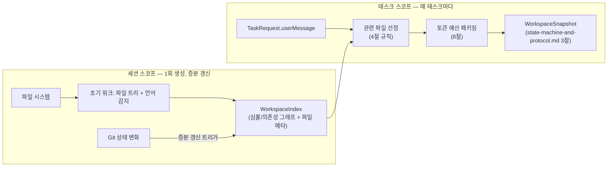

# Context Engine 설계

status: draft
관련: [state-machine-and-protocol.md](./state-machine-and-protocol.md) — `WorkspaceSnapshot`(3절), `ScriptIndex`(8절), Artifact GC(11절)의 "스냅샷은 태스크 전용" 가정

## 1. 설계 목표

- 매 태스크마다 전체 리포지토리를 두 모델에 다시 보내면 비용·지연시간이 리포 크기에 비례해 폭발한다. Context Engine은 **"관련성 높은 파일만, 토큰 예산 안에서"** 패키징하는 책임을 오케스트레이터/Provider에서 분리한다.
- OpenAI와 Claude는 **동일한 기준 스냅샷**을 받아야 한다 — 그렇지 않으면 코드 상태 차이가 모델 간 불일치처럼 보인다(원 아키텍처 제안서의 핵심 요구사항).
- 리포 전체를 매 태스크마다 다시 훑는 것(파일 트리 워크, 심볼 인덱싱)은 낭비다. **비싼 인덱싱은 세션 단위로 한 번 하고 증분 갱신**하며, **각 태스크는 그 인덱스에서 선택(selection)만** 수행한다 — 이게 2절 미해결이었던 "스냅샷을 태스크마다 새로 만들지 재사용할지" 질문의 답이다(3절에서 결론과 근거).
- 시크릿·대용량·바이너리 파일은 애초에 인덱스에 들어가지 않는다 — 이후 유출 여부를 반복 체크하는 게 아니라 진입 자체를 막는다.

## 2. 두 계층 구조: WorkspaceIndex(세션) vs WorkspaceSnapshot(태스크)

핵심 설계 결정: **`WorkspaceIndex`는 세션 스코프의 지속 상태**(파일 트리, 심볼/의존성 그래프, git 메타데이터 캐시)이고, `WorkspaceSnapshot`(기존 프로토콜 타입)은 **태스크마다 그 인덱스에서 값싸게 생성되는 선택 결과**다.



- `WorkspaceIndex`는 워크스페이스가 처음 열릴 때(또는 세션 시작 시) 1회 전체 구축되고, 이후 파일 변경 시 6절의 트리거로 증분 갱신된다. 프로세스 메모리 + SQLite에 캐시되며, **워크스페이스 지문이 같으면** 재사용한다 — 구현과 그 키를 고른 이유는 2.1절.
- `WorkspaceSnapshot`은 `TRIAGE` 이전 `SNAPSHOTTING` 단계(상태 머신 2절)에서 매 태스크마다 생성되지만, 비싼 작업(파일 트리 워크, 심볼 파싱)이 아니라 **이미 구축된 `WorkspaceIndex`에서 관련 파일을 고르고 파일 내용을 읽어 패키징하는 것**뿐이므로 태스크당 비용이 낮다.
- state-machine-and-protocol.md 11절의 "스냅샷은 태스크 전용이라 dangling reference 걱정 없음"이라는 GC 가정은 **`WorkspaceSnapshot`(선택 결과, artifact로 저장되는 것)에는 그대로 유효**하다 — `WorkspaceIndex`는 애초에 태스크별 artifact가 아니라 워크스페이스별 캐시이므로 태스크 GC 대상이 아니다. 이 구분을 명확히 하기 위해 state-machine-and-protocol.md 11절에 각주를 추가할 것(11절 참조).

### 2.1 캐시 (구현됨) — 키는 HEAD가 아니라 지문이다

**캐시가 프로세스보다 오래 살아야 하는 이유**는 멀티 워크스페이스에서 나왔다
([process-architecture.md 11절](./process-architecture.md)). 워크스페이스를 전환하면 sidecar가
종료되므로(자격증명 사본을 늘리지 않기 위해 살려두지 않는다) 프로세스 안 캐시는 함께 사라진다.
**프로세스가 아니라 결과를 저장한다** — 인덱스에는 자격증명이 없으므로 데이터를 남겨두는 것은
프로세스를 남겨두는 것과 성질이 다르다. 저장 위치는 SQLite이고 **워크스페이스당 한 행**이다
(지문마다 쌓아두면 영원히 안 맞는 항목만 늘어난다).

**키를 다시 골랐다.** 이 문서는 "git HEAD가 같으면 재사용"이라고 적었는데, 구현은 그보다
강했다 — `브랜치@hash(git status --porcelain=v1 --branch)`를 써서 워킹 트리 변화도 대부분
잡고 있었다. 즉 **문서가 코드보다 약하게 적혀 있었다.** 다만 그 키에도 좁은 사각이 둘 있다.

- `--porcelain`의 기본 untracked 모드는 **새 디렉터리를 한 줄로 접는다**(`?? newdir/`).
  그 안에 파일을 더 만들어도 status 출력이 그대로이므로 키가 바뀌지 않고, 인덱스는 그 파일을
  모른다. 선정 로직이 전부 `index.fileTree`를 보므로 **이름으로 지목해도 컨텍스트에 들어가지
  않는다.**
- 추적되는 파일을 계속 고쳐도 status에는 ` M path` 한 줄뿐이라 키가 더 바뀌지 않는다.
  인덱스의 `sizeBytes`가 그만큼 낡는다.

Rust의 워크스페이스 지문(`HEAD` + `status --porcelain -uall` + `diff HEAD`)은 둘 다 닫는다.
그리고 더 중요한 이유: **같은 질문("이 워크스페이스가 그때와 같은가")에 답이 두 개 있을 이유가
없다.** 재현 전제 판정이 쓰는 값과 같은 것을 쓴다([state-machine-and-protocol.md 21절](./state-machine-and-protocol.md)).

**지문을 낼 수 없는 워크스페이스(git 저장소가 아님)에서는 캐시를 쓰지도 저장하지도 않는다.**
같은지 판정할 방법이 없는데 재사용하면 "모른다"를 "같다"로 읽는 것이고, 어떤 상태의 인덱스인지
말할 수 없는 것을 저장하면 다음에 무엇과 비교해야 할지 알 수 없다.

몇 가지 규칙이 더 있다.

- **워크스페이스 id를 Node가 정하지 않는다.** Rust가 자기 루트에서 유도한다 — Node가 id를
  말할 수 있으면 다른 워크스페이스의 캐시를 읽고 쓸 수 있고, 그건 "이 루트를 벗어날 수 없다"를
  캐시 계층에서 우회하는 길이다.
- **인덱스를 만드는 사이에 워크스페이스가 바뀌면 저장하지 않는다.** 그 인덱스는 지금 존재하지
  않는 상태를 설명하므로 어느 지문으로 저장해도 틀린다. Rust가 저장 시점에 지문을 다시 재서
  확인한다.
- **캐시가 깨졌거나 모양이 다르면 없는 것으로 다룬다.** 캐시는 잃어도 정확성이 상하지 않는
  데이터이고, 깨진 값으로 오류를 올리면 고칠 수 없는 행 하나가 워크스페이스를 못 열게 만든다.
  앱을 업데이트해 인덱스 모양이 바뀌는 경우가 실제로 그렇다.
- **캐시를 못 써도 태스크는 진행된다.** 캐시를 못 썼다고 작업을 세우는 것은 꼬리가 몸통을
  흔드는 것이다.

#### 이득은 아직 측정되지 않았다

"첫 태스크만 느리다"(3절)도, "전환이 싸진다"(11.4절)도 **재본 적이 없는 주장이다.** 그래서
계측을 함께 붙였다: `WORKSPACE_INDEX_BUILT`(구축 시간, 파일 수)와
`WORKSPACE_INDEX_CACHE_HIT`(적중, 원래 걸렸던 시간).

**한동안 이 절은 "쌓이면 답할 수 있다"고 적어두고 있었지만 그건 사실이 아니었다** —
이벤트는 발행되는데 세는 사람이 없었다. 감사자가 로그를 손으로 세야 하는 상태는 "답할 수
있다"가 아니라 "원리적으로 가능하다"이다. 지금은 `tomverse-host metrics`의 `indexCache`가
집계한다.

읽는 법: **적중률이 아니라 `savedMsTotal`을 본다.** 100번 적중해도 구축이 원래 20ms였다면
캐시는 필요 없고, 그때는 지우는 것이 맞다. 회피 시간을 모르는 적중은 `hitsWithoutSavedMs`로
따로 센다 — 0으로 더하면 "이득이 작다"와 "배선이 끊겼다"가 같은 숫자가 된다.

```typescript
interface WorkspaceIndex {
  workspaceId: string;
  gitHeadAtIndex: string;
  fileTree: { path: string; language: string | null; sizeBytes: number; sha256: string }[];
  symbols: SymbolEntry[];
  dependencyEdges: DependencyEdge[]; // import/require 그래프
  projectMeta: {
    languages: string[];
    buildCommand?: string;
    testCommand?: string;
    lintCommand?: string;
    agentsMdPresent: boolean;
    agentsMdContent?: string; // 우선 탐색 대상, 존재하면 항상 스냅샷에 포함
  };
  scriptIndex: unknown; // state-machine-and-protocol.md 8절 ScriptIndex — Context Engine이 함께 관리
  builtAt: ISODateTime;
  lastIncrementalUpdateAt: ISODateTime;
}

interface SymbolEntry {
  id: string;
  name: string;
  kind: "function" | "class" | "method" | "interface" | "type" | "const" | "export";
  filePath: string;
  startLine: number;
  endLine: number;
  language: string;
}

interface DependencyEdge {
  fromFile: string;
  toFile: string;
  kind: "import" | "require" | "reference"; // 언어별 상세는 language-adapter가 정규화
}
```

## 3. 세션 재사용 결정 근거

세 가지 대안을 비교했다.

| 전략 | 장점 | 단점 |
|---|---|---|
| A. 태스크마다 전체 재구축 | 항상 최신, 구현 단순 | 리포가 크면 태스크당 지연시간이 수 초~수십 초로 커짐. 원 설계 문서 11절의 GC 가정과 충돌(태스크마다 새 인덱스면 GC 대상이 계속 쌓임) |
| B. 세션 내내 고정(최초 1회만) | 가장 빠름 | 세션이 길어지면(특히 이 태스크가 만든 변경사항이나 사용자의 외부 편집 반영이 안 됨) 스테일 컨텍스트로 잘못된 판단 유도 위험 — 안전 원칙과 충돌 |
| **C. 세션 스코프 인덱스 + 증분 갱신 (채택)** | 첫 태스크만 느리고 이후는 빠름, 항상 최신에 가까움 | 증분 갱신 로직이 필요해 구현 복잡도가 A/B보다 높음 |

C를 채택한 이유: 원 아키텍처 제안서가 명시한 "두 모델에 동일한 기준 스냅샷 제공"과 "변경된 파일 중심의 증분 업데이트"라는 두 요구사항을 동시에 만족하는 유일한 옵션이다. B는 안전 원칙("결정론적 검증이 모델 의견보다 우선")과 정면으로 충돌한다 — 스테일 컨텍스트로 인한 오류를 VERIFYING이 잡아내긴 하겠지만, 애초에 피할 수 있는 오류를 구조적으로 만드는 셈이다.

## 4. 관련 파일 선정 규칙

`WorkspaceSnapshot.relevantFiles[].reason`(state-machine-and-protocol.md 3절에 이미 정의됨) 각각의 판정 로직:

| reason | 판정 방법 |
|---|---|
| `mentioned` | `TaskRequest.userMessage`에서 파일 경로 패턴(`*.ts`, `src/...` 등) 또는 `WorkspaceIndex.symbols[].name`과 일치하는 식별자를 정규식+심볼 테이블 조회로 추출 |
| `symbol-match` | `mentioned`로 찾은 심볼에서 `dependencyEdges`를 1~2홉 이내로 순회해 직접 연관된 파일 |
| `recently-changed` | `git log --since=<세션 시작 or N일>` 기준 최근 변경 파일 (사용자가 방금 작업 중이던 맥락을 우선순위에 반영) |
| `dependency` | `symbol-match`로 선정된 파일들의 import 대상이지만 심볼 직접 매치는 없는 파일 (타입 정의, 유틸 등 컴파일에 필요한 주변 맥락) |

우선순위는 이 표의 순서(`mentioned` > `symbol-match` > `recently-changed` > `dependency`)이며, 8절의 토큰 예산이 부족할 때 뒤쪽부터 잘라낸다. `projectMeta.agentsMdContent`(AGENTS.md/README/빌드 설정)는 이 우선순위와 별개로 **항상 포함**한다(원 제안서: "AGENTS.md, README, 빌드 설정 등 우선 탐색").

## 5. 심볼/의존성 인덱스

- **파서:** Tree-sitter. 언어별 grammar를 MVP 범위(6절 참조)만큼만 번들.
- **검색 보조:** ripgrep을 심볼 인덱스의 보완재로 사용 — Tree-sitter 인덱스가 아직 없는 언어이거나 인덱싱 실패한 파일에 대한 폴백으로 텍스트 그레핑을 수행. `search_text` 도구(state-machine-and-protocol.md의 Tool Runtime)도 내부적으로 ripgrep을 그대로 사용.
- **인덱싱 범위:** 함수/클래스/메서드/인터페이스/타입/최상위 const/export 선언까지만 심볼로 취급 (변수 스코프 내부까지 완전한 call graph는 MVP 범위 밖).
- **의존성 그래프:** import/require 문 파싱으로 파일 단위 엣지만 구성 (심볼 단위 call graph는 MVP 범위 밖 — 필요성이 확인되면 이후 확장).

## 6. 증분 업데이트 트리거

| 트리거 | 반영 방식 |
|---|---|
| 태스크 실행 중 `apply_patch`/`create_file`/`delete_file` (Tool Runtime 결과) | 가장 신뢰도 높은 신호 — 해당 `ToolResult`가 확정되는 즉시 그 파일만 재파싱해 `symbols`/`dependencyEdges`/`fileTree` 갱신. git commit을 기다리지 않음 |
| 다음 태스크 SNAPSHOTTING 진입 시 `git diff <gitHeadAtIndex>..HEAD` | Tool Runtime 밖에서 사용자가 직접 편집했거나 다른 도구로 변경한 파일 탐지 — 변경된 파일만 재파싱 |
| `gitHeadAtIndex` != 현재 `git rev-parse HEAD`이고 diff가 너무 커서(설정 가능한 상한, 기본 200파일) 증분이 비효율적인 경우 | 전체 재구축으로 폴백 (브랜치 전환 등) |
| 워크스페이스 루트 변경(다른 프로젝트로 전환) | 전체 재구축, 이전 `WorkspaceIndex`는 워크스페이스별로 별도 보관(멀티 워크스페이스 지원 시) |

**이 표는 심볼 인덱스 층의 계획이고, 그 층은 아직 없다**(9절). 지금 실제로 도는 것은
6.1절이다 — 인덱스는 지문이 바뀌면 통째로 다시 만들어지고(2.1절), 태스크 안에서 낡는 것은
인덱스가 아니라 **모델이 보는 파일 내용**이다.

파일 시스템 watch(예: chokidar)는 MVP에서 채택하지 않는다 — 위 두 트리거(ToolResult 직접 반영 + 태스크 시작 시 git diff)만으로 "다음 태스크가 최신 상태를 본다"는 요구는 충족되고, 상시 watcher는 리소스 비용과 디바운싱 복잡도를 더한다. 필요성이 실제로 확인되면 이후 추가.


### 6.1 낡는 것은 인덱스가 아니라 **모델이 보는 파일 내용**이었다 (구현됨)

12절 항목("심볼 인덱스 갱신과 `apply_patch` 적용 사이의 원자성")을 열어보니 **문항이 아직
존재하지 않는 층을 가리키고 있었다.** 심볼 인덱스는 M0 범위 밖이라 비어 있고(9절), 인덱스
자체는 지문이 바뀌면 통째로 다시 만들어지므로(2.1절) "반쯤 갱신된 인덱스"라는 상태가 없다.

그런데 같은 자리에 **실재하는 결함**이 있었다. 스냅샷은 `SNAPSHOTTING`에서 한 번 만들어지고
그 뒤 `apply_patch`가 파일을 고치는데, FIX_LOOP는 **그 스냅샷을 다시 실어 보내면서** 프롬프트로
이렇게 말하고 있었다:

> *"The patch must apply to the CURRENT state of the files shown above (your previous change
> is already in them)."*

**거짓이었다.** 보여준 내용은 패치 이전이다. 모델은 자기가 고친 적 없는 코드를 보면서 "이미
고쳐진 코드"라는 말을 들었고, 그래서 낸 패치는 문맥이 어긋나 적용에 실패하거나(→ `fixLoopRounds`
소진) **직전 변경을 되돌린다.** 화면에는 아무 증상도 나지 않는다 — 루프는 정상적으로 돌고
라운드도 세어진다.

이 결함은 코드 안에 흔적을 남기고 있었다. 기준 게이트에는 *"실행 이후(fix loop 안)라면
초안으로 되돌리지 않는다 — 스냅샷이 낡았다"*는 분기가 있었다. **결함을 고치는 대신 결함을
피해 다니는 길이 이미 나 있었던 것이다.**

#### 다시 고르지 않고 다시 읽는다

**선정과 내용은 다른 것이다.** 어떤 파일이 관련 있는가는 태스크 수준의 판단이고 라운드가
바뀐다고 달라질 이유가 없다 — 오히려 라운드마다 달라지면 두 모델의 대조도, 라운드 간 비교도
근거를 잃는다(1절). 내용은 **지금 디스크에 있는 것**이라는 사실이고, 낡으면 안 된다.
그래서 전체 재선정이 아니라 고른 파일의 내용만 다시 읽는다(`ContextEngine.refreshSnapshot`).

규칙 다섯 가지:

- **변경이 건드린 파일은 앞으로 온다.** 예산이 모자라면 `packageFiles`가 뒤에서부터 자르는데,
  FIX_LOOP에서 답이 있는 곳이 잘리면 그 라운드는 처음부터 가망이 없다. 임의의 재정렬이 아니라
  **새 정보(무엇이 바뀌었는가)에 따른 것**이며, 프로젝트 규칙 파일은 자리를 지킨다(4절).
- **변경이 만든 파일은 새로 들어온다.** 모델이 방금 만든 파일을 못 보면 고칠 수도 없다.
- **제외 규칙은 그대로 걸린다.** 변경이 건드렸다는 이유로 `.env`가 들어오지 않는다. 7절의
  하드 필터는 진입 자체를 막는 것이고 여기는 **새로운 진입 지점**이다 — 새 문을 내면서
  자물쇠를 빼놓지 않는다. 그리고 **읽기 전에 경로로 먼저 판정한다**: 읽고 나서 버리면
  그 내용은 이미 이 프로세스 안에 들어와 있다.
- **"사라졌다"와 "모른다"를 가른다.** 이번 변경이 건드린 파일이 안 읽히면 삭제다(빼야 한다 —
  없는 파일의 내용을 계속 보여주면 모델이 그걸 고치려 든다). 건드린 적 없는 파일이 갑자기
  안 읽히는 것은 삭제의 증거가 아니라 **읽기 경로가 깨졌다는 신호**에 가깝고, 그때 전부 빼면
  모델은 빈 컨텍스트를 받는다. 그 경우는 옛 내용을 남기되 `unreadable`로 사실을 남긴다.
- **깨진 중간 상태를 감추지 않는다.** 다시 읽은 내용이 문법적으로 깨져 있을 수 있다. 그래도
  그대로 싣는다 — 스냅샷은 "이 코드가 올바르다"는 주장이 아니라 **"지금 디스크에 이것이
  있다"는 사실**이다. 깨진 상태를 감추고 옛 내용을 보여주는 것이 바로 이 결함이었다.
  심볼 인덱스가 생겼을 때도 같은 규칙을 따른다: 파싱에 실패한 파일은 **심볼을 잃되 파일이
  사라지지는 않는다.** 낡은 심볼을 남기면 모델이 지금은 없는 함수를 "본다".

#### 고치는 과정에서 같은 불변식을 깰 뻔했다

다시 읽기를 모델 호출마다 게으르게 하도록 두면 **두 실행자가 서로 다른 스냅샷을 받는다** —
초안 둘은 `Promise.all`로 동시에 나가기 때문이다(multi-engine-routing 13.1절). 그러면 대조에서
나온 불일치가 모델 차이인지 입력 차이인지 구별되지 않고, 1절의 전제가 무너진다. 그래서 진행
중인 다시 읽기를 **하나의 promise로 합치고**, 검사와 대입 사이에 `await`를 두지 않는다
(CLAUDE.md 함정 기록 — `await`가 곧 양보 지점이다).

#### 다시 읽은 스냅샷은 새 스냅샷이다

`snapshotId`를 새로 발급하고 `SNAPSHOT_CREATED`를 다시 남긴다. 전송 기록이 **마지막**
`SNAPSHOT_CREATED`를 읽으므로(`core/src/transmission.rs`), id를 물려주면 "지금 무엇이 나가
있는가"에 옛 답이 남는다. payload의 `refreshedAfterMutation`이 왜 두 번 찍혔는지를 말한다.
다시 읽지 못한 경우는 `SNAPSHOT_REFRESH_FAILED`로 남긴다 — `ERROR`에 묻으면 안 되는 사실이다.
그 이벤트가 있다는 것은 **그 뒤의 모델 호출이 낡은 내용을 받았다**는 뜻이고, 그 호출이 낸
패치가 왜 어긋났는지는 이것 없이는 설명되지 않는다.

#### 기준 게이트의 이유가 바뀌었다

위의 *"실행 이후라면 초안으로 되돌리지 않는다"* 분기는 남는다. 다만 **이유가 달라졌다**:
스냅샷이 낡아서가 아니라(이제 안 낡는다) **한 루프를 두 counter가 함께 다스리지 않기 위해서**다.
실행이 시작된 뒤로는 `fixLoopRounds` 하나가 상한을 쥔다(원칙 5). 이 분기를 여는 것은 별개의
결정이고, 여기서 하지 않는다.

## 7. 제외 규칙 (시크릿 · 대용량 · 바이너리)

초기 파일 트리 워크와 증분 갱신 모두에 적용되는 하드 필터 — `WorkspaceIndex`에 아예 들어가지 않으므로 이후 어떤 선택 로직도 이 파일들을 볼 수 없다.

- `.gitignore` 규칙 준수 (git이 무시하는 파일은 인덱싱하지 않음)
- 시크릿 패턴: `.env*`, `*.pem`, `*.key`, `id_rsa*`, `*.p12`, `credentials.json` 등 알려진 패턴 매칭 (정규식 목록은 워크스페이스 정책으로 확장 가능)
- 바이너리 감지: 파일 앞 8KB에 NUL 바이트 존재 여부로 휴리스틱 판정
- 대용량 파일: 기본 500KB 초과 시 인덱싱 제외 (`projectMeta`나 `relevantFiles`에 노출되지 않음 — `mentioned`로 명시 지목되어도 제외, 대신 오케스트레이터가 "이 파일은 너무 커서 컨텍스트에 포함할 수 없습니다"를 사용자에게 알림)
- `node_modules/`, `.git/`, 빌드 산출물 디렉터리(`dist/`, `build/`, `target/` 등 언어별 관례) — `.gitignore`에 없어도 하드코딩된 기본 제외 목록으로 처리

## 8. 토큰 예산 패키징

```typescript
interface TokenBudgetPolicy {
  provider: "openai" | "anthropic";
  maxTokens: number; // WorkspaceSnapshot에 할당 가능한 예산 (전체 프롬프트 예산의 일부)
  reservedForAgentsMd: number; // agentsMdContent 등 항상 포함되는 항목용 예약분
}
```

패키징 알고리즘: (1) `agentsMdContent` + `projectMeta` 먼저 포함(예약분에서 차감), (2) 4절 우선순위대로 `relevantFiles` 후보를 순회하며 각 파일의 토큰 **상한**을 추정(8.1절)해 예산 내에서 채움, (3) 예산이 부족해 파일 전체를 못 넣으면 `truncated: true`로 표시하고 파일 앞부분(또는 관련 심볼 주변 컨텍스트 우선)만 포함, (4) OpenAI와 Claude의 `maxTokens`가 다를 수 있으므로 **같은 `relevantFiles` 선택 결과를 기준으로 각 provider 예산에 맞춰 별도로 truncate** — 파일 선택 자체(어떤 파일이 관련 있는가)는 두 provider에 동일해야 한다는 1절 원칙을 지키되, 실제로 몇 바이트를 보내는지는 provider별로 달라질 수 있다.

### 8.1 정확한 토큰 수는 원리적으로 존재하지 않는다 — 상한을 쓰고, 그 상한을 잰다

종전 계획은 "문자 수 기반 근사로 시작하고 필요하면 tiktoken 등 정확한 카운터를 도입한다"였다.
**그 목표는 달성 가능한 목표가 아니다.**

이 설계는 **하나의 스냅샷을 모든 공급자에게 보낸다**(`providers/prompts.ts`의 네 빌더가 전부
같은 `renderSnapshot`을 쓴다 — 그게 대조가 성립하는 조건이다). 그런데 같은 텍스트의 토큰 수는
토크나이저마다 다르다. 공급자 A에게 정확한 수는 공급자 B에게 틀린 수이므로, "정확한 카운터"가
있어도 이 자리에 넣을 값은 하나로 정해지지 않는다.

달성 가능한 목표는 **상한**이다. 그래서 함수 이름이 `estimateTokensUpperBound`이고, 이 절이
정하는 것은 "얼마나 정확한가"가 아니라 **"넘지 않는가"**다.

#### 왜 tiktoken을 넣지 않는가

위 이유가 첫째다. 둘째, **Anthropic은 오프라인 토크나이저를 배포하지 않는다** — 정확히 세려면
API 호출이고, 그건 컨텍스트를 꾸릴 때마다 지연과 비용이 붙는다는 뜻이다. 컨텍스트 패킹을 위해
유료 호출을 하는 것은 예산 상한(multi-engine-routing.md 10.6절)이 막으려는 것과 같은 종류의
지출이다. 셋째, WASM 로딩 비용과 의존성이 붙는다.

#### 과소 추정과 과대 추정의 대가는 대칭이 아니다

| 방향 | 대가 | 보이는가 |
|---|---|---|
| 과대 추정 | 파일을 덜 싣는다 → 패치 품질이 떨어진다 | **보이지 않는다** |
| 과소 추정 | 예산보다 많이 보낸다 | 보인다(거부·원장 차단) |

**과소 추정의 대가가 달라졌다.** 종전 코드 주석은 그것을 "요청이 거부되고 재시도"로 적었는데,
예산 상한이 붙으면서 실제 입력 토큰이 예약의 근거였던 수를 넘으면 실제 비용이 예약액을 넘고
원장이 `BUDGET_ESTIMATE_BREACH`로 이후 호출을 막는다. 이제 과소 추정은 **돈과 태스크를 함께
잃는다.**

그래서 계수는 상한 쪽으로 기울인다. 다만 **최악의 토크나이저를 가정하지는 않는다** — 모든
문자를 1문자=3토큰으로 보면 컨텍스트가 1/3로 줄어 위 표의 "보이지 않는 손해"가 상시화된다.
필요한 것은 "우리가 실제로 라우팅하는 토크나이저들에 대해 성립하는 상한"이고, 그건 재봐야 안다.

#### 종전 근사가 틀렸던 방향은 하필 한국어였다

종전에는 전부 `문자 수 / 3.5`였다. 영문 코드에는 대략 맞지만 **한글에는 3~7배 과소 추정**이다 —
한글 음절은 UTF-8로 3바이트이고 BPE는 바이트 위에서 돌므로 보통 음절당 1토큰 이상이다.
이 제품의 사용자는 한국어로 요청을 쓰고 한국어 주석이 달린 코드를 다루므로, 그 오차는
예외적인 경우가 아니라 **기본 경로**에 있었다.

지금은 ASCII와 그 밖을 나눠 센다(`ASCII_CHARS_PER_TOKEN`, `NON_ASCII_TOKENS_PER_CHAR`).
**두 계수 모두 아직 유도하지 못한 상수다.**

#### 자를 때도 같은 계수로 센다

종전에는 `허용 토큰 × 문자당 토큰`으로 자를 문자 수를 역산했다. 계수가 문자 종류마다 다른
지금은 그 역산이 성립하지 않는다 — 한글 구간에서 역산하면 허용치의 3배를 잘라 넣는다.
그래서 앞에서부터 실제로 세면서 자르고(`truncateToTokens`), **코드 포인트 단위로** 자르므로
서로게이트 쌍이 반으로 쪼개지지 않는다.

#### 그래서 재고 있다

모든 공급자 호출이 `meta.estimatedInputTokens`(우리 추정)와 `usage.inputTokens`(공급자가 보고한
실제)를 함께 남긴다(스키마 v5). `tomverse-host metrics`의 `tokenEstimate`가 `실제 / 추정` 비율을
집계하고, **실제가 추정을 넘은 호출 수**를 따로 센다 — 그 수가 0이 아니면 이 모듈은 상한이
아니다. 계수를 고칠 근거는 이 숫자이지 감이 아니다.

**비교할 수 없는 호출을 비율 1로 세지 않는다.** 추정이 없는 기록(v5 이전, 추정하지 않은 경로)은
`callsWithoutEstimate`로 따로 센다 — 없는 쪽을 채우면 "추정이 맞았다"는 결론이 데이터 없이
나오고, 배선이 끊긴 것과 표본이 적은 것을 구별할 수 없게 된다.

## 9. MVP 언어/도구 범위

Tree-sitter grammar 및 스크립트 인덱싱(state-machine-and-protocol.md 8절)을 지원할 초기 범위: **JavaScript/TypeScript, Python, Rust**. 이 세 언어는 프로젝트 자체 스택(Node sidecar, Rust core)과 겹쳐 dogfooding이 쉽고, Tree-sitter grammar가 성숙하다. Go/Java/C# 등은 이후 사용자 수요에 따라 추가. 범위 밖 언어의 파일은 `symbols`/`dependencyEdges` 없이 `fileTree`(경로·크기·언어태그)만 인덱싱되고, `mentioned`/`recently-changed` 판정은 가능하지만 `symbol-match`/`dependency`는 적용되지 않는다(텍스트 검색 폴백으로 보완).

## 10. 데이터 모델 (SQLite 확장)

state-machine-and-protocol.md 7절 스키마에 추가:

```sql
CREATE TABLE workspace_index (
  workspace_id            TEXT PRIMARY KEY REFERENCES workspaces(workspace_id),
  git_head_at_index       TEXT NOT NULL,
  file_tree_ref           TEXT NOT NULL,  -- artifact 경로 (큰 JSON)
  symbols_ref             TEXT NOT NULL,  -- artifact 경로
  dependency_edges_ref    TEXT NOT NULL,  -- artifact 경로
  project_meta_json       TEXT NOT NULL,  -- 작아서 인라인
  built_at                TEXT NOT NULL,
  last_incremental_update_at TEXT NOT NULL
);
```

`WorkspaceIndex`는 태스크 단위가 아니라 워크스페이스 단위이므로 state-machine-and-protocol.md 11절의 artifact GC(터미널 태스크 기준 정리) 대상이 아니다 — 워크스페이스 자체가 삭제될 때만 함께 정리한다. 이 구분을 명확히 하기 위해 11절에 각주를 추가한다(아래 커밋에 포함).

## 11. M0 구현 상태와 보완

M0에서 구현된 것: 2계층 구조(세션 `WorkspaceIndex` + 태스크 `WorkspaceSnapshot`), 7절 하드 필터 전체,
4절의 `mentioned`/`project-meta` 선정, 8절 예산 패키징(문자 종류별 계수로 낸 **상한 추정**, 8.1절).

**구현되지 않은 것과 그 결과:** 5절 Tree-sitter 심볼/의존성 인덱스가 없으므로 `symbols`와 `dependencyEdges`가
비어 있고, 따라서 **`symbol-match`와 `dependency` 선정이 동작하지 않는다.** 빈 결과를 만들어 "구현했다"고
보이게 하지 않기 위해 그 `reason` 값을 아예 생성하지 않으며, 대신 파일명 키워드 매칭으로 후보를 고르고
그 사실을 `reasonDetail`에 적어 사용자가 선정 근거의 강도를 판단할 수 있게 한다.

6절 증분 갱신도 M0에서는 채택하지 않았다 — git 상태 지문이 바뀌면 전체 재구축한다. 증분 갱신은 심볼
인덱스가 있을 때 이득이 커지고, 그때까지는 전체 재구축이 더 단순하며 스테일 컨텍스트 위험도 없다.

### 11.1 TRIAGE와의 상호작용 (구현에서 발견)

Context Engine이 `project-meta`(README/package.json/CLAUDE.md)를 **항상** 포함하고, 파일명 키워드 매칭이
소스 파일과 그 테스트 파일을 함께 고르기 때문에, `relevantFiles.length`를 그대로 TRIAGE의 복잡도 신호로 쓰면
**모든 태스크가 `standard`로 분류되어 TRIAGE가 죽는다**(state-machine-and-protocol.md 13.2절의 임계값은 1이다).

그래서 TRIAGE는 작업 파일 개수를 셀 때 `project-meta`와 테스트 파일로 보이는 경로를 제외한다. 테스트 파일은
작업 범위가 아니라 그 작업을 판정할 근거이므로 복잡도가 아니다. 이 규칙은 임계값을 임의로 올리는 것보다
설명 가능하지만, 여전히 실측 근거가 없는 휴리스틱이다.

**제외 규칙에 대해서는 실측이 하나 생겼다**(state-machine-and-protocol.md 13.4절): 난이도 라벨이 붙은
태스크 29개에 규칙을 태워 임계값을 스윕했더니, 테스트 파일을 **세는** 쪽은 어떤 임계값에서도 제외하는
쪽보다 나은 결과를 만들지 못했다(전부 지배당하거나 동률). 제외 규칙이 이 세트에서 해롭지 않다는 뜻이며,
아래 11.1.1이 재려는 "제외가 실제 작업 대상을 지웠는가"와는 다른 질문이다 — 그쪽은 여전히 실사용 대기다.

#### 11.1.1 오분류를 셀 수 있게 만들었다 (구현됨)

미해결로 남아 있던 것은 "이 규칙이 오분류를 얼마나 내는가"였고, **그동안 답할 수 없던 이유는
데이터가 없어서가 아니라 측정할 수 없어서였다.** `TRIAGE_COMPLETED`가 `complexityTier` 하나만
남겼기 때문이다.

문제는 분모다. "`simple`이 몇 건인가"는 이 질문에 답하지 못한다 — 테스트 파일이 제외됐어도
위험 키워드나 미커밋 변경 때문에 **이미 `standard`였다면** 그 태스크는 이 규칙에 대해
아무것도 말해주지 않는다. 그런 태스크를 분모에 넣으면 오분류율이 실제보다 낮아 보인다.

그래서 판정과 함께 **반사실**을 남긴다: `tierIfTestsCounted` — *테스트 파일을 세었더라면 어떤
tier였는가.* 그리고 제외한 경로를 개수가 아니라 **경로 목록**으로 남긴다.

| | 뜻 |
|---|---|
| `tier != tierIfTestsCounted` | 이 태스크에서 규칙이 **실제로 판정을 바꿨다** — 오분류율의 분모 |
| 그중 제외했던 테스트 파일이 `FILE_MUTATED`에 나타남 | 그 파일은 작업 대상이었다 — **오분류**, 분자 |

집계는 Rust가 한다(`tomverse-host metrics`의 `testFileRule`). DB는 Rust의 것이므로 집계도
거기 둔다는 기존 규칙 그대로다.

**값 자체는 실사용이 쌓여야 나온다.** 달라진 것은 이제 답이 나올 수 있는 형태라는 것뿐이고,
그 답이 "규칙이 자주 틀린다"로 나오면 고칠 자리는 `TEST_FILE_PATTERNS`가 아니라 **규칙 자체**다 —
테스트 파일을 고치는 것이 작업인 태스크를 어떻게 알아볼 것인가가 진짜 질문이기 때문이다.

##### 그런데 이 분자는 모델의 선택에 의존한다

위 표의 분자(`FILE_MUTATED`에 나타남)에는 구조적 사각이 있다. **규칙이 테스트 파일을 복잡도에서
지운 탓에 모델이 그 파일을 고쳐야 한다는 것을 못 봤다면 — 즉 규칙이 정확히 해를 끼친 경우 —
그 파일은 `FILE_MUTATED`에 없다.** 규칙이 가장 나쁘게 작동한 경우가 가장 깨끗한 성적표로 나온다.
경로 대조 실패에 대해 이미 적어둔 "0으로 보이면 규칙이 완벽하다로 읽힌다"와 같은 함정이 **한 층
위에 또** 있었다.

그래서 **모델의 선택을 거치지 않는 분자**를 하나 더 둔다: 제외했던 테스트 파일이 **검증 실패
출력에 나타났는가**(`tasksWhereExcludedTestFailedVerification`). 검증은 모델이 아니라 Rust가
돌리고 실패한 테스트 파일 이름은 러너가 찍으므로, 이 값은 모델이 무엇을 골랐는지와 무관하다.

| 분자 | 세는 것 | 사각 |
|---|---|---|
| `WasMutated` | 모델이 그 파일을 고쳤다 | 모델이 못 보고 안 고친 경우 — 규칙이 해를 끼친 바로 그 경우 |
| `FailedVerification` | 러너가 그 파일의 실패를 찍었다 | 그 태스크에 실패한 test 체크가 없는 경우 |

셋째 값도 함께 낸다: `tasksWhereVerificationTextUnavailable`. 검증 출력이 커서 artifact로 빠지면
(`detailRef`) 이벤트에 본문이 없어 **대조 자체를 못 한다.** 그걸 "일치 없음"으로 세면 대조 실패가
무죄 판정으로 둔갑한다 — `hitsWithoutSavedMs`를 따로 센 것과 같은 이유다.

경로 대조는 **이름 경계를 지킨다.** 단순 포함으로 보면 `e.test.ts`가 `validate.test.ts`에 걸려
서로 다른 파일이 같은 것으로 세어지고, 그러면 이 분자가 실제보다 커진다. 방향이 반대인 오류라
같은 함정이 아니지만 결과는 똑같이 틀린 처방이다.

##### 가설 게이트 fixture로 앞당길 수는 없다 (측정해봤다)

TRIAGE **임계값**은 라벨 붙은 fixture 세트로 쟀다(state-machine 13.4절 — 규칙이 모델을 부르지
않으므로 실사용을 기다릴 필요가 없었다). 같은 방식으로 이 항목도 앞당길 수 있는지 확인했고,
**없다.**

분자는 "제외한 테스트 파일이 실제 작업 대상이었는가"인데, 게이트 fixture 24개의 **정답 패치가
전부 소스 파일을 고친다.** 세트가 반례를 담을 수 없는 구조이므로 여기서 나오는 분자 0은 규칙에
대해 아무것도 말하지 않는다. 그런 0을 보고하는 것이 이 항목에서 가장 나쁜 결말이다.

산문으로 적어두면 나중에 fixture가 늘었을 때 이 판단이 갱신되지 않으므로 **검사로 둔다** —
`triageCalibration.test.ts`가 정답 대상에 테스트 파일이 섞이는 순간 실패하고, 그때 이 항목은
실사용을 기다리지 않고 답할 수 있게 된다.

곁가지로 그 실행이 **규칙의 이득 방향**은 보여줬다. 현재 기본값에서 쉬운 태스크는 5건 중 1건만
`standard`로 가는데, 테스트 파일을 세면 **5건 전부** `standard`가 된다. 규칙이 판정을 바꾼 그
4건에서 규칙은 옳았다. 손해 방향(오분류)만 이 세트가 못 재는 것이다.

경로 대조에는 함정이 하나 있다. 스냅샷의 경로는 워크스페이스 상대이고 `FILE_MUTATED`의 경로는
Rust가 정규화한 것이라 표기가 다를 수 있다. **여기서 못 맞추면 오분류가 0으로 보고되고, 그건
"규칙이 완벽하다"로 읽힌다** — 가장 나쁜 종류의 조용한 실패다. 그래서 구분자를 맞추고 경로
경계를 지키며 꼬리를 비교하고, 그 동작을 테스트가 지킨다.

## 12. 다음으로 구체화할 것

- ~~정확한 토큰 카운팅(현재는 문자 수 근사) — provider별 tokenizer 라이브러리 도입 여부~~ → 8.1절에서 해결. **질문 자체가 틀렸다**: 하나의 스냅샷이 여러 공급자에게 가므로 "정확한 수"는 하나로 정해지지 않고, 필요한 것은 상한이다. tokenizer 라이브러리를 넣지 않기로 했고(Anthropic은 오프라인 토크나이저가 없어 정확히 세려면 유료 API 호출이다), 대신 계수를 문자 종류별로 나눠 상한 쪽으로 기울인 뒤 **그 상한이 실제로 상한이었는지를 집계한다**(`metrics`의 `tokenEstimate`). 남은 것: **두 계수 모두 유도하지 못한 상수다** — `callsWhereActualExceededEstimate`가 0이 아니면 상한이 아니라는 뜻이므로 그때 올리고, p90 비율이 한참 낮으면 과대 추정이므로 내린다
- ~~심볼 인덱스 갱신과 `apply_patch` 적용 사이의 원자성 — 파싱 실패 시(문법 오류가 있는 중간 상태) 인덱스를 어떻게 다루는지~~ → 6.1절에서 해결. **문항이 아직 존재하지 않는 층을 가리키고 있었다** — 심볼 인덱스는 비어 있고(9절) 인덱스는 지문이 바뀌면 통째로 다시 만들어지므로 "반쯤 갱신된 인덱스"라는 상태가 없다. 그런데 같은 자리에 실재하는 결함이 있었다: **FIX_LOOP가 패치 이전의 파일 내용을 실어 보내면서 프롬프트로는 "당신의 변경이 이미 반영되어 있다"고 말하고 있었다.** 코드 안에 흔적도 남아 있었다 — 기준 게이트가 "실행 이후라면 초안으로 되돌리지 않는다 — 스냅샷이 낡았다"로 결함을 피해 다니고 있었다. 고치는 과정에서 **같은 불변식(두 실행자는 같은 스냅샷을 받는다)을 깰 뻔했다**: 게으른 다시 읽기를 호출마다 두면 `Promise.all`로 나가는 초안 둘이 다른 입력을 받는다. 파싱 실패의 처리 규칙은 심볼이 생겼을 때를 위해 6.1절에 미리 적어두었다 — **심볼을 잃되 파일이 사라지지는 않는다**
- ~~멀티 워크스페이스(여러 프로젝트를 동시에 열어둔 경우) `WorkspaceIndex` 동시 보관/전환 전략~~ → [process-architecture.md 11절](./process-architecture.md)에서 결정. **"동시 보관"이라는 문항 자체가 답을 막고 있었다**: 인덱스는 sidecar 프로세스 안에 있고 sidecar는 워크스페이스당 하나를 살려둘 수 없으므로(자격증명 사본 + Policy Gate 루트 불변식, 11.3절), 프로세스를 살려두는 방식으로는 답이 없다. **프로세스가 아니라 결과를 저장한다** — 2절이 앱 재시작에 대해 이미 약속한 SQLite 캐시가 그대로 전환에 적용된다(전환은 재시작의 축소판이다). 인덱스에는 자격증명이 없으므로 데이터를 남겨두는 것은 프로세스를 남겨두는 것과 성질이 다르다. **캐시는 2.1절에서 구현했다.** 그 과정에서 키를 HEAD에서 **지문**으로 바꿨다(2절이 적어둔 규칙이 코드보다 약했고, 코드의 키에도 좁은 사각이 둘 있었다). 남은 것: **캐시의 이득은 아직 측정되지 않았다** — 계측을 붙였으므로(`WORKSPACE_INDEX_BUILT`/`_CACHE_HIT`) 실사용이 쌓이면 답할 수 있다
- 11.1절의 "테스트 파일은 복잡도 신호가 아니다" 규칙의 실측 검증 — **답할 수 없던 이유가 데이터가 아니라 측정 불가였다**(11.1.1절). `TRIAGE_COMPLETED`가 tier 하나만 남겨서, 어떤 태스크에서 이 규칙이 **작동하기라도 했는지** 구별되지 않았고 그러면 분모를 만들 수 없다. 이제 반사실(`tierIfTestsCounted`)과 제외한 **경로 목록**을 함께 남기고 Rust가 집계한다(`metrics`의 `testFileRule`). **비율 자체는 실사용 데이터가 있어야 나오므로 이 항목은 열려 있다.** 읽는 법: 분모는 `simple` 건수가 아니라 **규칙이 판정을 바꾼** 건수다. 답이 "자주 틀린다"로 나오면 고칠 자리는 `TEST_FILE_PATTERNS`가 아니라 규칙 자체다. **분자를 하나 더 붙였다**: 종전 분자(`FILE_MUTATED`)는 모델이 그 파일을 고쳤을 때만 세므로, **규칙이 해를 끼쳐 모델이 그 파일을 못 본 경우를 구조적으로 놓친다** — 규칙이 가장 나쁘게 작동한 경우가 가장 깨끗한 성적표로 나온다. 검증 실패 출력에 나타났는지는 모델의 선택을 거치지 않는다(`tasksWhereExcludedTestFailedVerification`), 그리고 출력을 못 본 경우는 "일치 없음"과 뭉치지 않고 따로 센다. **가설 게이트 fixture로 앞당길 수 있는지도 재봤고 없다** — 24개 정답 패치가 전부 소스 파일이라 반례를 담을 수 없는 세트다. 그 판단은 산문이 아니라 검사로 두었다(fixture가 테스트 파일을 고치기 시작하면 실패한다)
- ~~Rust core와 Node sidecar 중 어디가 `WorkspaceIndex` 구축을 실제로 수행할지~~ → [process-architecture.md](./process-architecture.md) 6절에서 Node로 결정 (Tree-sitter npm 생태계 성숙도, 권한 불필요 작업은 Node에 두는 일관성, 대용량 데이터 프로세스 간 전송 회피가 근거)


## 13. 선정이 파일 **내용**을 본다 — 심볼 그래프가 오기 전까지 (M3)

product-strategy 8.2절의 출시 기준은 *"Tree-sitter 3개 언어 + **ripgrep 폴백**"*이다.
Tree-sitter는 아직 없고, **폴백도 없었다.**

### 13.1 선정이 파일 이름만 보고 있었다

4절 표는 `mentioned`를 *"경로 패턴 또는 `WorkspaceIndex.symbols[].name`과 일치"*로 적었는데,
심볼 테이블이 비어 있으므로 실제로 남은 것은 **경로와 파일명 매칭**뿐이었다.

그러면 이런 요청이 실패한다:

> `resolveBudget` 이 음수를 받으면 터집니다

그 함수가 `ledger.ts`에 있으면 우리는 그 파일을 **영원히 고르지 못한다.** 모델은 엉뚱한
컨텍스트로 초안을 쓰고, 그 실패는 화면에서 *"모델이 잘못했다"*로 보인다. 결정론적 검증이
그 초안을 잡아내더라도, 잡아낸 것은 우리가 만든 실패다.

그리고 `search_text` 도구는 **처음부터 있었다.** Rust가 구현하고 있었고, 모델은 부를 수 있었고,
`ToolBridge.searchText`도 있었다 — **선정이 한 번도 부르지 않았다.** 문은 있고 길이 없었다.

### 13.2 정의를 먼저, 없으면 등장

`resolveBudget`을 그냥 찾으면 **부르는 곳이 전부** 걸린다. 그중 고쳐야 할 곳은 대개 정의가
있는 파일 하나이고, 나머지는 토큰 예산만 먹는다. 그래서 두 번 찾는다:

1. 정의처럼 보이는 자리 — `\b(function|class|const|...)\s+<키워드>\b`
2. 그것이 없을 때만 아무 등장이나

언어별로 정규식을 나누지 않는다. 갈래를 만들면 그 목록이 **또 하나의 손으로 지키는 규칙**이
되고, 틀려도 조용히 후보가 줄 뿐이라 드러나지 않는다. 여기서 틀리는 대가는 "정의를 못 찾아
넓은 검색으로 내려간다"이며 그건 실패가 아니다.

### 13.3 근거의 **강도**를 이름으로 말한다

`symbol-match`로 적지 않았다. 그건 심볼 그래프가 있을 때의 근거 — *"파서가 이 식별자의 정의를
안다"* — 이고, 여기서 한 것은 정규식이다. 이름이 근거보다 강하면 화면과 감사 기록이 "파서가
확인했다"고 말하게 된다.

그래서 `RelevanceReason`에 `content-match`를 더했고, `reasonDetail`도 **정규식이라는 사실을
그대로 적는다**. 사용자가 선정 근거의 강도를 판단할 수 있어야 한다는 것이 4절의 규칙이다.

순위는 `mentioned` 다음, `recently-changed` 앞이다. 뒤가 아닌 이유: fix loop에서 방금 고친
파일은 이미 컨텍스트에 있었고, 여기서 새로 찾은 것은 **아직 한 번도 실리지 않았을 수 있다.**

### 13.4 제외가 옆문으로 뚫리지 않는다

검색은 우리 인덱스의 제외 규칙을 똑같이 적용하지 않는다. 비밀값 파일은 실제 도구도 건너뛰지만,
**크기 제한은 우리 인덱스만의 규칙**이라 검색은 500KB짜리 생성 파일도 그대로 돌려준다.
그래서 인덱스에 없는 경로는 받지 않는다.

**이 검사를 처음에는 `.env`로 썼는데, 프로브가 잡았다** — fake가 실제 도구처럼 비밀값을
건너뛰므로 필터를 지워도 통과했다. 검사가 겨냥한 것과 실제로 지키는 것이 달랐고, 크기로
제외된 파일로 바꾸자 프로브가 걸렸다.

### 13.5 실패를 "없음"으로 읽지 않는다

검색이 실패하면 그 사실이 `excludedNotes`에 남는다. 읽지 못한 것과 없는 것은 다른 사실이고,
뭉개면 **컨텍스트가 조용히 좁아진 채** 모델이 불린다 — 그리고 그 좁음은 어디에도 기록되지 않는다.

상한도 둔다(원칙 5): 키워드 4개, 키워드당 후보 3개. 검색은 저장소 크기에 비례하므로 상한이
없으면 스냅샷 한 번이 수십 번의 전체 훑기가 된다.

### 13.6 아직 하지 않은 것

- **Tree-sitter 심볼 그래프**(9절). `content-match`는 그 자리를 **메우는 것이지 대체하는 것이
  아니다.** 정규식은 정의와 문자열 리터럴을 구별하지 못하고, `dependencyEdges`가 없으므로
  1~2홉 순회(4절 `symbol-match`/`dependency`)는 여전히 동작하지 않는다.
- ~~**검색 결과의 줄 번호를 쓰지 않는다.**~~ → 14절. **13절이 만든 이득을 스스로 깎고 있었다**:
  찾아 놓고 그 자리를 잘라 버렸다.
- **fake가 실제 도구와 갈리는 자리.** 이번에 fake의 `search_text`를 진짜로 찾게 만들었지만,
  제외 규칙(gitignore·바이너리)까지 흉내 내지는 않는다. 갈리면 검사가 실제와 다른 것을 지킨다.


## 14. 찾아 놓고 잘라 버리지 않는다 (M3)

13절이 본문 검색으로 파일을 고르게 만들었다. 그런데 **자르기는 여전히 접두사였다.**

`resolveBudget`이 600줄짜리 `ledger.ts`의 561번째 줄에 정의돼 있으면, 우리는 그 파일을 찾아
컨텍스트에 넣고 — **예산에 맞춰 앞에서부터 자르며 그 정의를 버린다.** 모델은 `filler0`부터
`filler300`까지를 받는다. 찾은 값어치가 거기서 사라진다.

13절이 없었다면 이 자리는 문제가 아니었다(파일을 아예 못 골랐으므로). **기능을 하나 만들면
그것이 지나는 다음 길목이 새 병목이 된다.**

### 14.1 창은 **연속된 하나**다

앵커마다 조각을 떼어 이어 붙이는 쪽이 토큰당 정보량은 높다. 그런데 그러면 본문에 **구멍**이
생기고, 구멍은 두 갈래 다 나쁘다.

- 표시하지 않으면 **거짓이다.** 모델은 연속된 코드를 보고 있다고 믿는다.
- 표시하면 그 표시가 **파일 내용처럼 보인다.** 모델이 `… 생략 …`을 patch의 context 줄로
  복사하면 `apply_patch`가 실패하고, 그 실패는 "모델이 잘못된 patch를 냈다"로 보인다.

그래서 조각을 잇지 않는다. 실린 본문은 **원본의 연속된 조각 그대로**이고, 어디를 실었는지는
`includedRange`라는 **값**으로 따로 말한다. 프롬프트의 파일 머리글이 그것을 읽어 적는다:

```
### src/ledger.ts
(selected because: 본문에서 "resolveBudget"의 정의처럼 보이는 자리를 찾음 …)
(NOTE: TRUNCATED — this is lines 431-600 of 600, a contiguous slice. …)
```

**"연속된 조각"이라는 사실도 말한다.** 구멍이 있다고 오해하면 모델이 방어적으로 쓴다.

### 14.2 앵커보다 **앞도** 남긴다

정의는 아래로 읽히지만 그 위에 import·타입·주석이 있다. 그것이 없으면 모델이 타입 이름을
지어낸다. 그래서 예산의 일부(`LEAD_SHARE`)를 앵커 앞쪽에 쓴다.

**유도하지 못한 상수다.** 0.25는 "앞을 조금, 뒤를 많이"라는 방향만 담고 있고, 그 방향의 근거는
정의 본문이 아래에 있다는 것뿐이다.

### 14.3 앵커를 그대로 믿지 않는다

검색과 읽기 사이에 파일이 바뀔 수 있다. 범위 밖 앵커를 그대로 쓰면 창이 파일 끝 너머를
가리키고, 결과는 **빈 창**이다 — "찾았는데 아무것도 안 실었다". 그래서 범위 밖 앵커는 버리고,
남은 것이 없으면 종전대로 앞에서부터 자른다.

예산이 한 줄도 담지 못할 만큼 작을 때도 빈 창을 내지 않는다. 앵커 줄 하나를 잘라서라도 넣는다.

### 14.4 조각마다 검사가 있어도 **이어지지 않으면 기능은 없다**

프로브가 배선 하나를 찾았다. `windowAroundLines`가 앵커를 존중한다는 검사가 있었고
`packageFiles`가 범위를 남긴다는 검사가 있었는데, **검색 결과의 줄 번호가 후보를 거쳐
파일까지 오는 길**에는 검사가 없었다. 그 길을 끊어 보니 아무 검사도 실패하지 않았다.

13절이 고친 결함("도구는 있는데 아무도 부르지 않았다")과 **같은 모양**이다. 조각을 잘 만드는
것과 이어 붙이는 것은 다른 일이고, 후자는 조각별 검사로는 보이지 않는다. 끝에서 끝까지
가는 검사를 추가했다: 600줄 파일, 561번째 줄에 정의, 파일 전체를 담지 못하는 예산.

### 14.5 검증한 것

| 조각 | 무엇을 |
|---|---|
| 창의 위치 | 앵커가 파일 뒤쪽이어도 그 자리가 실린다 / 앵커가 없으면 종전대로 앞에서부터 |
| 창의 모양 | 실린 본문이 원본의 **연속된 조각 그대로**다 |
| 앞쪽 | 앵커보다 앞도 조금 남는다 |
| 앵커 신뢰 | 범위 밖 앵커는 무시된다 / 예산이 아주 작아도 빈 창을 내지 않는다 |
| 값 | `packageFiles`가 실린 줄 범위를 값으로 남긴다 |
| 프롬프트 | 머리글이 범위와 "연속" 사실을 말하고, **본문에는 생략 표시가 없다** |
| 배선 | 검색이 찾은 줄이 예산에 쫓겨도 컨텍스트에 남는다 (끝에서 끝까지) |

프로브 다섯 번 중 넷이 잡혔고, **잡히지 않은 한 번이 14.4절의 배선 검사를 만들었다.**

### 14.6 아직 하지 않은 것

- **앵커가 여럿일 때 첫 번째만 쓴다.** 정의와 그 호출부가 멀리 떨어져 있으면 하나만 실린다.
  가장 많은 앵커를 덮는 창을 고르는 쪽이 낫지만, 그건 앵커 분포를 봐야 하고 지금은 그
  분포를 잰 적이 없다.
- **`LEAD_SHARE`가 유도되지 않았다.** 8절의 토큰 계수와 같은 상태다 — 재는 장치가 없으므로
  틀려도 드러나지 않는다.
- **잘린 파일에 대한 patch는 여전히 위험하다.** 창 밖의 코드를 모델이 모르므로, 같은 이름의
  함수가 창 밖에 또 있으면 hunk의 context가 모호해진다. `apply_patch`는 정확 일치를 요구하므로
  **틀리면 실패한다**(조용히 엉뚱한 자리에 적용되지 않는다) — 그 실패는 fix loop가 받는다.
