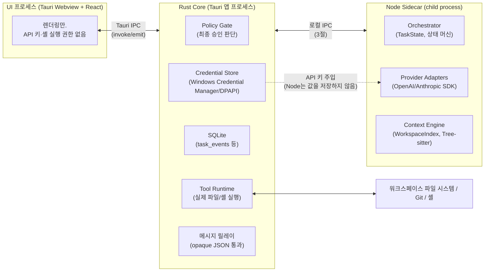

# 프로세스 구조 & IPC 설계

status: draft
관련: [state-machine-and-protocol.md](./state-machine-and-protocol.md) (프로토콜 타입, Rust/Node 타입 소유권 원칙), [context-engine.md](./context-engine.md) (`WorkspaceIndex` 소유권 — 이 문서에서 해결)

## 1. 설계 목표

- 지금까지의 설계 문서들은 "Rust core"와 "Node sidecar"가 존재하고 서로 통신한다는 걸 전제로 세부 사항(타입 소유권, 어댑터 계약)을 정했지만, **정작 세 프로세스(UI/Rust core/Node sidecar)가 실제로 어떻게 연결되는지는 문서화된 적이 없다.** 이 문서는 그 빈틈을 메운다.
- 원 아키텍처 제안서의 원칙을 프로세스 경계에 정확히 매핑한다: "UI 프로세스에는 API 키나 직접적인 셸 실행 권한을 두지 않는다", "LLM은 구조화된 도구 호출만 요청하고 실제 실행은 로컬 정책 엔진이 승인한 뒤 수행한다."
- **Rust core를 신뢰 경계(trust boundary)로, Node sidecar를 두뇌(orchestration + LLM 통신)로** 분리한다 — 이미 state-machine-and-protocol.md가 암묵적으로 전제한 방향("TypeScript가 프로토콜 타입의 단일 소스", "Rust는 정책 판단에 필요한 타입만 강타입")을 프로세스 수준에서 명시적으로 확정한다.

## 2. 프로세스 구성과 책임 분리



| 구성요소 | 프로세스 | 책임 |
|---|---|---|
| Orchestrator (상태 머신) | **Node** | `TaskState`/`TaskPhase` 소유, phase 전이 로직, 카운터 관리(clarificationRounds 등) |
| Provider Adapters | **Node** | OpenAI Responses API / Anthropic Messages API 공식 SDK 호출 (state-machine-and-protocol.md 13.3절 어댑터 계약) |
| Context Engine | **Node** | `WorkspaceIndex` 구축/증분 갱신, Tree-sitter 파싱, `WorkspaceSnapshot` 패키징 (context-engine.md 미해결 항목 해결 — 근거는 4절) |
| Policy Gate 최종 판단 | **Rust** | `ToolRequest` + `riskTier`를 받아 `auto_approve`/`require_user_approval`/`deny` 확정. Node가 1차 분류(`riskTier` 계산, 5절 allowlist 매칭)는 하지만 **실행 여부의 최종 게이트는 항상 Rust** |
| Tool Runtime (실행) | **Rust** | 승인된 `ToolRequest`만 실제로 실행 — 파일 I/O, `git`/기타 프로세스 spawn. Node는 실행 권한이 없음 |
| SQLite | **Rust** | `task_events`, `tool_requests`, `file_mutations` 등 — Rust가 유일한 쓰기 주체(단일 writer로 WAL 락 경합 최소화) |
| 자격증명 저장 | **Rust** | Windows Credential Manager/DPAPI. Node는 API 키를 **디스크에 저장하지 않고** 프로세스 시작 시 Rust가 환경변수/stdin으로 1회 주입, 메모리에만 보관 |
| UI 렌더링 | **UI (Tauri Webview)** | Rust가 릴레이하는 이벤트를 구독해 렌더링. API 키·셸 실행 권한 없음(원 제안서 원칙 그대로) |

**왜 Node가 두뇌이고 Rust가 게이트인가:** state-machine-and-protocol.md가 이미 "TypeScript가 프로토콜 타입의 단일 소스, Rust는 정책 판단에 필요한 타입만 강타입"이라고 정했다 — 이 문서는 그 결정을 프로세스 경계까지 그대로 확장한 것뿐이다. Node가 LLM SDK와 상태 머신을 다 갖고 있어도, **실제로 디스크에 쓰거나 프로세스를 실행하는 능력이 없으면** Node가 완전히 장악당해도(프롬프트 인젝션, SDK 취약점 등) 공격자는 "실행해달라고 요청"만 할 수 있을 뿐 Rust의 Policy Gate를 반드시 통과해야 한다 — Defense in depth.

## 3. Rust ↔ Node 로컬 IPC

- **채널:** Node sidecar는 Rust core가 자식 프로세스로 spawn하며, **stdio(stdin/stdout)**로 통신한다. 별도 소켓/named pipe 대신 stdio를 쓰는 이유: 앱 하나당 sidecar 하나뿐이라 멀티플렉싱이 필요 없고, 프로세스 생명주기(자식 종료 = 통신 종료)가 자동으로 맞아떨어진다. stderr는 Node 쪽 로그 전용으로 분리(프로토콜 메시지와 섞이지 않게).
- **프레이밍:** 줄바꿈으로 구분된 JSON(NDJSON) — 각 줄이 하나의 메시지. 사람이 읽기 쉬워 디버깅이 편하고, 별도 길이 프리픽스 파싱이 필요 없다. **한 줄의 크기에는 상한이 있다(3.1절)** — 없으면 Node가 신뢰 경계 프로세스의 메모리를 고갈시킬 수 있다.
- **메시지 형태:** JSON-RPC 2.0과 유사한 요청/응답 + 별도 이벤트 스트림 혼합.

```typescript
// Rust -> Node (요청) 또는 Node -> Rust (요청)
interface IpcRequest {
  kind: "request";
  id: string;         // 응답 매칭용
  method: string;      // 예: "provider.draft", "tool.execute", "policy.evaluate"
  params: unknown;     // state-machine-and-protocol.md의 프로토콜 타입들
}

interface IpcResponse {
  kind: "response";
  id: string;           // 대응하는 IpcRequest.id
  ok: boolean;
  result?: unknown;
  error?: { code: string; message: string };
}

// Node -> Rust, 스트리밍 진행상황 (응답을 기다리지 않고 발행)
interface IpcEvent {
  kind: "event";
  taskId: string;
  event: unknown;       // state-machine-and-protocol.md 7절 task_events의 event_type/payload와 동일 형태
}
```

- **누가 무엇을 요청하는가:**
  - Node → Rust: `tool.execute`(승인된 ToolRequest 실행), `policy.evaluate`(riskTier 최종 확정 요청), `db.appendEvent`(task_events insert), `credential.get`(API 키 요청, 세션 시작 시 1회)
  - Rust → Node: `task.start`(TaskRequest 전달, 새 태스크 시작), `task.cancel`, `task.userInput`(AWAITING_USER_INPUT에 대한 사용자 답변)
  - Node → Rust (event, 응답 없음): 태스크 진행 중 모든 phase 전이, DraftProposal/ReviewDecision 등 스트리밍 텍스트 조각

### 3.1 한 줄의 상한 — 성능 문제가 아니라 신뢰 경계 문제다

종전 미해결 항목은 이걸 "큰 페이로드가 매 메시지 파싱을 느리게 만들 가능성"으로 적었다.
**문제의 성질을 잘못 짚었다.**

Rust는 Node의 stdout을 `BufReader::lines()`로 읽고 있었다. 그건 줄바꿈이 나올 때까지 버퍼를
**무한히** 키운다. 즉 Node가 줄바꿈 없이 계속 쓰면 신뢰 경계 프로세스가 메모리를 다 쓰고 죽는다.
원칙 2는 "Node가 완전히 장악당해도 Rust 게이트를 반드시 통과해야 한다"고 말하는데,
**게이트에 도달하기 전에 게이트가 죽으면 그 문장은 성립하지 않는다.** 느린 것은 그 다음 문제다.

그래서 `MAX_IPC_LINE_BYTES`(32 MiB)를 두고, 한 줄을 읽는 함수가 그 상한 안에서만 버퍼를 키운다.

#### 상한을 넘기면 연결을 닫는다 (동기를 되찾지 않는다)

상한을 넘긴 줄은 **완결되지 않았다.** 우리가 상한까지 읽고 멈췄으므로 그 줄의 나머지가
스트림에 남아 있고, 다음에 읽는 "줄"은 앞 메시지의 꼬리다. **프레임 동기를 잃은 스트림을 계속
파싱하면 우리가 "메시지"라고 부르는 것이 아무것도 보장하지 않는다.**

줄바꿈까지 버려 동기를 되찾는 방법도 있지만 그렇게 하지 않는다: 32 MiB를 넘는 한 줄은 정상
상태가 아니고, **정상 아닌 것을 조용히 회복하는 것이 그 상태를 오래 남기는 방식이다.**

#### 완결된 줄의 오류는 다르게 다룬다

UTF-8이 아닌 줄은 **완결됐다**(줄바꿈까지 읽었다). 프레임 동기가 살아 있으므로 그 줄만 버리고
계속한다 — 파싱 불가한 JSON을 무시하는 기존 규칙과 같다. 버려진 줄이 응답이었다면 해당 요청은
타임아웃으로 끝나며, 그건 상한 없는 대기를 만들지 않는다는 규칙(원칙 5)이 이미 처리한다.

두 경우를 타입으로 갈라 두는 이유가 이것이다 — `Oversized`와 `InvalidUtf8`은 같은 "쓸 수 없는
줄"이지만 **그 다음에 해야 할 일이 반대다.**

#### 왜 파일 경로 참조로 바꾸지 않는가

종전 메모는 "필요시 파일 내용은 별도 임시 파일 경로로 참조하고 IPC 메시지엔 경로만 담는 방식"을
검토 대상으로 적어두었다. **그 방향은 신뢰 경계를 무너뜨린다** — Node가 준 경로를 Rust가 읽게
되므로, Policy Gate를 지나지 않는 파일 읽기 경로가 생긴다. Node가 장악되면 그 경로로 워크스페이스
밖을 가리킬 수 있고, 그건 지금 `tool.execute`가 막고 있는 바로 그 동작이다.
크기 문제를 푸는 대가로 이 제품의 보안 모델을 여는 교환이므로 하지 않는다.

#### 종료 사유를 갖고 나간다

종전에는 어떤 이유로 리더 루프가 끝나든 대기 중인 요청이 전부 "sidecar가 응답 전에 종료됨"을
받았다. 프로토콜 위반·읽기 실패·정상 종료가 같은 문장으로 보고되면 사용자는 **고칠 수 있는
것과 고칠 수 없는 것을 구별하지 못한다.** 이제 사유를 남기고 그것을 실패 메시지에 싣는다.

#### 반대 방향(Rust → Node)에는 같은 상한을 두지 않는다

그쪽의 발신자는 Rust이고, Rust는 이 시스템에서 신뢰되는 쪽이다. 같은 코드를 양쪽에 두면
대칭적으로 보이지만 **막는 대상이 없다** — 자기 자신이 자신을 공격하는 것을 막는 장치는
보호가 아니라 장식이다. Rust가 보내는 메시지가 커서 Node가 죽는 것은 우리 버그이고, 그건
상한이 아니라 그 버그를 고쳐야 하는 문제다.

### 3.2 상한이 맞는지 재는 자리 (구현됨)

32 MiB를 고를 때 근거로 쓴 것은 "다중 파일 patch가 실린 `db.appendEvent`가 수 MB가 될 수
있다"였다. **그건 추정이었고, 재본 적이 없었다.**

이제 리더가 줄마다 크기를 세고, 태스크가 터미널에 도달할 때 그 구간의 분포를
`IPC_LINE_SIZES`로 남긴다. 집계는 `tomverse-host metrics`의 `ipcLineSizes`다.

**최댓값 하나가 아니라 분포인 이유**: "3 MiB짜리가 한 번 있었다"와 "3 MiB짜리가 늘 온다"는
상한을 낮출 수 있는지에 대해 정반대를 말하는데, 최댓값은 둘을 구별하지 못한다. 구간 상한은
1 KiB · 64 KiB · 1 MiB · 8 MiB · 32 MiB이고 **마지막이 실제 상한과 같다** — 상한 근처가
비어 있다는 사실 자체가 답이기 때문이다.

**Node → Rust 방향만 잰다.** 상한이 그 방향에만 있고, 그 상한은 신뢰 경계를 지키는 장치다
(원칙 2 — 장악당한 Node가 게이트를 메모리로 죽이지 못하게). 반대 방향에는 상한이 없는데
그건 빠뜨린 것이 아니라 **위협이 다르기 때문**이다: Rust가 보내는 줄은 우리가 만든 것이다.
대칭으로 맞추고 싶은 유혹이 나중에 들 수 있어 여기 적어둔다 — 대칭을 만들어도 막는 것이 없다.

**표본은 줄이 아니라 태스크다.** 한 태스크가 줄을 수십 개 주고받으므로 줄로 세면 **한 번
돌린 것만으로 "표본이 충분하다"가 된다** — e2e 한 번에 43줄이 나왔고, 그 사실이 단언에 걸려
드러났다. 질문은 "여러 태스크에 걸쳐 어떤 크기가 오가는가"이므로 분모도 태스크여야 한다
(`tasksObserved`). 다른 열린 질문들과 축을 맞추는 문제이기도 하다(product-strategy 14.1절).

**읽는 법**: `maxPercentOfLimit`이 한 자리 수에 머무르면 상한이 헐거운 것이다. 다만 낮추는
쪽은 **정당한 메시지를 프로토콜 위반으로 죽이는 방향**이므로, 가장 큰 구간의 줄 수를 함께
보고 여유를 남긴다. 표본이 충분한지는 `openQuestions`의 `ipcLineSize`가 말한다(14.1절).

#### 정상 경로는 `AlreadyTerminal`이다

계측을 남기는 자리는 터미널 확정 직후인데, 처음에는 그것을 **`Recorded`일 때만** 했다.
그러면 정상 실행에서만 기록이 사라진다: 터미널을 먼저 잡는 것은 Node가 보낸 터미널
`PHASE_CHANGED`이고(store의 원자적 자리 잡기), 그 뒤 호스트의 확정은 `AlreadyTerminal`로
돌아오기 때문이다. 실패 경로에서만 기록이 남는 상태였고, **e2e가 잡았다** — 단위 테스트는
호스트가 직접 확정하는 경로만 태우므로 이 갈래를 볼 수 없었다.

지금은 두 결말 모두에서 남긴다. 두 번 불려도 안전한 이유는 `take_line_sizes`가 **꺼내면
비우기** 때문이다 — 두 번째 호출은 0을 보고 아무것도 남기지 않는다.

#### 계측기를 건네는 자리가 한 곳인 이유

sidecar를 띄우는 곳이 둘이다(Tauri 껍데기, 헤드리스 호스트). 각자 계측을 배선하면 반드시
갈라진다 — 이 저장소는 그 갈라짐을 이미 한 번 겪었다(CLAUDE.md의 `_env.bat` 기록: 단계는
같은데 환경 준비 의미가 달라, 한쪽만 통과하는 상태가 됐다). 둘 다 handler를 넘기므로
**넘기는 그 자리에서**(`SidecarClient::spawn`) 계측기를 handler에게 건넨다.

건네는 것은 **약한 참조**다. 클라이언트가 handler를 `Arc`로 들고 있으므로 handler가
클라이언트를 되잡으면 순환 참조가 되어 둘 다 영원히 해제되지 않는다 — 워크스페이스를 전환할
때마다 죽은 sidecar 클라이언트가 하나씩 쌓인다. 리더 스레드가 `Arc::downgrade`를 쓰는 것과
같은 이유이며, 테스트가 그 되잡기가 약한지를 확인한다.

## 4. Rust ↔ UI (Tauri IPC)

- Tauri의 기본 메커니즘 그대로 사용: UI → Rust는 `invoke`(command), Rust → UI는 `emit`(event). 별도 프로토콜을 새로 만들지 않는다.
- Rust는 3절의 `IpcEvent`(Node가 보낸 것)를 **그대로 릴레이**한다 — state-machine-and-protocol.md 1절의 원칙("Rust 코어는 필요한 타입만 강타입, 나머지는 opaque JSON")이 여기서도 적용된다. Rust는 `event.event` 내용을 파싱하지 않고 `emit("task-event", event)`으로 그대로 웹뷰에 전달한다. 단, **Tool 실행 승인 요청만은 예외** — Rust가 직접 `policy.evaluate` 결과를 보고 `AWAITING_APPROVAL`이 필요하다고 판단하면, UI에 `invoke`용 커맨드가 아니라 `emit("approval-required", {...})`로 알리고 UI의 승인/거부는 `invoke("respond_approval", {...})`로 Rust에 돌아온다 — 이 왕복은 Node를 거치지 않고 Rust가 직접 처리한다(승인/거부는 정책 판단의 연장이므로 Rust 책임 소관, 2절 원칙과 일치).

## 5. 프로세스 생명주기

| 이벤트 | 처리 |
|---|---|
| 앱 시작 | Rust가 Node sidecar를 spawn, `ready` 메시지를 기다림(타임아웃 10초, 실패 시 UI에 "백엔드 초기화 실패" 표시 후 재시도 버튼) |
| Node sidecar 크래시 | Rust가 stdio 종료(EOF)를 감지 → 진행 중이던 태스크는 state-machine-and-protocol.md 7절의 재시작 복구 절차와 동일하게 처리(`EXECUTING` 중이었다면 `FAILED`, 그 외 phase는 이벤트 로그 기준으로 상태 재계산) → Node를 최대 2회 자동 재spawn 시도, 계속 실패하면 사용자에게 알림 |
| 앱 정상 종료 | Rust가 Node에 `shutdown` 요청 → Node가 진행 중인 in-flight Provider 호출을 취소하고 `ok` 응답 → Rust가 자식 프로세스 종료 대기(타임아웃 5초 후 강제 종료) |
| Node sidecar 버전 불일치 | Node가 `ready` 메시지에 프로토콜 버전을 포함시키고, Rust가 지원 버전과 다르면 즉시 종료 후 사용자에게 "앱을 업데이트하세요" — Node/Rust는 항상 같은 앱 배포판 안에서 버전이 고정되므로(원격 배포 아님) 이 케이스는 개발 중 버전 스큐 방지용 안전장치 성격이 강하다 |

### 5.1 크래시 후 재spawn — 살리는 것은 태스크가 아니라 다음 태스크다

위 표는 크래시 처리를 두 문장으로 적어두었다. **그 둘은 다른 것을 말한다.**

- 진행 중이던 태스크: 재시작 복구 절차와 같이 처리된다(7절). Node가 죽으면 그 안의
  Orchestrator 상태도 함께 사라지므로, **재spawn으로 되살릴 수 있는 것이 아니다.**
- 그 다음: 새 프로세스가 있어야 **다음** 태스크를 시작할 수 있다.

종전 구현에는 그 "다음"이 없었다. 한 번 닫히면 `closed`가 영원히 true여서 워크스페이스를 다시
열기 전까지 모든 요청이 실패했고, **사용자에게는 앱이 죽은 것처럼 보였다.**

#### 상한은 워크스페이스 세션당이다 — "성공하면 리셋"은 상한이 아니다

원칙 5는 모든 루프에 상한을 요구한다. 흔한 구현은 "정상 동작하면 카운터를 리셋"인데, 그러면
**태스크마다 한 번씩 죽는 sidecar가 영원히 재spawn된다.** 그래서 카운터는 워크스페이스를 여는
동안 누적되고, 리셋하는 유일한 방법은 사용자가 다시 여는 것이다 — 사람을 루프 안에 둔다.

**spawn 자체가 실패한 시도도 센다.** 세지 않으면 실행 파일이 없는 환경에서 상한이 없는 것과
같아진다(부를 때마다 새로 시도한다).

#### 프로토콜 위반은 재spawn하지 않는다

3.1절의 한 줄 상한을 넘겨 **우리가** 닫은 연결은 다시 띄우지 않는다. 같은 위반을 반복할 뿐이고,
그게 공격이라면 재시도가 곧 협조다. 크래시(우리가 닫지 않았는데 끊긴 것)만 재spawn 대상이며,
그 구별은 종료 사유에 남는 표시로 한다.

#### 재spawn 지점은 한 곳이다

**태스크를 시작하기 전에만** 확인한다. 도중에 클라이언트를 바꿔치기하면 진행 중인 요청이 어느
프로세스의 것인지 알 수 없게 된다. 같은 이유로 **취소는 재spawn하지 않는다** — 취소가 향하는
곳은 그 태스크를 돌리고 있던 프로세스이고, 그게 죽었다면 태스크도 함께 죽었다.

#### 자격증명 사본을 늘리지 않는다

재spawn은 "같은 설정으로 다시 띄우는 방법"을 클로저로 받아 수행한다. 설정을 복제해 감독자가
들고 있으면 **API 키의 살아 있는 사본이 하나 더 생긴다**(2절). 클로저 안에서 매번 다시 읽는다.

### 5.2 백엔드가 죽었을 때 화면이 무엇을 제안하는가

재spawn 상한은 5.1절에서 붙였지만, 도달한 뒤에는 **문장으로만 안내**했다. 그러면 두 가지가
잘못된다.

**① 버튼 여부를 화면이 문장에서 읽어내야 한다.** 안내를 한국어 문장으로만 주면 화면은
그 문장을 문자열로 비교할 수밖에 없고, 문구를 다듬는 순간 버튼이 사라진다. 그래서 Rust가
`recovery`를 값으로 준다.

| 상황 | `recovery` | 이유 |
|---|---|---|
| 재spawn 상한 도달 | `reopenWorkspace` | 다시 열면 감독자가 새로 만들어져 상한이 초기화된다 — **실제로 달라진다** |
| spawn 자체가 실패 | `reopenWorkspace` | 원인을 고친 뒤 다시 열면 달라질 수 있다 |
| 프로토콜 위반 | `none` | 다시 열어도 같은 위반이 반복된다. **버튼을 주면 눌러도 같은 결과가 나온다** — 그건 안내가 아니라 거짓말이고, 전진하지 않는 "더 보기"와 같은 종류다 |

**② "죽어 있다"가 곧 "사용자가 개입해야 한다"는 아니다.** 상한이 남아 있으면 다음 태스크
시작 시 자동으로 다시 뜨므로 사용자가 할 일이 없다. 둘을 한 값으로 합치면 화면이 필요 없는
조치를 요구하게 되고, 그러면 사용자는 배너를 무시하는 법을 배운다. 그래서 상태가 셋이다 —
`alive` / `willRespawn` / `unavailable`.

조회(`backend_status`)는 **아무것도 다시 띄우지 않는다.** 물었더니 재spawn이 일어나면 그건
조회가 아니다. 그리고 안내 문장은 `RespawnOutcome::failure()` 한 곳에서 나온다 — 조회 경로와
실행 경로가 각자 문장을 들고 있으면 한쪽만 고쳐질 때 그 사실이 드러나지 않는다.

**문장과 판정을 core에 둔 실질적인 이유**가 하나 더 있다: Tauri 껍데기 크레이트는 GUI
라이브러리를 요구해 개발 환경에서 **컴파일되지 않으므로**, 거기 남는 로직은 검증되지 않는다
(10.3절과 같은 이유).

## 6. WorkspaceIndex 소유권 결정 (context-engine.md 미해결 항목)

**Node가 소유한다.** 근거:

- Tree-sitter는 언어 문법을 npm 패키지(예: `tree-sitter`, `tree-sitter-typescript` 등)로 배포하는 생태계가 Rust crate 생태계보다 이 프로젝트 맥락에서 더 성숙하고 최신 문법 업데이트가 빠르다.
- `WorkspaceIndex`는 순수 데이터 가공(파싱, 그래프 구성)이지 OS 권한이 필요한 작업이 아니다 — 2절의 "Rust는 신뢰 경계"라는 역할 분리 원칙에 따르면 권한이 필요 없는 작업은 Node에 두는 게 일관적이다.
- `WorkspaceSnapshot`(태스크별 패키징 결과)을 만드는 것도 결국 `DraftProposal`/`ReviewDecision`과 같은 흐름으로 Node의 Orchestrator가 소비하므로, 인덱스와 소비자가 같은 프로세스에 있으면 프로세스 간 대용량 데이터 전송(파일 트리 전체, 심볼 테이블)을 피할 수 있다 — `WorkspaceIndex` 자체는 Rust나 UI로 넘어갈 필요가 없다(SQLite에 저장할 때만 3절 IPC로 Rust에 전달).
- 파일 시스템 접근 자체(읽기)는 필요하지만, `read_file`/`list_files`는 이미 Tool Runtime(Rust)을 거치는 도구이므로, `WorkspaceIndex` 구축도 초기 전체 스캔 시에는 Node가 Rust의 `list_files`/`read_file`을 호출해 파일을 받아오는 방식을 쓴다 — Node가 워크스페이스 파일 시스템에 직접 접근하지 않는다(신뢰 경계 원칙 유지, 원 제안서의 "UI 프로세스에는... 직접적인 셸 실행 권한을 두지 않는다"와 같은 정신을 Node에도 적용).

## 7. 보안 경계 요약

| 능력 | UI | Node | Rust |
|---|---|---|---|
| API 키 보유 | ✗ | ✗ (메모리에만, 재주입 필요) | ✓ (자격증명 저장소) |
| 파일 읽기/쓰기 | ✗ | ✗ (Rust의 `read_file`/`apply_patch` 호출을 통해서만) | ✓ |
| 셸 프로세스 실행 | ✗ | ✗ | ✓ (승인된 `run_command`만) |
| LLM API 호출 | ✗ | ✓ | ✗ |
| Policy Gate 최종 판단 | ✗ | ✗ (1차 분류만) | ✓ |
| SQLite 쓰기 | ✗ | ✗ (Rust에 `db.appendEvent` 요청) | ✓ |

## 8. M0 구현에서 확정된 것

### 8.1 크레이트 분리: `tomverse-core`와 Tauri 껍데기

2절은 "Rust core"를 하나의 덩어리로 그렸지만, 구현에서 **두 크레이트로 나눴다.**

- `apps/desktop/src-tauri/core/` (`tomverse-core`) — Policy Gate, Tool Runtime, SQLite, Verification Runner,
  sidecar IPC. **`tauri`에 의존하지 않는다.**
- `apps/desktop/src-tauri/` (`desktop`) — Tauri command/event 배관과 승인 왕복의 UI 쪽 절반만.

근거:

1. `tauri`는 webkit2gtk/GTK(Linux) 또는 WebView2(Windows) 시스템 라이브러리를 요구한다. 신뢰 경계 코드가
   거기에 묶이면 **GUI 의존성이 없는 환경에서 `cargo test`가 아예 돌지 않는다** — 보안 로직의 테스트 가능성이
   GUI 툴킷 설치 여부에 인질로 잡히는 것은 받아들일 수 없다.
2. CLAUDE.md "보안 로직과 UI 로직을 섞지 않는다"를 구조로 강제한다. `tomverse-core`는 tauri에 의존하지
   않으므로 UI 관심사가 물리적으로 들어올 수 없다.
3. 같은 코어를 GUI 없이 구동하는 `tomverse-host` 바이너리가 가능해진다 — end-to-end 테스트가 실제
   Policy Gate·Tool Runtime·SQLite를 태우면서 GUI를 요구하지 않는다.

이 때문에 `tokio` 의존이 사라졌다. sidecar IPC를 std 스레드 + mpsc로 구현해 Tauri(비동기)와 헤드리스
호스트(동기)가 같은 코드를 공유한다.

### 8.2 `credential.get`을 IPC에서 제거

3절은 Node → Rust 요청에 `credential.get`을 두었고, 8절 미해결 항목은 그 남용을 막는 rate limit을 과제로 적었다.
**구현에서는 그 메서드를 아예 없앴다.** 자격증명은 sidecar spawn 시 환경변수로 1회 주입되고, Node가 런타임에
키를 다시 요청할 경로가 존재하지 않는다. Rust는 `credential.get` 요청을 명시적 오류로 거부한다.

근거: "재요청 빈도로 이상을 탐지한다"는 것보다 **경로 자체를 없애는 것이 단순하고 강하다.** rate limit은
정상 요청과 남용을 구별하는 임계값을 정해야 하는데, M0에서 그 임계값의 근거가 없다.

### 8.3 Rust → Node 요청에 추가된 것

- `verify.run` — **결정론적 검증은 Rust가 실행한다.** Node는 "언제" 돌릴지만 요청하고, 어떤 명령이 실제로
  돌았는지와 그 결과는 Rust가 만들어 `verification_reports`에 직접 기록한다. Node가 장악당해도
  "검증했고 통과했다"고 주장할 수 없어야 하기 때문이다(CLAUDE.md 원칙 1 + 2가 함께 요구하는 것).
- `usage.record` — 공급자 토큰/비용/지연시간 기록. SQLite writer는 Rust 하나뿐이라는 원칙을 유지한다.

## 12. Windows 착지 검사 — 판정을 사람 머릿속에 두지 않는다

세 항목이 "Windows에서 실행해야만 검증된다"로 유보되어 있다: Job Object
(state-machine-and-protocol.md 20.6절), sidecar 동봉(10.4절), Credential Store
(multi-engine-routing.md 18절). 그 기준들은 **문서 세 곳에 흩어진 산문**이었다.

그 방식의 실패는 조용하다. 사람이 아홉 개 남짓한 항목을 읽고, 손으로 해보고, 머릿속에서
판정한다 — 하나를 빠뜨려도 아무 일도 일어나지 않고 "확인했다"는 기억만 남는다.
`tomverse-host windows-landing`이 그 판정을 대신한다(읽기 전용, DB도 열지 않는다).

### 12.1 확인하지 못한 것을 통과로 세지 않는다

이 도구의 규칙은 하나다. **`Landed`는 전부 `Passed`일 때만 나온다.** 자동으로 볼 수 없었던
것이 하나라도 있으면 `Incomplete`이고, 그건 "거의 다 됐다"가 아니라 **아직 아니다**라는 뜻이다.
유도 문턱(표본이 모자라면 유도값을 내지 않는다)과 열린 질문(14.1절)에 이미 적용한 규율과
같은 것이다.

상태를 다섯으로 나눈 것도 같은 이유다.

| 상태 | 뜻 | 다음에 할 일 |
|---|---|---|
| `passed` / `failed` | 봤고, 그 결과다 | 없음 / 고친다 |
| `not_checkable_here` | 이 플랫폼·입력에서는 볼 수 없다 | Windows에서 다시 돈다 (또는 `--bundle`을 준다) |
| `needs_human` | 자동으로 볼 수 없다 | 사람이 그 단계를 한다 |
| `not_implemented` | 기능 자체가 없다 | 코드를 쓴다 |

**`not_checkable_here`와 `not_implemented`를 합치지 않는다.** 둘 다 "통과가 아니다"이지만
다음에 할 일이 전혀 다르다 — 앞은 머신을 구하는 것이고 뒤는 코드를 쓰는 것이다.

**판정을 종료 코드에 싣지 않는다.** 실으면 "도구가 실패했다"와 "아직 착지하지 않았다"가 같은
값이 된다 — `reproduce`가 같은 이유로 그렇게 한다(state-machine 21절).

### 12.2 Windows를 기다리지 않아도 되는 것은 기다리지 않는다

20.6절 4번("앱 자신이 job에 들어가지 않는다")은 **플랫폼과 무관한 소스 불변식**이다.
`win_job.rs`는 그 규칙을 주석에 적고 *"이 파일에 그 심볼이 등장하면 리뷰에서 멈춰야 한다"*고
말하는데, **사람이 지키는 규칙은 언젠가 빠진다.** 이 규칙이 빠졌을 때의 증상은 앱이 스스로
죽는 것이다(`KILL_ON_JOB_CLOSE` job에 우리 프로세스가 들어가면 Drop이 앱을 죽인다).

그 파일은 Linux에서 컴파일되지 않지만 **텍스트로는 읽힌다.** 그래서 테스트가 훑는다:
금지된 심볼이 없고, job 배정 호출이 하나뿐이며, 그 인자가 자식 핸들에서 온다.

그 테스트를 쓰면서 함정 하나를 다시 밟았다 — **주석에 적힌 금지 문장 자체가 위반으로 잡혔다.**
규칙을 적어두는 것이 규칙을 어기는 것이 되는 셈이다(CLAUDE.md "소스를 검사하는 테스트는 자기
자신을 센다"의 다른 얼굴). 규칙은 코드에 대한 것이므로 검사도 주석을 뺀 코드만 본다.

## 13. 프런트엔드가 둘이 될 때 — IDE 확장은 어디에 붙는가 (M3 이후)

product-strategy.md 15절의 "IDE 연동 범위" 항목 중 **되돌리기 비싼 절반**이다. 기능 목록은 나중에
싸게 바꿀 수 있지만, 확장이 코어를 어떻게 만나는가와 승인이 어디서 일어나는가는 그렇지 않다.
범위(무엇을 넣을까)는 product-strategy 8.5절에 있고, 여기서는 **경계**를 정한다.

### 13.1 확장은 UI와 같은 등급이다 — 더 낮게 볼 이유도 있다

2절 원칙 3: UI 프로세스는 API 키도 셸 실행 권한도 갖지 않는다. IDE 확장도 프런트엔드이므로
같은 등급이고, 한 가지가 더 있다: **확장 호스트는 사용자가 설치한 다른 확장과 프로세스를
공유한다.** 우리 확장에 키를 주면 그 프로세스에 있는 모든 코드가 그 키에 닿을 수 있다.

그러므로 확장은 **요청만 한다.** 모델을 부르지 않고, Policy Gate를 갖지 않고, SQLite를 열지
않는다. 이건 성능이나 편의로 뒤집을 수 있는 종류의 결정이 아니다.

이 규칙은 지금 프런트엔드가 하나뿐이라 "React 코드가 그러지 않는다"로 지켜지고 있었다. 두
번째 프런트엔드가 생기면 사람이 기억하는 규칙은 잊힌다 — 그래서 첫 번째에 대해 기계로
고정해 두었다(`apps/desktop/test/frontendTrust.test.ts`). 새 프런트엔드가 생기면 같은 검사를
그쪽에도 건다.

### 13.2 코어는 워크스페이스당 하나다 — 확장은 붙고, 띄우지 않는다

11.3절이 sidecar를 워크스페이스마다 살려두지 않기로 한 근거 둘이 여기 그대로 적용된다.
확장이 **자기 코어를 따로 spawn하면** 같은 워크스페이스에 코어가 둘이 되어:

- 자격증명의 살아 있는 사본이 둘이 되고,
- SQLite writer가 둘이 된다(3절: writer는 Rust 하나뿐이라는 원칙),
- 승인 등록부가 둘이 되어 **11.5절이 고친 결함이 새 표면에서 되살아난다** — 사용자가 본 승인과
  실제 실행 대상이 갈리는 그 결함이다.

그러므로 확장은 **이미 떠 있는 코어에 붙는다.**

떠 있지 않으면? 두 선택지가 있고 **앱을 띄우는 쪽을 고른다.** "앱을 실행하세요"라고만 말하면,
사용자가 IDE에서 시작한 태스크가 승인 시점에 멈추는데 그 멈춤의 이유를 확장 안에서 설명할 수
없다. 다만 확장이 하는 이 유일한 "실행"은 **데스크톱 앱 실행 파일 하나**로 좁힌다 — 임의의
프로그램을 띄울 수 있는 자리가 되면 그 자체가 원칙 3의 우회로다.

### 13.3 붙는 방법: named pipe, 그리고 그 채널은 신뢰 경계 **밖**이다

지금의 stdio+NDJSON은 부모-자식 전용이다(3절). 확장은 부모가 아니므로 채널이 하나 더 필요하고,
Windows 전용 제품이므로 **named pipe**가 자연스럽다. ACL은 현재 사용자로 제한한다.

**이 채널로 오는 요청은 UI가 보내는 것과 같은 등급이다.** Rust는 신뢰하지 않고 Policy Gate를
그대로 지난다. 프레이밍도 같은 NDJSON을 쓴다 — 두 채널이 다른 인코딩을 쓰면 한쪽에만 있는
검사가 생긴다.

**그리고 이건 공격면이 하나 느는 일이다.** 파이프가 열려 있는 동안 로컬의 다른 프로세스가
말을 걸 수 있고, ACL은 "같은 사용자"까지만 좁힌다 — 같은 사용자로 도는 악성 프로그램은
막지 못한다. 그래서 이 채널은 **확장이 실제로 필요할 때만 열고**(기본 꺼짐), 여는 동안에도
Policy Gate와 승인이 그대로 앞을 막는다는 사실이 유일한 방어다. 이 문단을 적어두는 이유는,
나중에 "편의를 위해 항상 켜두자"는 제안이 나올 때 무엇을 교환하는 것인지 보이게 하기 위해서다.

### 13.4 승인은 데스크톱 앱에 남는다 (v1 범위)

원칙 6은 **승인 화면에 보인 argv가 실제 실행되는 것과 100% 같다**는 보장이다. 확장이 승인 UI를
그리면 그 보장을 확장 호스트가 지게 되는데, 거기는 우리가 통제하지 않는 코드가 함께 도는
곳이다. 보장의 값어치는 그것을 지는 쪽의 신뢰도를 넘지 못한다.

그래서 v1의 분담은 **"위험을 만드는 행위는 전부 데스크톱 앱"** 이다. 임의로 그은 선이 아니라
원칙 2·3·6에서 유도된다. 어떤 화면이 어디에 가는지는 product-strategy 8.5절의 표에 있다.

## 9. 다음으로 구체화할 것

- ~~NDJSON 메시지 크기 상한~~ → 3.1절에서 해결. **문제의 성질이 달랐다**: 느려지는 것이 아니라 `BufReader::lines()`가 무한히 버퍼를 키워 **Node가 신뢰 경계 프로세스를 메모리로 죽일 수 있었다**(원칙 2). 그리고 검토 대상으로 적혀 있던 "파일 경로 참조" 방식은 **채택하지 않는다** — Node가 준 경로를 Rust가 읽게 되므로 Policy Gate를 지나지 않는 파일 읽기 경로가 생긴다. 남은 것: **32 MiB는 여전히 유도하지 못한 상수다.** 다만 이제 **잰다**(3.2절) — 태스크마다 관측한 줄 크기 분포가 `IPC_LINE_SIZES`로 남고 `metrics`의 `ipcLineSizes`가 집계한다. 값은 실사용이 쌓여야 나오므로 이 항목은 열려 있다
- ~~Node sidecar의 정확한 spawn 커맨드/패키징 방식~~ → 10절에서 결정하고 **해석 쪽을 구현했다**(`core/src/launcher.rs`). **판단 기준이 틀려 있었다**: 배포 크기와 "Node 20+ 필요" 노출은 실재하지만 결정적인 것은 **신뢰 경계**다 — `Command::new("node")`는 **PATH가 인터프리터를 고르게 두는 것**이고, 그 프로세스는 API 키가 주입되는 프로세스다. 남은 것: **동봉 자체는 Windows에서만 확인된다**(10.4절 착지 기준). 그때까지 화면은 번들이 아닌 상태를 stderr로 알린다. **기준 판정은 이제 명령이 한다** — `tomverse-host windows-landing --bundle <경로>`(12절)
- ~~`credential.get` 요청을 Node가 남용하지 못하도록 하는 rate limit~~ → 8.2절에서 메서드 자체를 제거해 해소
- ~~sidecar 크래시 시 자동 재spawn (5절 표의 "최대 2회")~~ → 5.1절에서 구현. **재spawn이 진행 중이던 태스크를 살리지는 못한다** — 그 상태는 죽은 프로세스에 있었으므로 표의 두 문장(태스크 처리 / 재spawn)은 서로 다른 것을 말한다. ~~남은 것: 상한에 도달한 뒤 화면이 "다시 열기" 버튼을 주지 않는다~~ → 5.2절에서 해결. **버튼을 줄지는 문장이 아니라 `recovery` 값이 정한다**(문구를 다듬는 순간 버튼이 사라지지 않도록), 그리고 **"죽어 있다"와 "사용자가 개입해야 한다"는 다른 값이다** — 상한이 남아 있으면 자동으로 다시 뜨므로 배너를 띄우지 않는다
- ~~멀티 워크스페이스 지원 시 Node sidecar를 워크스페이스당 1개씩 둘지 공유할지~~ → 11절에서 **공유하지 않는다**로 결정(자격증명 사본, 그리고 공유하면 Policy Gate의 루트를 요청마다 정하는 코드가 생겨 그게 곧 우회 지점이 된다). 문항이 "전환"과 "동시 실행"을 묶고 있었고, **v1은 전환만 한다**. 그 과정에서 워크스페이스가 하나일 때는 드러나지 않던 결함을 닫았다(11.5절 — 전환이 대기 중인 승인을 정리하지 않아 낡은 모달의 승인이 이전 워크스페이스에서 실행될 수 있었다). 남은 것: ~~전환을 싸게 만드는 인덱스 캐시~~ → 11.4절에서 구현(이득 측정은 실사용 대기)과 **동시 실행의 선행 조건 4가지**(11.6절)


## 10. sidecar 패키징 — 런타임을 동봉한다 (M1)

9절 항목의 답이다. 구현은 `apps/desktop/src-tauri/core/src/launcher.rs`.

### 10.1 판단 기준이 배포 크기가 아니었다

원래 문항은 "pkg로 단일 바이너리화 vs 시스템 Node.js 요구 vs 런타임 임베딩"이었고, 기준으로
**배포 크기와 'Node 20+ 필요' 노출 여부**를 적어두었다. 둘 다 실재하는 고려지만 결정적이지 않다.

구현은 `Command::new("node")`였다. 즉 **PATH가 인터프리터를 고른다.** 그 프로세스는 API 키가
주입되고 신뢰 경계와 대화하는 프로세스다. PATH를 바꿀 수 있는 사람은 누구든 그 프로세스를
바꿀 수 있고, 그건 원칙 2("Node가 완전히 장악당해도 Rust 게이트를 통과해야 한다")가 다루는
상황보다 **한 칸 앞**이다 — 장악당한 Node가 아니라 우리가 부른 적 없는 Node다.

이 저장소는 같은 계열의 사고를 이미 겪었다: Git for Windows의 GNU `link.exe`가 MSVC `link.exe`를
PATH에서 가려 링크가 깨졌다(CLAUDE.md 함정 기록). 그건 빌드가 깨지는 것으로 끝났고 증상도
요란했다. **여기서는 조용하다.**

### 10.2 결정

**런타임을 동봉하고 절대 경로로 부른다.**

- **시스템 Node를 요구하지 않는다.** 데스크톱 앱 사용자에게 "Node 20+를 설치하세요"는 설치
  과제이고, 만족되지 않았을 때의 증상이 이해 불가능하다.
- **`pkg`는 쓰지 않는다** — 아카이브된 프로젝트다. 남은 단일 바이너리 수단은 Node SEA인데,
  SEA로 묶어도 런타임 크기는 그대로 지불한다. 그러면 동봉 + 절대 경로 실행이 더 단순하고,
  더 중요하게는 **sidecar JS가 파일로 남는다** — 감사자가 실제로 실행되는 코드를 읽을 수 있다.
  SEA는 그걸 blob 안으로 감춘다. 투명성이 제품 명제다(product-strategy 7절).

배포판 레이아웃:

```text
<실행 파일 디렉터리>/
  tomverse-code.exe
  sidecar/
    node.exe      ← 동봉 런타임
    index.js      ← sidecar 진입점 (빌드 산출물 그대로)
```

### 10.3 출처를 합치지 않는다

해석 결과는 **인터프리터와 진입점의 출처를 따로** 담는다(`ProgramSource` / `EntrySource`).
하나로 합치면 **"번들 진입점을 PATH의 node로 돌고 있다"**가 표현되지 않는데, 그게 정확히
위험한 상태다 — 배포판에서 `PathLookup`이 나오면 번들이 깨진 것이고, 그 사실이 보여야 한다.

명시적 지정(`TOMVERSE_SIDECAR_NODE`/`TOMVERSE_SIDECAR_ENTRY`, `tomverse-host --sidecar`)은
가장 세지만 **PATH에서 주워온 것과 다른 값으로 기록된다.** 사용자가 스스로 고른 것과 환경이
정해준 것은 다른 사실이다. 그리고 지정된 진입점도 **존재를 확인한다** — 지정한 사람은 그
경로가 맞다고 믿고 있으므로, 틀렸을 때 조용히 다른 후보로 넘어가면 오타 하나가 "왜 옛 코드가
도나"가 된다.

찾지 못하면 **확인한 경로를 전부** 말한다(MSVC 탐지에서 같은 실수를 이미 했다). 성공한
해석도 확인 목록을 들고 있다 — 실패했을 때만 남기면 "왜 이 조합이 골라졌는가"에 답할 수 없다.

**해석과 spawn 설정 조립은 한 곳에 있다**(`launcher::config_from`). Tauri 껍데기와 헤드리스
호스트가 각자 조립하면 갈라지고, 이 저장소는 그 사고를 이미 겪었다(`.bat`만 `_env.bat`을
call해서 진입점 둘의 환경 준비 의미가 달랐던 일). 게다가 껍데기 크레이트는 GUI 라이브러리를
요구해 개발 환경에서 **컴파일조차 되지 않으므로**, 거기 남는 로직은 검증되지 않는다.

### 10.4 착지 기준 — 동봉은 Windows에서만 확인된다

**아래가 전부 참으로 확인되기 전까지 이 항목은 "결정됨"이지 "배포 가능"이 아니다.**
Job Object(state-machine 20.6절)와 같은 모양의 유보다.

1. `scripts\tauri-build.bat`이 만든 번들 안에 `sidecar/node.exe`와 `sidecar/index.js`가 있다.
2. 설치된 앱을 **PATH에 node가 없는 머신**에서 실행해 sidecar가 뜬다.
3. 그 실행에서 `ProgramSource`/`EntrySource`가 둘 다 `Bundled`다.
4. ~~동봉 런타임의 Node 버전이 sidecar가 요구하는 것과 같다 — 지금은 확인하는 코드가 없다.~~
   → **붙였다**(10.5절). `ready` 왕복에서 sidecar가 `process.versions.node`를 보고하고 Rust가
   판정한다. 이 항목은 **Windows 없이 닫혔다** — 판정 자체는 플랫폼과 무관하기 때문이다.
   남은 착지 기준은 "동봉된 런타임이 실제로 그 버전인가"이고 그건 1~3번이 확인한다.
5. 번들 크기가 기록된다. "크기는 고려하지 않았다"가 아니라 **얼마인지 알고 받아들였다**여야 한다.

### 10.5 런타임 버전 확인 — 조용한 죽음을 이해 가능한 실패로

동봉 런타임의 Node 버전이 sidecar가 요구하는 것보다 낮으면 **증상이 "sidecar가 조용히
죽는다"**다. 최신 문법이나 API를 파싱하다 죽으므로 오류가 사용자에게 닿지 않는다. 그리고
번들을 만드는 쪽에서 실수하기 쉬운 자리다 — 런타임을 따로 복사해 넣기 때문이다.

`ready` 왕복(`ping`)에서 sidecar가 `process.versions.node`를 보고하고 **Rust가 판정한다.**
Node가 자기 버전을 속일 수 있지만 그건 여기서 다루는 문제가 아니다 — 속인 Node는 어차피
실행 중에 죽는다. 이 검사의 목적은 보안이 아니라 **이해 가능한 실패**다.

판정은 셋이다. `Ok` / `TooOld` / **`Unknown`**. `Unknown`은 막지 않는다 — Node와 Rust는 같은
배포판 안에서 버전이 고정되므로(5절 표) 이 값이 없다는 것은 대개 **우리가 필드를 바꿨다**는
뜻이고, 그때 앱이 안 뜨면 안 된다. 버전 스큐 자체는 프로토콜 버전 검사가 이미 막는다.
그렇다고 조용히 넘기지도 않는다(stderr로 알린다).

거부 문장에는 **어디서 온 런타임인지**가 함께 들어간다(10.3절의 출처). 고칠 방법이 다르기
때문이다 — 동봉 런타임이 낮으면 번들이 깨진 것이고(재설치), PATH에서 주워온 것이면 설치된
Node가 낮은 것이다.

**요구 버전은 한 곳에서만 선언한다.** 루트 `package.json`의 `engines.node`가 선언이고
`launcher.rs`의 상수가 강제인데, 둘이 갈라지면 "요구한다고 적어둔 버전"과 "실제로 거부하는
버전"이 달라지고 그 차이는 아무도 모른다. `packages/toolchain/test/nodeVersion.test.ts`가
두 파일을 직접 읽어 대조한다 — 판정 기준을 사람이 적은 세 번째 목록으로 두지 않는다.


## 11. 멀티 워크스페이스 (M1 — 설계 확정, 전제 조건 하나 구현)

9절 항목("워크스페이스당 sidecar 1개 vs 공유")과 [context-engine.md 12절](./context-engine.md)
항목("`WorkspaceIndex` 동시 보관/전환 전략")의 답이다. 두 항목은 같은 결정의 두 면이었다.

### 11.1 "멀티 워크스페이스"가 두 가지를 가리키고 있었다

두 문항 모두 무엇을 만들지 정하지 않은 채 어떻게 만들지를 묻고 있었다. 실제로는 아주 다른 둘이다.

- **A. 전환** — 여러 프로젝트를 오가되 **한 번에 하나만 활성**. 필요한 것은 전환이 싸고
  안전한 것이다.
- **B. 동시 실행** — 두 워크스페이스에서 태스크가 **동시에** 돈다.

**결정: v1은 A만 한다.** B는 "나중에"가 아니라 **먼저 풀어야 할 것이 있는** 항목이다(11.5절).

### 11.2 B(동시 실행)를 지금 하지 않는 이유

세 가지가 걸리고, 셋 다 이 제품의 원칙에 직접 닿는다.

**① 승인이 어느 프로젝트의 것인지 사용자가 알 수 없다.** 승인 모달은 하나이고, 두 워크스페이스가
동시에 승인을 요구하면 같은 `git clean -fd`가 두 저장소 중 어느 쪽인지 화면이 말해야 한다.
원칙 6("승인 화면에 보인 argv가 실제 실행되는 것과 같다")은 **같은 argv라도 대상 저장소가
다르면 다른 동작**이라는 점에서 워크스페이스가 빠지면 절반만 성립한다.

**② 태스크당 예산이 세션 지출을 통제하지 못하게 된다.** 상한은 태스크 하나에 걸리는데,
동시에 둘이 돌면 사용자가 실제로 부담하는 금액은 그 두 배다. "얼마 쓰고 있나"를 묻는 화면이
한 태스크만 보여주면 그 숫자는 참이지만 답이 아니다.

**③ 결정론적 검증이 환경에 흔들린다.** `npm test` 두 개가 같은 머신에서 경합하면 타임아웃이
늘고, 타임아웃은 `TIMED_OUT`이라는 **판정**이 된다. 1번 원칙이 지키려는 것은 "결과가 최종
판정자"인데, 그 판정이 옆 워크스페이스의 부하에 따라 달라지면 판정자가 흔들린다.

### 11.3 sidecar는 활성 워크스페이스 하나에만 붙는다 (공유하지 않는다)

전환만 한다고 해도 남는 질문이다: 비활성 워크스페이스의 sidecar를 살려두면 전환이 빨라진다.
**그러지 않는다.** 근거 둘 다 신뢰 경계다.

**① 자격증명 사본이 열어둔 워크스페이스 수만큼 늘어난다.** 5.1절은 재spawn 설계에서 "설정을
복제해 감독자가 들고 있으면 API 키의 살아 있는 사본이 하나 더 생긴다"는 이유로 클로저를 썼다.
sidecar를 워크스페이스마다 살려두는 것은 **같은 대가를 더 큰 규모로 지불하는 것**이다 —
아무 일도 하지 않는 프로세스 4개가 키를 메모리에 들고 있다.

**② 공유 sidecar는 Policy Gate의 루트를 요청마다 결정하게 만든다.** 지금 게이트의 불변식은
"이 루트를 벗어날 수 없다"이고, 루트가 프로세스 수명 동안 **하나**이기 때문에 검사 없이
성립한다. 하나의 Node가 두 워크스페이스를 다루면 "이 요청은 어느 루트로 판정하는가"를 정하는
코드가 새로 생기고, **그 코드가 곧 새로운 우회 지점**이다. Node가 장악당했을 때 A 태스크가
B 워크스페이스 경로를 요청하는 것을 막는 것은 그 한 줄뿐이 된다.

따라서 전환 시 이전 sidecar를 종료한다(지금 동작 그대로다).

### 11.4 그러면 전환 비용은 프로세스가 아니라 캐시로 푼다

sidecar를 죽이면 그 안의 `WorkspaceIndex`도 사라진다. 그래서 "인덱스를 동시 보관한다"는
[context-engine.md 12절](./context-engine.md)의 문항은 **프로세스를 살려두는 방식으로는 답이
없다.** 대신 context-engine.md 2절이 이미 적어둔 것이 답이다:

> 로컬 코어 프로세스 메모리 + SQLite에 캐시되며, 앱 재시작 시 git HEAD가 같으면 캐시를 그대로
> 재사용한다.

**프로세스를 살려두는 것이 아니라 결과를 저장한다.** 앱 재시작에 대해 이미 약속한 것이 전환에도
그대로 적용된다 — 전환은 재시작의 축소판이다. **인덱스에는 자격증명이 없으므로** 살려두는
대상이 프로세스가 아니라 데이터일 때는 ①의 문제가 생기지 않는다.

**구현됐다**([context-engine.md 2.1절](./context-engine.md)). 키는 HEAD가 아니라 워크스페이스
지문이고, 워크스페이스 id는 Rust가 자기 루트에서 유도한다(Node가 id를 말할 수 있으면 다른
워크스페이스의 캐시를 읽고 쓸 수 있다). e2e가 **호스트를 완전히 새로 띄워** 저장된 인덱스를
쓰는지 확인한다 — 프로세스 안 캐시로는 통과할 수 없는 검사다.

남은 것: **이득은 아직 측정되지 않았다.** "전환이 싸진다"는 이 문단의 주장이지 관측이 아니므로
계측을 함께 붙였다(`WORKSPACE_INDEX_BUILT` / `WORKSPACE_INDEX_CACHE_HIT`).

### 11.5 전제 조건 — 승인이 워크스페이스를 알아야 한다 (구현됨)

설계를 정하면서 **워크스페이스가 하나뿐일 때는 드러나지 않던 결함**이 나왔다. 전환은 이미
구현되어 있었는데(열면 이전 것을 교체한다), 그 경로가 대기 중인 승인을 정리하지 않았다.

승인 등록부는 `approvalId → 응답 채널` 하나짜리 맵이었고 워크스페이스를 몰랐다. 전환 시
이전 sidecar만 종료하고 대기 승인은 그대로 뒀으므로, 그 승인은 타임아웃(10분)까지 살아 있다.
그 사이에 화면이 들고 있던 낡은 모달에서 "승인"을 누르면 응답이 이전 워크스페이스의
`TaskHost`로 가고, 그 호스트는 **이전 워크스페이스 루트**로 판정한다 — 즉 **사용자가 보고
있지 않은 저장소에서 명령이 돈다.** 승인 화면은 워크스페이스를 말하지도 않았으므로 알아챌
방법도 없었다.

세 가지를 고쳤다(`core/src/approvals.rs`).

1. **`ApprovalRequest`에 `workspaceRoot`가 들어간다.** Policy Gate가 제한하는 바로 그 루트이며,
   모달이 먼저 보여준다.
2. **응답은 활성 워크스페이스의 것만 받는다.** 다른 워크스페이스의 승인 id로 온 응답은
   전달하지 않되 **지우지도 않는다** — 그 승인은 여전히 자기 워크스페이스의 것이고, 여기서
   지우면 그 태스크가 응답도 거부도 못 받은 채 타임아웃까지 매달린다.
3. **떠날 때 그 워크스페이스의 대기 승인을 거부로 정리한다.** 거부가 기본인 이유는 승인
   타임아웃과 같다 — "응답이 없으면 허용"은 게이트의 의미를 무너뜨린다. 정리한 **개수**를
   돌려주는 이유: 조용히 지우면 그 태스크가 왜 거부로 끝났는지 설명할 수 없다.

등록부를 `tomverse-core`로 옮긴 이유는 10.3절과 같다 — Tauri 껍데기 크레이트는 개발 환경에서
**컴파일되지 않으므로** 거기 있는 로직은 검증되지 않는다. 승인은 보안 로직이다.

### 11.6 B(동시 실행)를 하려면 먼저 풀어야 할 것

착지 기준이 아니라 **선행 조건**이다. 아래가 없으면 동시 실행은 위 세 문제를 그대로 안는다.

1. 승인 모달이 **여러 워크스페이스의 요청을 동시에** 다룰 수 있어야 한다(큐, 그리고 어느
   저장소인지 시각적으로 구별되는 표시). 11.5절의 `workspaceRoot`가 그 절반이다.
2. 지출 표시가 **태스크 단위에서 세션 단위로** 올라가야 한다. 태스크당 상한은 그대로 두되
   합계를 보여줘야 하고, 그 합계가 무엇의 합인지 화면이 말해야 한다.
3. 검증 실행을 **직렬화**하거나, 경합으로 늘어난 시간이 판정을 바꾸지 않는다는 것을 실측으로
   보여야 한다. 후자를 택하면 그 실측이 근거로 남아야 한다.
4. 워크스페이스별 sidecar의 자격증명 노출면을 줄이는 방법이 있어야 한다 — 예를 들어
   **활성이 아닌 sidecar에는 키를 주입하지 않는다**(그러면 전환할 때 다시 띄우는 것과
   같아지므로, 그 경우 살려둘 이유 자체가 사라진다).
