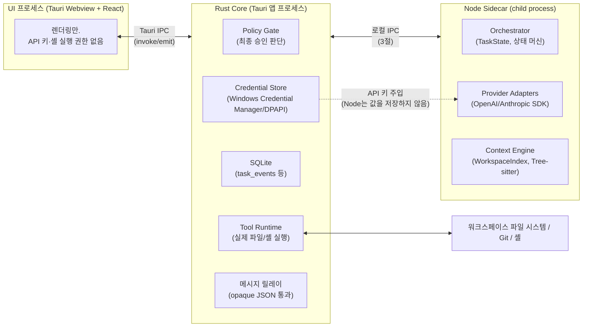

# 프로세스 구조 & IPC 설계

status: draft
관련: [state-machine-and-protocol.md](./state-machine-and-protocol.md) (프로토콜 타입, Rust/Node 타입 소유권 원칙), [context-engine.md](./context-engine.md) (`WorkspaceIndex` 소유권 — 이 문서에서 해결)

## 1. 설계 목표

- 지금까지의 설계 문서들은 "Rust core"와 "Node sidecar"가 존재하고 서로 통신한다는 걸 전제로 세부 사항(타입 소유권, 어댑터 계약)을 정했지만, **정작 세 프로세스(UI/Rust core/Node sidecar)가 실제로 어떻게 연결되는지는 문서화된 적이 없다.** 이 문서는 그 빈틈을 메운다.
- 원 아키텍처 제안서의 원칙을 프로세스 경계에 정확히 매핑한다: "UI 프로세스에는 API 키나 직접적인 셸 실행 권한을 두지 않는다", "LLM은 구조화된 도구 호출만 요청하고 실제 실행은 로컬 정책 엔진이 승인한 뒤 수행한다."
- **Rust core를 신뢰 경계(trust boundary)로, Node sidecar를 두뇌(orchestration + LLM 통신)로** 분리한다 — 이미 state-machine-and-protocol.md가 암묵적으로 전제한 방향("TypeScript가 프로토콜 타입의 단일 소스", "Rust는 정책 판단에 필요한 타입만 강타입")을 프로세스 수준에서 명시적으로 확정한다.

## 2. 프로세스 구성과 책임 분리



| 구성요소 | 프로세스 | 책임 |
|---|---|---|
| Orchestrator (상태 머신) | **Node** | `TaskState`/`TaskPhase` 소유, phase 전이 로직, 카운터 관리(clarificationRounds 등) |
| Provider Adapters | **Node** | OpenAI Responses API / Anthropic Messages API 공식 SDK 호출 (state-machine-and-protocol.md 13.3절 어댑터 계약) |
| Context Engine | **Node** | `WorkspaceIndex` 구축/증분 갱신, Tree-sitter 파싱, `WorkspaceSnapshot` 패키징 (context-engine.md 미해결 항목 해결 — 근거는 4절) |
| Policy Gate 최종 판단 | **Rust** | `ToolRequest` + `riskTier`를 받아 `auto_approve`/`require_user_approval`/`deny` 확정. Node가 1차 분류(`riskTier` 계산, 5절 allowlist 매칭)는 하지만 **실행 여부의 최종 게이트는 항상 Rust** |
| Tool Runtime (실행) | **Rust** | 승인된 `ToolRequest`만 실제로 실행 — 파일 I/O, `git`/기타 프로세스 spawn. Node는 실행 권한이 없음 |
| SQLite | **Rust** | `task_events`, `tool_requests`, `file_mutations` 등 — Rust가 유일한 쓰기 주체(단일 writer로 WAL 락 경합 최소화) |
| 자격증명 저장 | **Rust** | Windows Credential Manager/DPAPI. Node는 API 키를 **디스크에 저장하지 않고** 프로세스 시작 시 Rust가 환경변수/stdin으로 1회 주입, 메모리에만 보관 |
| UI 렌더링 | **UI (Tauri Webview)** | Rust가 릴레이하는 이벤트를 구독해 렌더링. API 키·셸 실행 권한 없음(원 제안서 원칙 그대로) |

**왜 Node가 두뇌이고 Rust가 게이트인가:** state-machine-and-protocol.md가 이미 "TypeScript가 프로토콜 타입의 단일 소스, Rust는 정책 판단에 필요한 타입만 강타입"이라고 정했다 — 이 문서는 그 결정을 프로세스 경계까지 그대로 확장한 것뿐이다. Node가 LLM SDK와 상태 머신을 다 갖고 있어도, **실제로 디스크에 쓰거나 프로세스를 실행하는 능력이 없으면** Node가 완전히 장악당해도(프롬프트 인젝션, SDK 취약점 등) 공격자는 "실행해달라고 요청"만 할 수 있을 뿐 Rust의 Policy Gate를 반드시 통과해야 한다 — Defense in depth.

## 3. Rust ↔ Node 로컬 IPC

- **채널:** Node sidecar는 Rust core가 자식 프로세스로 spawn하며, **stdio(stdin/stdout)**로 통신한다. 별도 소켓/named pipe 대신 stdio를 쓰는 이유: 앱 하나당 sidecar 하나뿐이라 멀티플렉싱이 필요 없고, 프로세스 생명주기(자식 종료 = 통신 종료)가 자동으로 맞아떨어진다. stderr는 Node 쪽 로그 전용으로 분리(프로토콜 메시지와 섞이지 않게).
- **프레이밍:** 줄바꿈으로 구분된 JSON(NDJSON) — 각 줄이 하나의 메시지. 사람이 읽기 쉬워 디버깅이 편하고, 별도 길이 프리픽스 파싱이 필요 없다. 메시지 크기가 매우 커질 수 있는 필드(예: `WorkspaceSnapshot.relevantFiles[].content`)는 원칙적으로 크게 문제되지 않지만, 8절에서 상한을 둔다.
- **메시지 형태:** JSON-RPC 2.0과 유사한 요청/응답 + 별도 이벤트 스트림 혼합.

```typescript
// Rust -> Node (요청) 또는 Node -> Rust (요청)
interface IpcRequest {
  kind: "request";
  id: string;         // 응답 매칭용
  method: string;      // 예: "provider.draft", "tool.execute", "policy.evaluate"
  params: unknown;     // state-machine-and-protocol.md의 프로토콜 타입들
}

interface IpcResponse {
  kind: "response";
  id: string;           // 대응하는 IpcRequest.id
  ok: boolean;
  result?: unknown;
  error?: { code: string; message: string };
}

// Node -> Rust, 스트리밍 진행상황 (응답을 기다리지 않고 발행)
interface IpcEvent {
  kind: "event";
  taskId: string;
  event: unknown;       // state-machine-and-protocol.md 7절 task_events의 event_type/payload와 동일 형태
}
```

- **누가 무엇을 요청하는가:**
  - Node → Rust: `tool.execute`(승인된 ToolRequest 실행), `policy.evaluate`(riskTier 최종 확정 요청), `db.appendEvent`(task_events insert), `credential.get`(API 키 요청, 세션 시작 시 1회)
  - Rust → Node: `task.start`(TaskRequest 전달, 새 태스크 시작), `task.cancel`, `task.userInput`(AWAITING_USER_INPUT에 대한 사용자 답변)
  - Node → Rust (event, 응답 없음): 태스크 진행 중 모든 phase 전이, DraftProposal/ReviewDecision 등 스트리밍 텍스트 조각

## 4. Rust ↔ UI (Tauri IPC)

- Tauri의 기본 메커니즘 그대로 사용: UI → Rust는 `invoke`(command), Rust → UI는 `emit`(event). 별도 프로토콜을 새로 만들지 않는다.
- Rust는 3절의 `IpcEvent`(Node가 보낸 것)를 **그대로 릴레이**한다 — state-machine-and-protocol.md 1절의 원칙("Rust 코어는 필요한 타입만 강타입, 나머지는 opaque JSON")이 여기서도 적용된다. Rust는 `event.event` 내용을 파싱하지 않고 `emit("task-event", event)`으로 그대로 웹뷰에 전달한다. 단, **Tool 실행 승인 요청만은 예외** — Rust가 직접 `policy.evaluate` 결과를 보고 `AWAITING_APPROVAL`이 필요하다고 판단하면, UI에 `invoke`용 커맨드가 아니라 `emit("approval-required", {...})`로 알리고 UI의 승인/거부는 `invoke("respond_approval", {...})`로 Rust에 돌아온다 — 이 왕복은 Node를 거치지 않고 Rust가 직접 처리한다(승인/거부는 정책 판단의 연장이므로 Rust 책임 소관, 2절 원칙과 일치).

## 5. 프로세스 생명주기

| 이벤트 | 처리 |
|---|---|
| 앱 시작 | Rust가 Node sidecar를 spawn, `ready` 메시지를 기다림(타임아웃 10초, 실패 시 UI에 "백엔드 초기화 실패" 표시 후 재시도 버튼) |
| Node sidecar 크래시 | Rust가 stdio 종료(EOF)를 감지 → 진행 중이던 태스크는 state-machine-and-protocol.md 7절의 재시작 복구 절차와 동일하게 처리(`EXECUTING` 중이었다면 `FAILED`, 그 외 phase는 이벤트 로그 기준으로 상태 재계산) → Node를 최대 2회 자동 재spawn 시도, 계속 실패하면 사용자에게 알림 |
| 앱 정상 종료 | Rust가 Node에 `shutdown` 요청 → Node가 진행 중인 in-flight Provider 호출을 취소하고 `ok` 응답 → Rust가 자식 프로세스 종료 대기(타임아웃 5초 후 강제 종료) |
| Node sidecar 버전 불일치 | Node가 `ready` 메시지에 프로토콜 버전을 포함시키고, Rust가 지원 버전과 다르면 즉시 종료 후 사용자에게 "앱을 업데이트하세요" — Node/Rust는 항상 같은 앱 배포판 안에서 버전이 고정되므로(원격 배포 아님) 이 케이스는 개발 중 버전 스큐 방지용 안전장치 성격이 강하다 |

## 6. WorkspaceIndex 소유권 결정 (context-engine.md 미해결 항목)

**Node가 소유한다.** 근거:

- Tree-sitter는 언어 문법을 npm 패키지(예: `tree-sitter`, `tree-sitter-typescript` 등)로 배포하는 생태계가 Rust crate 생태계보다 이 프로젝트 맥락에서 더 성숙하고 최신 문법 업데이트가 빠르다.
- `WorkspaceIndex`는 순수 데이터 가공(파싱, 그래프 구성)이지 OS 권한이 필요한 작업이 아니다 — 2절의 "Rust는 신뢰 경계"라는 역할 분리 원칙에 따르면 권한이 필요 없는 작업은 Node에 두는 게 일관적이다.
- `WorkspaceSnapshot`(태스크별 패키징 결과)을 만드는 것도 결국 `DraftProposal`/`ReviewDecision`과 같은 흐름으로 Node의 Orchestrator가 소비하므로, 인덱스와 소비자가 같은 프로세스에 있으면 프로세스 간 대용량 데이터 전송(파일 트리 전체, 심볼 테이블)을 피할 수 있다 — `WorkspaceIndex` 자체는 Rust나 UI로 넘어갈 필요가 없다(SQLite에 저장할 때만 3절 IPC로 Rust에 전달).
- 파일 시스템 접근 자체(읽기)는 필요하지만, `read_file`/`list_files`는 이미 Tool Runtime(Rust)을 거치는 도구이므로, `WorkspaceIndex` 구축도 초기 전체 스캔 시에는 Node가 Rust의 `list_files`/`read_file`을 호출해 파일을 받아오는 방식을 쓴다 — Node가 워크스페이스 파일 시스템에 직접 접근하지 않는다(신뢰 경계 원칙 유지, 원 제안서의 "UI 프로세스에는... 직접적인 셸 실행 권한을 두지 않는다"와 같은 정신을 Node에도 적용).

## 7. 보안 경계 요약

| 능력 | UI | Node | Rust |
|---|---|---|---|
| API 키 보유 | ✗ | ✗ (메모리에만, 재주입 필요) | ✓ (자격증명 저장소) |
| 파일 읽기/쓰기 | ✗ | ✗ (Rust의 `read_file`/`apply_patch` 호출을 통해서만) | ✓ |
| 셸 프로세스 실행 | ✗ | ✗ | ✓ (승인된 `run_command`만) |
| LLM API 호출 | ✗ | ✓ | ✗ |
| Policy Gate 최종 판단 | ✗ | ✗ (1차 분류만) | ✓ |
| SQLite 쓰기 | ✗ | ✗ (Rust에 `db.appendEvent` 요청) | ✓ |

## 8. 다음으로 구체화할 것

- NDJSON 메시지 크기 상한 — `WorkspaceSnapshot`처럼 큰 페이로드가 매 메시지 파싱을 느리게 만들 가능성, 필요시 파일 내용은 별도 임시 파일 경로로 참조하고 IPC 메시지엔 경로만 담는 방식 검토
- Node sidecar의 정확한 spawn 커맨드/패키징 방식(pkg로 단일 바이너리화 vs 시스템 Node.js 요구 vs Node 런타임 임베딩) — 배포 크기와 "Node 20+ 필요" 요구사항 노출 여부에 영향
- `credential.get` 요청을 Node가 남용(과도한 재요청)하지 못하도록 하는 rate limit — 신뢰 경계 원칙상 Node가 이상 동작해도 자격증명 재주입 빈도로 이상 탐지가 가능해야 함
- 멀티 워크스페이스 지원 시 Node sidecar를 워크스페이스당 1개씩 둘지 공유할지 (context-engine.md의 멀티 워크스페이스 미해결 항목과 연결)
