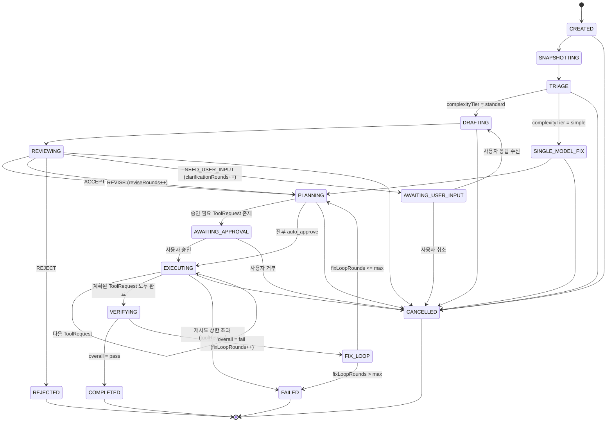

# 크로스 검증 상태 머신 & 공통 프로토콜 스키마

status: draft
관련: [../architecture-overview.md](./architecture-overview.md) (아직 없음 — 전체 개요 문서화 시 링크)

## 1. 설계 목표

- 하나의 TaskRequest가 시작부터 끝까지 거치는 **단일 상태 머신**을 정의한다. OpenAI/Claude 각각의 내부 루프가 아니라, 오케스트레이터가 소유하는 전역 상태다.
- 모든 루프(재질문, 수정 요청, 검증 실패 후 재수정)는 **상한이 있는 카운터**로 제어한다. 상한 없는 루프는 허용하지 않는다.
- LLM이 반환하는 값과 오케스트레이터/도구 런타임이 다루는 값을 분리한다. Rust 코어는 `ToolRequest`/`ToolResult`/`PolicyDecision`처럼 **정책 판단에 필요한 타입만 강하게 타이핑**하고, `DraftProposal`/`ReviewDecision`처럼 UI 렌더링용 콘텐츠는 opaque JSON으로 통과시킨다. 이렇게 하면 OpenAI/Anthropic 응답 포맷이 바뀌어도 Rust 코어를 건드릴 일이 줄어든다.
- 스키마의 단일 소스는 TypeScript(Node sidecar가 이 타입들을 직접 다루므로)로 두고, Rust 쪽은 필요한 필드만 `serde`로 부분 역직렬화한다. 향후 스키마가 안정되면 JSON Schema로 승격해 codegen(`typify` 등)을 고려한다.

## 2. 상태 머신



`TRIAGE`/`SINGLE_MODEL_FIX`는 13절(Phase 0 스파이크 결과 반영)에서 추가된 상태다 — 원래 설계에는 없었고, 스파이크가 "쉬운 태스크에서는 교차검증이 정확도 이득 없이 비용/지연만 늘린다"는 걸 실측으로 보여준 뒤 반영되었다.

### 2.1 Phase 설명 및 종료 조건

| Phase | 담당 | 진입 조건 | 종료/전이 |
|---|---|---|---|
| `CREATED` | Orchestrator | TaskRequest 수신 | 즉시 SNAPSHOTTING |
| `SNAPSHOTTING` | Context Engine | - | WorkspaceSnapshot 생성 완료 → TRIAGE |
| `TRIAGE` | Orchestrator | WorkspaceSnapshot 완료 | 13.2절 규칙으로 `complexityTier` 결정 → standard면 DRAFTING, simple이면 SINGLE_MODEL_FIX |
| `DRAFTING` | OpenAI Provider | Snapshot + (재질문 시) 사용자 답변 | DraftProposal 수신 → REVIEWING |
| `SINGLE_MODEL_FIX` | Claude Provider | Snapshot (OpenAI 초안 없음) | Claude가 직접 수정안 생성 → PLANNING (verdict 없음, ACCEPT와 동일하게 취급) |
| `REVIEWING` | Claude Provider | DraftProposal + 동일 Snapshot | ReviewDecision.verdict에 따라 4갈래 분기 |
| `AWAITING_USER_INPUT` | UI | verdict = NEED_USER_INPUT | 사용자 응답 → DRAFTING, 취소 → CANCELLED |
| `PLANNING` | Orchestrator | ACCEPT/REVISE 확정, SINGLE_MODEL_FIX 완료, 또는 FIX_LOOP에서 복귀 | 결과를 ExecutionPlan(ToolRequest[])으로 변환 |
| `AWAITING_APPROVAL` | Policy Gate + UI | ExecutionPlan 내 riskTier != auto | 사용자 승인/거부 |
| `EXECUTING` | Tool Runtime | 승인 완료 | 각 ToolRequest 순차 실행, 전부 완료 시 VERIFYING |
| `VERIFYING` | Verify 서브시스템 | ExecutionPlan 적용 완료 | build/test/lint/diff 결과 종합 |
| `FIX_LOOP` | Claude Provider | VerificationReport.overall = fail | VerificationReport를 Claude에 다시 전달, 수정된 결과 요청 (원래 tier와 무관하게 항상 Claude 단독 호출이므로 tier 재분류 불필요) |
| `COMPLETED` / `FAILED` / `CANCELLED` / `REJECTED` | - | 터미널 상태 | FinalResult 생성, UI에 전달 |

### 2.2 루프 상한 (기본값, 설정 가능해야 함)

| 카운터 | 어디서 증가 | 기본 상한 | 초과 시 |
|---|---|---|---|
| `clarificationRounds` | NEED_USER_INPUT 진입 시 | 2 | AWAITING_USER_INPUT에서 더 이상 재질문하지 않고, 사용자에게 "모호함을 해소하지 못함"으로 FAILED 전환 |
| `reviseRounds` | REVISE verdict 수신 시 (실행 전 단계) | 2 | 강제로 REJECTED 처리, "OpenAI/Claude가 계획에 합의하지 못함" 사유 기록 |
| `fixLoopRounds` | VERIFYING → fail 판정 시 | 3 | FAILED, 마지막 diff/로그를 사용자에게 제시하고 수동 개입 요청 |
| `toolRetries[requestId]` | ToolResult.status = timeout/transient error | 2 (지수 백오프) | 해당 ToolRequest를 `error`로 확정, EXECUTING 전체를 FAILED로 전이 |

모든 상한 값은 `TaskPolicy` 설정(워크스페이스별 override 가능)에서 읽는다. 하드코딩하지 않는다.

## 3. 프로토콜 스키마 (TypeScript, 단일 소스)

Node sidecar와 UI가 공유하는 정식 타입. Rust 코어는 `ToolRequest`, `ToolResult`, `PolicyDecision`, `TaskState`(카운터/phase만)를 제외한 나머지는 `serde_json::Value`로 그대로 통과시킨다.

```typescript
// ---- 공통 ----
type ISODateTime = string;
type Verdict = "ACCEPT" | "REVISE" | "REJECT" | "NEED_USER_INPUT";
type RiskTier = "auto" | "conditional" | "user_approval" | "blocked";

// ---- 1. TaskRequest ----
interface TaskRequest {
  taskId: string;
  sessionId: string;
  workspaceId: string;
  userMessage: string;
  attachments?: { path: string; note?: string }[];
  createdAt: ISODateTime;
}

// ---- 2. WorkspaceSnapshot ----
interface WorkspaceSnapshot {
  snapshotId: string;
  workspaceId: string;
  gitHead: string;
  gitBranch: string;
  gitDirty: boolean;
  gitDiffSummary?: string;
  relevantFiles: {
    path: string;
    reason: "mentioned" | "symbol-match" | "recently-changed" | "dependency";
    content: string;
    truncated: boolean;
  }[];
  projectMeta: {
    languages: string[];
    buildCommand?: string;
    testCommand?: string;
    lintCommand?: string;
    agentsMdPresent: boolean;
  };
  tokenBudget: { provider: "openai" | "anthropic"; maxTokens: number }[];
  createdAt: ISODateTime;
}

// ---- 3. DraftProposal (OpenAI 산출물) ----
interface PlanStep {
  stepId: string;
  description: string;
  toolHint?: "apply_patch" | "create_file" | "delete_file" | "run_command" | "run_tests";
  targetPaths?: string[];
}

interface DraftProposal {
  taskId: string;
  proposalId: string;
  interpretation: string;
  relevantFiles: { path: string; reason: string }[];
  plan: PlanStep[];
  patch?: string; // unified diff
  risks: string[];
  requiredTests: string[];
  uncertainties: string[];
  doneCriteria: string[];
  model: string;
  createdAt: ISODateTime;
}

// ---- 4. ReviewDecision (Claude 산출물) ----
interface ReviewDecision {
  taskId: string;
  proposalId: string;
  verdict: Verdict;
  rationale: string;
  revisedPlan?: PlanStep[];
  revisedPatch?: string;
  questionsForUser?: string[]; // verdict = NEED_USER_INPUT
  rejectionReason?: string;    // verdict = REJECT
  model: string;
  createdAt: ISODateTime;
}

// ---- 5. ExecutionPlan / ToolRequest (오케스트레이터 소유, Rust가 강타입으로 다룸) ----
interface ToolRequest {
  requestId: string;
  taskId: string;
  tool: "list_files" | "search_text" | "read_file" | "apply_patch"
      | "create_file" | "delete_file" | "run_command"
      | "git_status" | "git_diff" | "run_tests";
  args: Record<string, unknown>;
  requestedBy: "openai" | "claude" | "orchestrator";
  riskTier: RiskTier;
  createdAt: ISODateTime;
}

interface ExecutionPlan {
  taskId: string;
  planId: string;
  toolRequests: ToolRequest[];
  approvalRequired: boolean;
}

interface ToolResult {
  requestId: string;
  status: "ok" | "error" | "denied" | "timeout";
  output?: unknown;
  error?: string;
  durationMs: number;
  completedAt: ISODateTime;
}

interface PolicyDecision {
  requestId: string;
  decision: "auto_approve" | "require_user_approval" | "deny";
  matchedRule: string;
  reason: string;
}

// ---- 6. VerificationReport ----
interface VerificationCheck {
  kind: "build" | "test" | "lint" | "typecheck" | "diff_review";
  command?: string;
  status: "pass" | "fail" | "skipped";
  summary: string;
  detail?: string;
}

interface VerificationReport {
  taskId: string;
  reportId: string;
  checks: VerificationCheck[];
  overall: "pass" | "fail";
  createdAt: ISODateTime;
}

// ---- 7. TaskState (오케스트레이터 내부 상태, append-only 이벤트 로그와 함께 저장) ----
type TaskPhase =
  | "CREATED" | "SNAPSHOTTING" | "TRIAGE" | "DRAFTING" | "SINGLE_MODEL_FIX" | "REVIEWING"
  | "AWAITING_USER_INPUT" | "PLANNING" | "AWAITING_APPROVAL"
  | "EXECUTING" | "VERIFYING" | "FIX_LOOP"
  | "COMPLETED" | "FAILED" | "CANCELLED" | "REJECTED";

type ComplexityTier = "simple" | "standard";

interface TaskState {
  taskId: string;
  phase: TaskPhase;
  complexityTier: ComplexityTier | null; // TRIAGE 완료 전에는 null
  counters: {
    clarificationRounds: number;
    reviseRounds: number;
    fixLoopRounds: number;
    toolRetries: Record<string, number>;
  };
}

// ---- 8. FinalResult ----
type FailureReason =
  | "clarification_exhausted"    // AWAITING_USER_INPUT 재질문 상한 초과
  | "revise_exhausted"           // 실행 전 REVISE 루프 상한 초과
  | "fix_loop_exhausted"         // 검증 실패 후 수정 루프 상한 초과
  | "tool_retry_exhausted"       // 도구 실행 재시도 상한 초과 (7절 toolRetries)
  | "provider_retry_exhausted"   // LLM 호출 인프라 재시도 상한 초과 (9절 providerRetries)
  | "provider_config_error"      // API 키/설정 오류 등 재시도 무의미한 오류
  | "app_restart_interrupted";   // EXECUTING 도중 앱 재시작으로 중단 (10절)

interface FinalResult {
  taskId: string;
  status: "completed" | "failed" | "cancelled" | "rejected";
  failureReason?: FailureReason; // status = "failed"일 때만
  summary: string;
  finalDiff?: string;
  verificationReport?: VerificationReport;
  auditTrailEventIds: string[];
  completedAt: ISODateTime;
}
```

## 4. Policy Gate 기본 매핑 (초안)

`ToolRequest.tool` → 기본 `riskTier`. 워크스페이스 설정으로 override 가능해야 하며, `blocked`는 override로도 못 푼다(예: workspace 바깥 경로 쓰기).

| tool | 기본 riskTier | 비고 |
|---|---|---|
| `list_files`, `search_text`, `read_file`, `git_status`, `git_diff` | `auto` | 읽기 전용 |
| `apply_patch`, `create_file` | `conditional` | workspace 내부 경로면 auto, 아니면 `blocked` |
| `delete_file` | `user_approval` | |
| `run_tests` | `conditional` | 프로젝트 정의 test 커맨드면 auto, 임의 커맨드면 `user_approval` |
| `run_command` | `user_approval` | allowlist(예: `git`, 프로젝트 package manager) 매칭 시 `conditional`로 완화 가능, 그 외 항상 승인 |
| workspace 외부 경로 대상 모든 tool | `blocked` | 정책으로도 해제 불가 |

## 5. `run_command` allowlist 문법

**전제: `run_command`의 `args`는 셸 문자열이 아니라 argv 배열이다.**

```typescript
interface RunCommandArgs {
  executable: string;      // "git", "npm", "pytest" — PATH에서 resolve, basename 비교
  args: string[];          // ["status", "--short"] — shell 파싱 없음
  cwd: string;             // workspace root 기준 상대경로, ".." 세그먼트 금지
  shell?: false;            // true를 요청하면 allowlist 무시하고 항상 user_approval (파이프/리다이렉트 등은 신뢰 불가)
}
```

셸 문자열(`"git status && rm -rf /"` 같은) 형태의 명령을 애초에 도구 인터페이스에서 받지 않는다. 이렇게 하면 셸 메타문자 인젝션 문제 자체가 없어지고, allowlist 매칭이 결정론적이 된다.

### 5.1 Rule 스키마

```typescript
interface CommandRule {
  executable: string;
  argPattern?: string[];      // 위치 기반 glob. "*" = 인자 1개, "**" = 나머지 전부 (마지막 세그먼트에만 허용)
  cwdMustBeWorkspaceRoot?: boolean; // 기본 true
  effect: "auto" | "conditional";   // conditional = UI에 원클릭 승인으로 노출(사유 요약 포함), auto = 무음 허용
}

interface CommandPolicy {
  allow: CommandRule[];   // 순서대로 first-match
  deny: CommandRule[];    // allow보다 항상 우선 평가, 매치 시 riskTier = "blocked" (override 불가)
}
```

매칭 순서: **deny 규칙을 먼저 전체 스캔** → 하나라도 매치하면 `blocked` 확정, 더 볼 것 없음. 그다음 `allow`를 순서대로 first-match. 아무 규칙도 안 맞으면 도구 기본값(`run_command` = `user_approval`)으로 폴백.

### 5.2 기본 워크스페이스 정책 예시

```json
{
  "deny": [
    { "executable": "sudo" },
    { "executable": "runas" },
    { "executable": "reg" },
    { "executable": "netsh" },
    { "executable": "powershell", "argPattern": ["-enc", "**"] },
    { "executable": "git", "argPattern": ["push", "--force", "**"] },
    { "executable": "git", "argPattern": ["push", "-f", "**"] }
  ],
  "allow": [
    { "executable": "git", "argPattern": ["status", "**"], "effect": "auto" },
    { "executable": "git", "argPattern": ["diff", "**"], "effect": "auto" },
    { "executable": "git", "argPattern": ["log", "**"], "effect": "auto" },
    { "executable": "git", "argPattern": ["show", "**"], "effect": "auto" },
    { "executable": "git", "argPattern": ["branch", "--list"], "effect": "auto" },
    { "executable": "git", "argPattern": ["add", "**"], "effect": "conditional" },
    { "executable": "git", "argPattern": ["commit", "**"], "effect": "conditional" },
    { "executable": "npm", "argPattern": ["test"], "effect": "conditional" },
    { "executable": "npm", "argPattern": ["run", "*"], "effect": "conditional" },
    { "executable": "pytest", "argPattern": ["**"], "effect": "conditional" }
  ]
}
```

`npm run *`처럼 스크립트명이 와일드카드인 규칙은 Context Engine이 `package.json`의 `scripts` 키를 미리 인덱싱해서, 실제 정의된 스크립트명과 일치할 때만 `conditional`로 허용하고 그 외엔 `user_approval`로 떨어뜨린다 (임의 스크립트 주입 방지).

경로 인자(파일/디렉터리로 보이는 인자)는 별도로 workspace root 기준 canonicalize 후, root 바깥으로 벗어나면 규칙 매치 여부와 무관하게 `blocked` — 이건 Policy Gate가 `CommandRule` 매칭과 별개로 항상 적용하는 하드 체크다.

## 6. FIX_LOOP 재전달 페이로드

전체 로그를 매번 다시 보내면 토큰 예산이 빠르게 소진되고, `fixLoopRounds`가 올라갈수록 컨텍스트가 누적 팽창한다. 두 가지로 분리한다.

- **`VerificationReport`**: 감사/UI용 전체 기록. SQLite/artifact store에 그대로 저장.
- **`VerificationDigest`**: Claude에게 실제로 보내는 축약본. 실패한 체크만 상세, 통과한 체크는 한 줄 요약.

```typescript
interface VerificationDigest {
  taskId: string;
  reportId: string;
  attemptNumber: number;              // = fixLoopRounds
  failingChecks: {
    kind: VerificationCheck["kind"];
    command?: string;
    exitCode?: number;
    excerpt: string;                  // head N줄 + tail M줄 (기본 40/40), 중간 생략 표시
    fileReferences: { path: string; line?: number }[]; // 컴파일러/테스트 출력에서 정규식으로 추출
  }[];
  passingChecksSummary: string;       // 예: "lint: pass, typecheck: pass"
}
```

FIX_LOOP에서 Claude 호출 시 함께 보내는 것:

1. 원본 `TaskRequest`, `WorkspaceSnapshot`(참조로, 재전송 아님 — provider가 대화 상태를 유지하지 않는다면 필요한 부분만 재삽입)
2. 직전 `ReviewDecision`
3. **`WorkspaceDelta`** — 전체 스냅샷이 아니라 EXECUTING 단계에서 실제로 바뀐 파일의 diff만

```typescript
interface WorkspaceDelta {
  baseSnapshotId: string;
  changedFiles: { path: string; diff: string }[]; // unified diff, base snapshot 대비
  createdAt: ISODateTime;
}
```

4. `VerificationDigest`

토큰 예산 규칙: `VerificationDigest` + `WorkspaceDelta` 합이 태스크 잔여 예산의 30%를 넘으면, 실패 체크 중 우선순위 낮은 것(예: lint)의 `excerpt`부터 줄인다. `build`/`test` 실패는 마지막까지 보존한다.

## 7. 이벤트 로그 & SQLite 스키마

설계 원칙: `task_events`가 append-only 진실의 원천이고, `tasks.phase`/`counters`는 매 이벤트 삽입과 같은 트랜잭션 안에서 갱신되는 파생 캐시다. 이렇게 하면 (a) UI가 히스토리를 재생할 수 있고 (b) 앱이 크래시돼도 재시작 시 마지막 이벤트+카운터로 진행 중이던 태스크 상태를 복원할 수 있다.

큰 콘텐츠(파일 전체 내용, patch, 전체 로그)는 `payload_json`에 인라인하지 않는다. 8KB 넘는 페이로드는 `%APPDATA%/Tomverse Code/artifacts/<taskId>/<eventId>.blob` 파일로 쓰고 JSON에는 경로+해시만 남긴다. SQLite WAL 비대화를 막기 위함이다.

```sql
CREATE TABLE workspaces (
  workspace_id   TEXT PRIMARY KEY,
  root_path      TEXT NOT NULL UNIQUE,
  name           TEXT NOT NULL,
  policy_json    TEXT NOT NULL DEFAULT '{}',
  created_at     TEXT NOT NULL
);

CREATE TABLE sessions (
  session_id     TEXT PRIMARY KEY,
  workspace_id   TEXT NOT NULL REFERENCES workspaces(workspace_id),
  title          TEXT,
  started_at     TEXT NOT NULL
);

CREATE TABLE tasks (
  task_id        TEXT PRIMARY KEY,
  session_id     TEXT NOT NULL REFERENCES sessions(session_id),
  workspace_id   TEXT NOT NULL REFERENCES workspaces(workspace_id),
  user_message   TEXT NOT NULL,
  phase          TEXT NOT NULL,       -- TaskPhase
  counters_json  TEXT NOT NULL,       -- { clarificationRounds, reviseRounds, fixLoopRounds, toolRetries }
  final_status   TEXT,                -- null 이면 아직 진행 중
  created_at     TEXT NOT NULL,
  updated_at     TEXT NOT NULL
);

CREATE TABLE task_events (
  event_id       INTEGER PRIMARY KEY AUTOINCREMENT,
  task_id        TEXT NOT NULL REFERENCES tasks(task_id),
  seq            INTEGER NOT NULL,    -- task 내 순번, (task_id, seq) unique
  event_type     TEXT NOT NULL,       -- 아래 이벤트 타입 목록
  payload_json   TEXT NOT NULL,       -- 8KB 초과분은 artifact 참조로 대체
  created_at     TEXT NOT NULL,
  UNIQUE(task_id, seq)
);
CREATE INDEX idx_task_events_task ON task_events(task_id, seq);

CREATE TABLE tool_requests (
  request_id     TEXT PRIMARY KEY,
  task_id        TEXT NOT NULL REFERENCES tasks(task_id),
  plan_id        TEXT NOT NULL,
  tool           TEXT NOT NULL,
  args_json      TEXT NOT NULL,
  risk_tier      TEXT NOT NULL,
  requested_by   TEXT NOT NULL,       -- openai | claude | orchestrator
  created_at     TEXT NOT NULL
);
CREATE INDEX idx_tool_requests_task ON tool_requests(task_id);

CREATE TABLE tool_results (
  request_id     TEXT PRIMARY KEY REFERENCES tool_requests(request_id),
  status         TEXT NOT NULL,       -- ok | error | denied | timeout
  output_ref     TEXT,                -- artifact 경로 또는 인라인 JSON (짧은 경우)
  error          TEXT,
  duration_ms    INTEGER NOT NULL,
  completed_at   TEXT NOT NULL
);

CREATE TABLE verification_reports (
  report_id      TEXT PRIMARY KEY,
  task_id        TEXT NOT NULL REFERENCES tasks(task_id),
  attempt_number INTEGER NOT NULL,    -- = fixLoopRounds 당시 값
  overall        TEXT NOT NULL,       -- pass | fail
  checks_json    TEXT NOT NULL,
  created_at     TEXT NOT NULL
);
CREATE INDEX idx_verification_reports_task ON verification_reports(task_id);

CREATE TABLE snapshots (
  snapshot_id    TEXT PRIMARY KEY,
  workspace_id   TEXT NOT NULL REFERENCES workspaces(workspace_id),
  git_head       TEXT NOT NULL,
  meta_json      TEXT NOT NULL,       -- projectMeta, tokenBudget 등. relevantFiles 본문은 artifact로
  created_at     TEXT NOT NULL
);
```

`task_events.event_type` 값: `TASK_CREATED`, `SNAPSHOT_CREATED`, `DRAFT_RECEIVED`, `REVIEW_RECEIVED`, `PLAN_CREATED`, `APPROVAL_REQUESTED`, `APPROVAL_GRANTED`, `APPROVAL_DENIED`, `TOOL_REQUESTED`, `TOOL_COMPLETED`, `VERIFICATION_COMPLETED`, `FIX_LOOP_STARTED`, `PHASE_CHANGED`, `USER_MESSAGE_RECEIVED`, `TASK_COMPLETED`, `TASK_FAILED`, `TASK_CANCELLED`, `TASK_REJECTED`.

재시작 복구 절차: 앱 기동 시 `final_status IS NULL`인 `tasks` 행을 찾고, 각각의 최신 `task_events` 행 하나를 읽어 `phase`/`counters_json`이 이벤트 로그와 일치하는지 검증한다(불일치 시 이벤트 로그가 우선하며 `tasks` 행을 재계산). `EXECUTING` 중 크래시난 태스크는 재개하지 않고 `FAILED`(사유: "앱 재시작으로 중단됨")로 확정한 뒤 사용자에게 재시도를 맡긴다 — 부분 실행된 `ToolRequest`의 실행 재개는 멱등성 보장이 안 되면 위험하므로 MVP 범위에서는 자동 재개를 하지 않는다.

## 8. Context Engine 스크립트 인덱싱

5절의 `run_command` allowlist(`npm run *` 등)가 실제 프로젝트에 정의된 스크립트인지 확인할 때 쓰는 인덱스. 모노레포를 고려해 workspace root 하나가 아니라 **매니페스트 단위(package)**로 인덱싱한다.

```typescript
interface ScriptIndex {
  workspaceId: string;
  packages: PackageScripts[];
  indexedAt: ISODateTime;
  sourceHash: string; // 모든 매니페스트 파일 해시 — 캐시 무효화 판단용
}

interface PackageScripts {
  manifestPath: string;      // "packages/api/package.json"
  packageRoot: string;       // 매니페스트가 있는 디렉터리, workspace root 기준 상대경로
  ecosystem: "npm" | "python" | "cargo" | "dotnet";
  scripts: {
    name: string;             // "test", "build", "lint"
    command: string;          // 매니페스트 원문 그대로 — 감사/표시용, 절대 이 문자열을 셸로 실행하지 않음
    parsedExecutable?: string; // best-effort 파싱 (예: "jest --coverage" → "jest")
    suspicious: boolean;      // 휴리스틱: curl|sh, rm -rf, sudo, 알 수 없는 호스트로 네트워크 호출 등
  }[];
}
```

- **탐색 대상(v1)**: `package.json`(scripts), `pyproject.toml`(`[project.scripts]`/`[tool.poetry.scripts]`), `Cargo.toml`(사용자 정의 스크립트 없음 — cargo 표준 서브커맨드는 4절 allowlist에서 별도 규칙으로 다룸), `.csproj`/`.sln`은 v1 범위에서 스크립트 개념이 약해 제외.
- **재인덱싱 트리거**: 스냅샷 생성 시 1회, 이후 매니페스트 파일이 git diff에 포함될 때 증분 재인덱싱.
- **suspicious 판정**: `Policy Gate`가 이 플래그를 보고 `effect: "conditional"`을 절대 부여하지 않는다 — suspicious=true인 스크립트는 이름이 allowlist 패턴과 맞아도 항상 `user_approval`로 떨어진다.
- Policy Gate 매칭 시점에는 `ToolRequest.args.cwd`와 일치하는 `packageRoot`를 가진 `PackageScripts`에서만 스크립트명을 찾는다 (다른 패키지의 `test` 스크립트를 엉뚱한 디렉터리에서 실행 허용하는 것 방지).

## 9. Provider 호출 재시도 (인프라 재시도 vs 의미론적 루프 분리)

`toolRetries`(7절)는 로컬 도구 실행 실패에 대한 재시도다. 이것과 완전히 다른 축으로, **LLM API 호출 자체의 인프라 재시도**가 필요하다 — rate limit(429), 5xx, 네트워크 타임아웃 같은 건 모델의 판단과 무관한 전송 계층 문제이므로 `reviseRounds`/`fixLoopRounds`(의미론적 루프, 모델이 실제로 판정을 내린 횟수)와 섞으면 안 된다.

```typescript
interface TaskState {
  taskId: string;
  phase: TaskPhase;
  complexityTier: ComplexityTier | null;
  counters: {
    clarificationRounds: number;
    reviseRounds: number;
    fixLoopRounds: number;
    toolRetries: Record<string, number>;
    providerRetries: Record<string, number>; // key = "draft:1", "review:2", "fix:1" 등 호출 식별자
  };
}
```

| 오류 유형 | 재시도 정책 | 최대 시도 |
|---|---|---|
| 429 (rate limit) | `Retry-After` 헤더 우선 존중, 없으면 지수 백오프(base 2s, cap 60s) | 3 |
| 5xx / 네트워크 타임아웃 | 지수 백오프(base 1s, cap 30s) | 3 |
| 4xx (429 제외: 인증 오류, 잘못된 요청, 콘텐츠 정책 위반) | 재시도 안 함 — 일시적 문제가 아님 | 즉시 실패 |
| 스트리밍 중 연결 끊김 | 부분 응답 폐기, 프롬프트 그대로 1회 재호출 (resume 아님 — provider가 이어받기를 지원하지 않음) | 위 표의 해당 오류 유형 카운트에 포함 |

`providerRetries`가 상한(3)을 넘으면 `FAILED`, `failureReason: "provider_retry_exhausted"`. 인증 오류 등 4xx는 재시도 없이 즉시 `FAILED`, `failureReason: "provider_config_error"` — 사용자가 API 키를 고치기 전엔 재시도해봐야 소용없으므로 루프를 태우지 않는다.

## 10. REJECTED/FAILED 종료 시 롤백 UX

**REJECTED는 되돌릴 파일이 없다** — REJECT 판정은 REVIEWING 단계(PLANNING/EXECUTING 이전)에서만 나오므로 아직 아무 파일도 건드리지 않은 상태다. 롤백이 실제로 필요한 건 `FAILED`(EXECUTING/VERIFYING 중 발생 가능)와 `CANCELLED`(EXECUTING 도중 취소) 뿐이다.

**git stash 대신 태스크 단위 파일 되돌리기를 쓴다.** git stash는 사용자가 Tomverse Code와 무관하게 작업 중이던 uncommitted 변경사항까지 전부 쓸어담아 혼란을 준다. 대신 Tool Runtime이 파일을 변경하는 모든 `ToolRequest`(`apply_patch`/`create_file`/`delete_file`) 결과에 이미 diff 표시를 위해 필요한 pre-image/post-image를 남기므로, 이걸 재사용해 **이 태스크가 건드린 파일만** 정확히 원상복구한다.

```typescript
interface FileMutationRecord {
  requestId: string;
  path: string;
  preImage: { existed: boolean; contentRef?: string };  // artifact 참조, 없었으면 existed=false
  postImage: { existed: boolean; contentRef?: string };
}
```

- `ToolResult.output`의 일부로 저장하거나 별도 `file_mutations` 테이블로 분리(쿼리 편의상 후자 권장, 7절 스키마에 추가 예정).
- UI: `FAILED`/`CANCELLED` 화면에 "이 작업이 변경한 N개 파일" 목록과 "되돌리기" 버튼. `FAILED`는 되돌리기가 기본 추천(깨진 상태 방치 방지), `CANCELLED`는 사용자 선택에 맡긴다(부분 진행 결과를 원할 수도 있음).
- **되돌리기도 일반 `ToolRequest` 경로를 그대로 탄다** — pre-image를 역방향 patch로 만들어 `apply_patch`/`create_file`/`delete_file`을 다시 큐잉하고 정상적으로 이벤트 로그에 남긴다. 감사 추적에 예외가 없어야 한다.

## 11. Artifact 디렉터리 GC 정책

저장 위치: `%APPDATA%/Tomverse Code/artifacts/<taskId>/...` (7절에서 정의한 8KB 초과 payload들).

- **활성 태스크(터미널 상태 아님)는 절대 GC 대상 아님.**
- **터미널 태스크**(`COMPLETED`/`FAILED`/`CANCELLED`/`REJECTED`)는 기본 30일 보관(설정 가능) 후 정리 대상.
- **디스크 용량 상한**(기본 2GB, 설정 가능)을 넘으면 30일이 안 지났어도 `completed_at` 기준 오래된 터미널 태스크부터 GC — 단, 사용자가 현재 UI에 열어둔 세션의 태스크는 터미널 상태여도 건드리지 않는다.
- GC는 태스크 디렉터리 통째로 삭제. **[context-engine.md](./context-engine.md)에서 결론**: 태스크 artifact로 저장되는 `WorkspaceSnapshot`(선택·패키징 결과, 이 GC 대상)과 세션 스코프로 증분 갱신되는 `WorkspaceIndex`(심볼/의존성 그래프 등 비싼 인덱스, 워크스페이스 단위로 별도 보관되며 이 GC 대상이 아님)는 서로 다른 저장 단위다. 따라서 "스냅샷은 태스크 전용"이라는 가정은 `WorkspaceSnapshot`에 한해 여전히 유효하며, 멀티턴 세션의 재사용/증분 갱신은 `WorkspaceIndex` 쪽에서 이미 반영되었다(context-engine.md 2~3절) — dangling reference 걱정 없음.
- artifact가 지워져도 `tasks`/`task_events`/`verification_reports`의 경량 메타데이터(pass/fail, phase, 타임스탬프)는 영구 보관(작아서 비용이 적고, 세션 히스토리/통계에 필요). `tasks`에 `artifacts_purged BOOLEAN` 컬럼을 추가해 UI가 "로그가 정리됨"을 깨진 링크 대신 표시하게 한다.
- 트리거: 앱 시작 시 1회 + 실행 중 6시간마다, 사용자 액션을 막지 않는 백그라운드 작업으로. 설정 화면에 "지금 정리" 수동 버튼도 둔다.

## 12. 다음으로 구체화할 것

- ~~멀티턴 세션에서 `WorkspaceSnapshot`을 태스크마다 새로 만들지, 세션 내에서 재사용/증분 갱신할지~~ → [context-engine.md](./context-engine.md)에서 "세션 스코프 `WorkspaceIndex` + 태스크 스코프 `WorkspaceSnapshot`" 2계층 구조로 해결
- ~~OpenAI Responses API / Anthropic Messages API 필드를 `DraftProposal`/`ReviewDecision`으로 매핑하는 실제 어댑터 계약~~ → 13.3절에서 Phase 0 스파이크 코드로 검증 완료
- `file_mutations` 테이블 DDL과 7절 스키마 통합
- UI 와이어프레임 (단계 표시, diff 미리보기, 승인 모달)
- 13.2절 TRIAGE 규칙의 실제 임계값(파일 개수, 키워드 목록) — 스파이크의 5개 초소형 태스크만으로는 튜닝 근거가 부족함. "어려운" 태스크 세트로 스파이크를 재실행해 규칙을 검증/조정 필요
- `SINGLE_MODEL_FIX`가 `NEED_USER_INPUT`에 해당하는 모호성을 감지했을 때 어떻게 할지 — 현재는 verdict 개념이 없어 애매한 요청도 그냥 수정을 시도함. REVIEWING과 동일하게 verdict를 갖게 할지, 아니면 TRIAGE 단계에서 모호성도 함께 걸러낼지 결정 필요

## 13. Phase 0 스파이크 결과 반영

`spike/`(커밋 `b3eaf87`)에서 CLI 하네스로 실측한 결과를 바탕으로 한 설계 변경. 원본 스파이크 코드는 저장소의 `spike/src/`에 있다.

### 13.1 측정 결과

작은 단일 파일·단일 함수 버그 5개(오프바이원, 경계값 비교, null 가드 누락, `await` 누락, 불리언 역전)에 대해 `gpt-4.1`(초안) + `claude-sonnet-5`(검수) 교차검증과 `claude-sonnet-5` 단독 수정을 비교:

| | 통과율 | 총비용 | 총지연시간 |
|---|---|---|---|
| dual_verification (초안+검수) | 100% (5/5) | $0.0324 | 24.7s |
| baseline_single_model (Claude 단독) | 100% (5/5) | $0.0198 | 14.5s |

두 파이프라인 모두 5개 전부 통과 — 이 난이도에서는 교차검증이 정확도를 전혀 끌어올리지 못했고, 비용은 1.63배, 지연시간은 1.70배로만 늘었다. `docs/design/state-machine-and-protocol.md`를 처음 설계하기 전 아키텍처 리뷰에서 지적했던 우려("교차검증의 가치가 검증되지 않았다")가 부분적으로 확인된 셈이다 — 다만 이건 가설 기각이 아니라 "쉬운 태스크에는 교차검증이 안 맞는다"는 훨씬 실행 가능한 결론이다. 단일 모델이 실제로 틀릴 만한 난이도(다중 파일, 모호한 요구사항, 미묘한 경계값)의 태스크로 재실험해야 가설의 진짜 검증이 된다 (12절 미해결 항목).

### 13.2 설계 반영: TRIAGE 단계와 `complexityTier`

13.1의 실측을 반영해 상태 머신에 `TRIAGE`/`SINGLE_MODEL_FIX`를 추가했다(2절). 핵심 원칙:

- **결정론적 검증(VERIFYING)은 절대 생략하지 않는다.** TRIAGE가 건너뛰는 건 OpenAI 초안 + Claude 검수라는 "LLM 대 LLM" 이중 판단뿐이다. build/test/lint 같은 제3의 판정자는 tier와 무관하게 항상 돈다 — 프로젝트의 핵심 원칙("재현 가능한 검증이 모델 의견보다 우선")을 TRIAGE가 훼손하지 않는다.
- **TRIAGE는 LLM 호출이 아니라 규칙 기반 휴리스틱이다.** 분류 자체에 모델을 쓰면 모든 태스크에 세 번째 호출이 추가되어 "쉬운 태스크의 비용 절감"이라는 목적과 모순된다. SNAPSHOTTING 완료 시점에 이미 있는 신호(`WorkspaceSnapshot.relevantFiles.length`, `gitDiffSummary` 유무, `TaskRequest.userMessage`의 키워드 매칭)만으로 판정한다.
  - 기본 규칙(초안, 12절에서 튜닝 필요 표시): `relevantFiles.length <= 1` AND 다른 미커밋 변경 없음(`gitDiffSummary` 비어있음) AND userMessage가 고위험 키워드(아키텍처/리팩터/마이그레이션/보안/인증/결제/삭제 등)에 매칭되지 않음 → `simple`. 그 외 전부 `standard`.
- **잘못된 `simple` 분류는 VERIFYING이 걸러낸다.** `simple`로 분류됐지만 `SINGLE_MODEL_FIX`의 결과가 테스트를 통과하지 못하면 FIX_LOOP로 빠지고, FIX_LOOP는 (13.1 이전부터) 항상 Claude를 다시 호출해 VerificationReport 기반으로 수정한다 — 이 시점부터는 사실상 "실패를 알고 재시도하는 Claude"이므로 tier를 다시 매길 필요가 없다. 즉 분류 오류의 비용은 재시도 1회로 국한되고, 최종 결과의 정확성은 tier 판정 정확도에 의존하지 않는다.
- **사용자가 정책으로 override 가능해야 한다.** `TaskPolicy`에 `forceComplexityTier: "standard" | null` 같은 옵션을 두어, 특정 워크스페이스(예: 프로덕션 결제 코드)는 TRIAGE 결과와 무관하게 항상 `standard`로 강제할 수 있게 한다(4절 Policy Gate와 같은 워크스페이스별 override 패턴).

### 13.3 Provider 어댑터 계약 (스파이크 코드로 검증됨)

12절에 있던 미해결 항목("실제 어댑터 계약")이 스파이크 구현으로 해소되었다. 실제 동작이 검증된 패턴:

- **OpenAI (초안/DRAFTING, SINGLE_MODEL_FIX 아님):** Responses API, `text.format = { type: "json_schema", strict: true, schema: {...} }`로 구조화된 JSON 출력을 강제. `response.output_text`에서 파싱(`spike/src/providers/openai.ts`).
- **Anthropic (검수/REVIEWING, SINGLE_MODEL_FIX):** Messages API, `tool_choice: { type: "tool", name: "..." }`로 특정 도구 호출을 강제해 구조화된 판정(`verdict`/`rationale`/`finalFile`)을 받음(`spike/src/providers/anthropic.ts`). REJECT일 때 `finalFile`을 생략할 수 있도록 스키마의 `required`에서 제외.
- **모델 선택 관련 실전 이슈:** `gpt-5`/`gpt-5.5` 같은 reasoning 모델은 OpenAI Organization Verification이 필요해 계정에 따라 즉시 사용이 막힐 수 있다(스파이크 실행 중 실제로 발생). 프로덕션에서는 조직 인증 여부를 사전에 확인하거나, 인증이 안 된 조직을 위한 폴백 모델(`gpt-4.1` 등)을 Provider Adapter 레벨에서 자동 선택하는 로직이 필요 — 단순 설정값이 아니라 "인증 상태에 따른 모델 가용성"이라는 새로운 축으로 다뤄야 한다.
- **아직 스파이크가 다루지 않은 것:** `apply_patch`(unified diff) 방식은 검증 안 됨 — 스파이크는 파일 전체 교체만 사용. `ToolRequest`/`ToolResult` 루프, REVISE 다회차, FIX_LOOP는 실제 구현 전이라 여전히 설계 단계.
