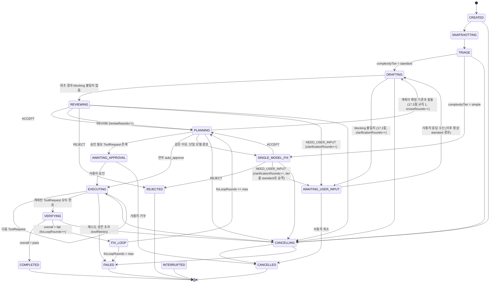
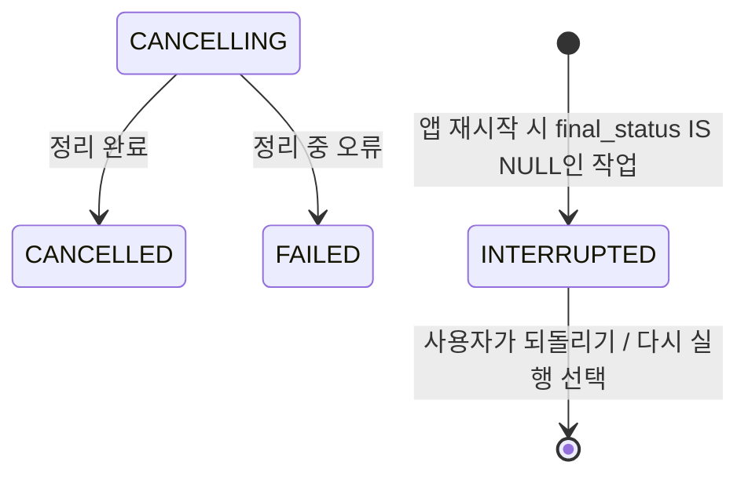

# 크로스 검증 상태 머신 & 공통 프로토콜 스키마

status: draft
관련: [../architecture-overview.md](./architecture-overview.md) (아직 없음 — 전체 개요 문서화 시 링크)

## 1. 설계 목표

- 하나의 TaskRequest가 시작부터 끝까지 거치는 **단일 상태 머신**을 정의한다. OpenAI/Claude 각각의 내부 루프가 아니라, 오케스트레이터가 소유하는 전역 상태다.
- 모든 루프(재질문, 수정 요청, 검증 실패 후 재수정)는 **상한이 있는 카운터**로 제어한다. 상한 없는 루프는 허용하지 않는다.
- LLM이 반환하는 값과 오케스트레이터/도구 런타임이 다루는 값을 분리한다. Rust 코어는 `ToolRequest`/`ToolResult`/`PolicyDecision`처럼 **정책 판단에 필요한 타입만 강하게 타이핑**하고, `DraftProposal`/`ReviewDecision`처럼 UI 렌더링용 콘텐츠는 opaque JSON으로 통과시킨다. 이렇게 하면 OpenAI/Anthropic 응답 포맷이 바뀌어도 Rust 코어를 건드릴 일이 줄어든다.
- 스키마의 단일 소스는 TypeScript(Node sidecar가 이 타입들을 직접 다루므로)로 두고, Rust 쪽은 필요한 필드만 `serde`로 부분 역직렬화한다. 향후 스키마가 안정되면 JSON Schema로 승격해 codegen(`typify` 등)을 고려한다.

## 2. 상태 머신



`CANCELLING`(비터미널)과 `INTERRUPTED`(터미널)는 M0.1에서 추가됐다 — 16절 참조. 취소는 순간이 아니라
자식 프로세스가 죽기를 기다리는 **구간**이고, 앱이 비정상 종료된 작업은 완료도 실패도 취소도 아니다.

`TRIAGE`/`SINGLE_MODEL_FIX`는 13절(Phase 0 스파이크 결과 반영)에서 추가된 상태다 — 원래 설계에는 없었고, 스파이크가 "쉬운 태스크에서는 교차검증이 정확도 이득 없이 비용/지연만 늘린다"는 걸 실측으로 보여준 뒤 반영되었다. `SINGLE_MODEL_FIX`의 verdict 처리(REJECT/NEED_USER_INPUT 분기, tier 승격 규칙)는 14.1절에서 마무리했다.

### 2.1 Phase 설명 및 종료 조건

| Phase | 담당 | 진입 조건 | 종료/전이 |
|---|---|---|---|
| `CREATED` | Orchestrator | TaskRequest 수신 | 즉시 SNAPSHOTTING |
| `SNAPSHOTTING` | Context Engine | - | WorkspaceSnapshot 생성 완료 → TRIAGE |
| `TRIAGE` | Orchestrator | WorkspaceSnapshot 완료 | 13.2절 규칙으로 `complexityTier` 결정 → standard면 DRAFTING, simple이면 SINGLE_MODEL_FIX |
| `DRAFTING` | OpenAI Provider | Snapshot + (재질문 시) 사용자 답변 | DraftProposal 수신 → REVIEWING |
| `SINGLE_MODEL_FIX` | Claude Provider | Snapshot (OpenAI 초안 없음) | `SingleModelFixResult.verdict`(REVISE 없이 ACCEPT/NEED_USER_INPUT/REJECT 중 하나)에 따라 PLANNING/AWAITING_USER_INPUT/REJECTED로 분기 |
| `REVIEWING` | Claude Provider | DraftProposal + 동일 Snapshot | ReviewDecision.verdict에 따라 4갈래 분기 |
| `AWAITING_USER_INPUT` | UI | verdict = NEED_USER_INPUT (REVIEWING 또는 SINGLE_MODEL_FIX 양쪽에서 진입 가능) | 사용자 응답 → DRAFTING(항상 standard 경로, 14.1절), 취소 → CANCELLED |
| `PLANNING` | Orchestrator | ACCEPT/REVISE 확정, SINGLE_MODEL_FIX 완료, 또는 FIX_LOOP에서 복귀 | 결과를 ExecutionPlan(ToolRequest[])으로 변환 |
| `AWAITING_APPROVAL` | Policy Gate + UI | ExecutionPlan 내 riskTier != auto | 사용자 승인/거부 |
| `EXECUTING` | Tool Runtime | 승인 완료 | 각 ToolRequest 순차 실행, 전부 완료 시 VERIFYING |
| `VERIFYING` | Verify 서브시스템 | ExecutionPlan 적용 완료 | build/test/lint/diff 결과 종합 |
| `FIX_LOOP` | Claude Provider | VerificationReport.overall = fail | VerificationReport를 Claude에 다시 전달, 수정된 결과 요청 (원래 tier와 무관하게 항상 Claude 단독 호출이므로 tier 재분류 불필요) |
| `CANCELLING` | Orchestrator + Rust | 취소 요청 접수 | 자식 프로세스 트리 종료·남은 단계 건너뛰기 완료 → CANCELLED (정리 중 오류면 FAILED) |
| `COMPLETED` / `FAILED` / `CANCELLED` / `REJECTED` | - | 터미널 상태 | FinalResult 생성, UI에 전달 |
| `INTERRUPTED` | Rust (앱 시작 시) | 앱 재시작 시 `final_status IS NULL`로 발견됨 | 터미널. 자동 재개하지 않고 사용자에게 되돌리기/다시 실행 선택을 준다 (16.1절) |

### 2.2 루프 상한 (기본값, 설정 가능해야 함)

| 카운터 | 어디서 증가 | 기본 상한 | 초과 시 |
|---|---|---|---|
| `clarificationRounds` | NEED_USER_INPUT 진입 시 | 2 | AWAITING_USER_INPUT에서 더 이상 재질문하지 않고, 사용자에게 "모호함을 해소하지 못함"으로 FAILED 전환 |
| `reviseRounds` | REVISE verdict 수신 시 (실행 전 단계) | 2 | 강제로 REJECTED 처리, "OpenAI/Claude가 계획에 합의하지 못함" 사유 기록 |
| `fixLoopRounds` | VERIFYING → fail 판정 시 | 3 | FAILED, 마지막 diff/로그를 사용자에게 제시하고 수동 개입 요청 |
| `toolRetries[requestId]` | ToolResult.status = timeout/transient error | 2 (지수 백오프) | 해당 ToolRequest를 `error`로 확정, EXECUTING 전체를 FAILED로 전이 |

모든 상한 값은 `TaskPolicy` 설정(워크스페이스별 override 가능)에서 읽는다. 하드코딩하지 않는다.

## 3. 프로토콜 스키마 (TypeScript, 단일 소스)

Node sidecar와 UI가 공유하는 정식 타입. Rust 코어는 `ToolRequest`, `ToolResult`, `PolicyDecision`, `TaskState`(카운터/phase만)를 제외한 나머지는 `serde_json::Value`로 그대로 통과시킨다.

```typescript
// ---- 공통 ----
type ISODateTime = string;
type Verdict = "ACCEPT" | "REVISE" | "REJECT" | "NEED_USER_INPUT";
type RiskTier = "auto" | "conditional" | "user_approval" | "blocked";

// ---- 1. TaskRequest ----
interface TaskRequest {
  taskId: string;
  sessionId: string;
  workspaceId: string;
  userMessage: string;
  attachments?: { path: string; note?: string }[];
  createdAt: ISODateTime;
}

// ---- 2. WorkspaceSnapshot ----
interface WorkspaceSnapshot {
  snapshotId: string;
  workspaceId: string;
  gitHead: string;
  gitBranch: string;
  gitDirty: boolean;
  gitDiffSummary?: string;
  relevantFiles: {
    path: string;
    reason: "mentioned" | "symbol-match" | "recently-changed" | "dependency";
    content: string;
    truncated: boolean;
  }[];
  projectMeta: {
    languages: string[];
    buildCommand?: string;
    testCommand?: string;
    lintCommand?: string;
    agentsMdPresent: boolean;
  };
  tokenBudget: { provider: "openai" | "anthropic"; maxTokens: number }[];
  createdAt: ISODateTime;
}

// ---- 3. DraftProposal (OpenAI 산출물) ----
interface PlanStep {
  stepId: string;
  description: string;
  toolHint?: "apply_patch" | "create_file" | "delete_file" | "run_command" | "run_tests";
  targetPaths?: string[];
}

interface DraftProposal {
  taskId: string;
  proposalId: string;
  interpretation: string;
  relevantFiles: { path: string; reason: string }[];
  plan: PlanStep[];
  patch?: string; // unified diff
  risks: string[];
  requiredTests: string[];
  uncertainties: string[];
  doneCriteria: string[];
  model: string;
  createdAt: ISODateTime;
}

// ---- 4. ReviewDecision (Claude 산출물) ----
interface ReviewDecision {
  taskId: string;
  proposalId: string;
  verdict: Verdict;
  rationale: string;
  revisedPlan?: PlanStep[];
  revisedPatch?: string;
  questionsForUser?: string[]; // verdict = NEED_USER_INPUT
  rejectionReason?: string;    // verdict = REJECT
  model: string;
  createdAt: ISODateTime;
}

// ---- 4b. SingleModelFixResult (SINGLE_MODEL_FIX 산출물, 13.2절 TRIAGE로 진입) ----
// ReviewDecision과 구조는 비슷하지만 리뷰 대상 DraftProposal이 없으므로 별도 타입으로 둔다.
// verdict는 REVISE를 쓰지 않는다 — 검토할 초안이 없으므로 "수정 요청"이라는 개념 자체가 성립하지 않고,
// Claude가 곧바로 최종안(ACCEPT)이거나 모호함(NEED_USER_INPUT)이거나 불가/위험(REJECT) 중 하나로 판정한다.
interface SingleModelFixResult {
  taskId: string;
  verdict: Exclude<Verdict, "REVISE">;
  rationale: string;
  plan?: PlanStep[];           // verdict = ACCEPT
  patch?: string;               // verdict = ACCEPT
  questionsForUser?: string[];  // verdict = NEED_USER_INPUT
  rejectionReason?: string;     // verdict = REJECT
  model: string;
  createdAt: ISODateTime;
}

// ---- 5. ExecutionPlan / ToolRequest (오케스트레이터 소유, Rust가 강타입으로 다룸) ----
interface ToolRequest {
  requestId: string;
  taskId: string;
  tool: "list_files" | "search_text" | "read_file" | "apply_patch"
      | "create_file" | "delete_file" | "run_command"
      | "git_status" | "git_diff" | "run_tests";
  args: Record<string, unknown>;
  requestedBy: "openai" | "claude" | "orchestrator";
  riskTier: RiskTier;
  createdAt: ISODateTime;
}

interface ExecutionPlan {
  taskId: string;
  planId: string;
  toolRequests: ToolRequest[];
  approvalRequired: boolean;
}

interface ToolResult {
  requestId: string;
  status: "ok" | "error" | "denied" | "timeout";
  output?: unknown;
  error?: string;
  durationMs: number;
  completedAt: ISODateTime;
}

interface PolicyDecision {
  requestId: string;
  decision: "auto_approve" | "require_user_approval" | "deny";
  matchedRule: string;
  reason: string;
}

// ---- 6. VerificationReport ----
interface VerificationCheck {
  kind: "build" | "test" | "lint" | "typecheck" | "diff_review";
  command?: string;
  status: "pass" | "fail" | "skipped";
  summary: string;
  detail?: string;
}

interface VerificationReport {
  taskId: string;
  reportId: string;
  checks: VerificationCheck[];
  overall: "pass" | "fail";
  createdAt: ISODateTime;
}

// ---- 7. TaskState (오케스트레이터 내부 상태, append-only 이벤트 로그와 함께 저장) ----
type TaskPhase =
  | "CREATED" | "SNAPSHOTTING" | "TRIAGE" | "DRAFTING" | "SINGLE_MODEL_FIX" | "REVIEWING"
  | "AWAITING_USER_INPUT" | "PLANNING" | "AWAITING_APPROVAL"
  | "EXECUTING" | "VERIFYING" | "FIX_LOOP"
  | "COMPLETED" | "FAILED" | "CANCELLED" | "REJECTED";

type ComplexityTier = "simple" | "standard";

interface TaskState {
  taskId: string;
  phase: TaskPhase;
  complexityTier: ComplexityTier | null; // TRIAGE 완료 전에는 null
  counters: {
    clarificationRounds: number;
    reviseRounds: number;
    fixLoopRounds: number;
    toolRetries: Record<string, number>;
  };
}

// ---- 8. FinalResult ----
type FailureReason =
  | "clarification_exhausted"    // AWAITING_USER_INPUT 재질문 상한 초과
  | "revise_exhausted"           // 실행 전 REVISE 루프 상한 초과
  | "fix_loop_exhausted"         // 검증 실패 후 수정 루프 상한 초과
  | "tool_retry_exhausted"       // 도구 실행 재시도 상한 초과 (7절 toolRetries)
  | "provider_retry_exhausted"   // LLM 호출 인프라 재시도 상한 초과 (9절 providerRetries)
  | "provider_config_error"      // API 키/설정 오류 등 재시도 무의미한 오류
  | "app_restart_interrupted";   // EXECUTING 도중 앱 재시작으로 중단 (10절)

interface FinalResult {
  taskId: string;
  status: "completed" | "failed" | "cancelled" | "rejected";
  failureReason?: FailureReason; // status = "failed"일 때만
  summary: string;
  finalDiff?: string;
  verificationReport?: VerificationReport;
  auditTrailEventIds: string[];
  completedAt: ISODateTime;
}
```

## 4. Policy Gate 기본 매핑 (초안)

`ToolRequest.tool` → 기본 `riskTier`. 워크스페이스 설정으로 override 가능해야 하며, `blocked`는 override로도 못 푼다(예: workspace 바깥 경로 쓰기).

| tool | 기본 riskTier | 비고 |
|---|---|---|
| `list_files`, `search_text`, `read_file`, `git_status`, `git_diff` | `auto` | 읽기 전용 |
| `apply_patch`, `create_file` | `conditional` | workspace 내부 경로면 auto, 아니면 `blocked` |
| `delete_file` | `user_approval` | |
| `run_tests` | `conditional` | 프로젝트 정의 test 커맨드면 auto, 임의 커맨드면 `user_approval` |
| `run_command` | `user_approval` | allowlist(예: `git`, 프로젝트 package manager) 매칭 시 `conditional`로 완화 가능, 그 외 항상 승인 |
| workspace 외부 경로 대상 모든 tool | `blocked` | 정책으로도 해제 불가 |

## 5. `run_command` allowlist 문법

**전제: `run_command`의 `args`는 셸 문자열이 아니라 argv 배열이다.**

```typescript
interface RunCommandArgs {
  executable: string;      // "git", "npm", "pytest" — PATH에서 resolve, basename 비교
  args: string[];          // ["status", "--short"] — shell 파싱 없음
  cwd: string;             // workspace root 기준 상대경로, ".." 세그먼트 금지
  shell?: false;            // true를 요청하면 allowlist 무시하고 항상 user_approval (파이프/리다이렉트 등은 신뢰 불가)
}
```

셸 문자열(`"git status && rm -rf /"` 같은) 형태의 명령을 애초에 도구 인터페이스에서 받지 않는다. 이렇게 하면 셸 메타문자 인젝션 문제 자체가 없어지고, allowlist 매칭이 결정론적이 된다.

### 5.1 Rule 스키마

```typescript
interface CommandRule {
  executable: string;
  argPattern?: string[];      // 위치 기반 glob. "*" = 인자 1개, "**" = 나머지 전부 (마지막 세그먼트에만 허용)
  cwdMustBeWorkspaceRoot?: boolean; // 기본 true
  effect: "auto" | "conditional";   // conditional = UI에 원클릭 승인으로 노출(사유 요약 포함), auto = 무음 허용
}

interface CommandPolicy {
  allow: CommandRule[];   // 순서대로 first-match
  deny: CommandRule[];    // allow보다 항상 우선 평가, 매치 시 riskTier = "blocked" (override 불가)
}
```

매칭 순서: **deny 규칙을 먼저 전체 스캔** → 하나라도 매치하면 `blocked` 확정, 더 볼 것 없음. 그다음 `allow`를 순서대로 first-match. 아무 규칙도 안 맞으면 도구 기본값(`run_command` = `user_approval`)으로 폴백.

### 5.2 기본 워크스페이스 정책 예시

```json
{
  "deny": [
    { "executable": "sudo" },
    { "executable": "runas" },
    { "executable": "reg" },
    { "executable": "netsh" },
    { "executable": "powershell", "argPattern": ["-enc", "**"] },
    { "executable": "git", "argPattern": ["push", "--force", "**"] },
    { "executable": "git", "argPattern": ["push", "-f", "**"] }
  ],
  "allow": [
    { "executable": "git", "argPattern": ["status", "**"], "effect": "auto" },
    { "executable": "git", "argPattern": ["diff", "**"], "effect": "auto" },
    { "executable": "git", "argPattern": ["log", "**"], "effect": "auto" },
    { "executable": "git", "argPattern": ["show", "**"], "effect": "auto" },
    { "executable": "git", "argPattern": ["branch", "--list"], "effect": "auto" },
    { "executable": "git", "argPattern": ["add", "**"], "effect": "conditional" },
    { "executable": "git", "argPattern": ["commit", "**"], "effect": "conditional" },
    { "executable": "npm", "argPattern": ["test"], "effect": "conditional" },
    { "executable": "npm", "argPattern": ["run", "*"], "effect": "conditional" },
    { "executable": "pytest", "argPattern": ["**"], "effect": "conditional" }
  ]
}
```

`npm run *`처럼 스크립트명이 와일드카드인 규칙은 Context Engine이 `package.json`의 `scripts` 키를 미리 인덱싱해서, 실제 정의된 스크립트명과 일치할 때만 `conditional`로 허용하고 그 외엔 `user_approval`로 떨어뜨린다 (임의 스크립트 주입 방지).

경로 인자(파일/디렉터리로 보이는 인자)는 별도로 workspace root 기준 canonicalize 후, root 바깥으로 벗어나면 규칙 매치 여부와 무관하게 `blocked` — 이건 Policy Gate가 `CommandRule` 매칭과 별개로 항상 적용하는 하드 체크다. **`--out=../../etc/passwd`처럼 플래그 값에 숨은 경로도 검사한다** — `-`로 시작하는 인자를 통째로 건너뛰면 그 경로로 탈출할 수 있다(M0 구현에서 발견해 보완).

### 5.3 이 allowlist가 보장하지 않는 것

정직하게 적어둔다. 파일 도구(`read_file`/`apply_patch`/`create_file`/`delete_file`)의 workspace 경계는 강한 보장이다 — 경로를 canonicalize해 루트 밖이면 실행 자체를 하지 않는다.

**그러나 `run_command`로 실행된 프로세스가 그 안에서 무엇을 하는지는 통제할 수 없다.** `npm test`가 workspace 밖 파일을 쓰거나 네트워크를 타는 것을 Policy Gate는 막지 못한다 — 그건 프로세스 샌드박싱(Windows job object, seccomp, 컨테이너)의 문제이고 M0 범위 밖이다.

따라서 **"Policy Gate가 있으니 임의 코드 실행이 안전하다"는 주장은 하지 않는다.** 참인 주장은 세 가지다: (a) 실행될 명령이 사용자에게 정확히 보이고(argv 계약), (b) allowlist 밖 명령은 기본 거부되며, (c) 무엇이 실행됐는지 이벤트 로그로 감사 가능하다. 프로세스 샌드박싱은 별도 항목으로 12절에 남긴다.

## 6. FIX_LOOP 재전달 페이로드

전체 로그를 매번 다시 보내면 토큰 예산이 빠르게 소진되고, `fixLoopRounds`가 올라갈수록 컨텍스트가 누적 팽창한다. 두 가지로 분리한다.

- **`VerificationReport`**: 감사/UI용 전체 기록. SQLite/artifact store에 그대로 저장.
- **`VerificationDigest`**: Claude에게 실제로 보내는 축약본. 실패한 체크만 상세, 통과한 체크는 한 줄 요약.

```typescript
interface VerificationDigest {
  taskId: string;
  reportId: string;
  attemptNumber: number;              // = fixLoopRounds
  failingChecks: {
    kind: VerificationCheck["kind"];
    command?: string;
    exitCode?: number;
    excerpt: string;                  // head N줄 + tail M줄 (기본 40/40), 중간 생략 표시
    fileReferences: { path: string; line?: number }[]; // 컴파일러/테스트 출력에서 정규식으로 추출
  }[];
  passingChecksSummary: string;       // 예: "lint: pass, typecheck: pass"
}
```

FIX_LOOP에서 Claude 호출 시 함께 보내는 것:

1. 원본 `TaskRequest`, `WorkspaceSnapshot`(참조로, 재전송 아님 — provider가 대화 상태를 유지하지 않는다면 필요한 부분만 재삽입)
2. 직전 `ReviewDecision`
3. **`WorkspaceDelta`** — 전체 스냅샷이 아니라 EXECUTING 단계에서 실제로 바뀐 파일의 diff만

```typescript
interface WorkspaceDelta {
  baseSnapshotId: string;
  changedFiles: { path: string; diff: string }[]; // unified diff, base snapshot 대비
  createdAt: ISODateTime;
}
```

4. `VerificationDigest`

토큰 예산 규칙: `VerificationDigest` + `WorkspaceDelta` 합이 태스크 잔여 예산의 30%를 넘으면, 실패 체크 중 우선순위 낮은 것(예: lint)의 `excerpt`부터 줄인다. `build`/`test` 실패는 마지막까지 보존한다.

## 7. 이벤트 로그 & SQLite 스키마

설계 원칙: `task_events`가 append-only 진실의 원천이고, `tasks.phase`/`counters`는 매 이벤트 삽입과 같은 트랜잭션 안에서 갱신되는 파생 캐시다. 이렇게 하면 (a) UI가 히스토리를 재생할 수 있고 (b) 앱이 크래시돼도 재시작 시 마지막 이벤트+카운터로 진행 중이던 태스크 상태를 복원할 수 있다.

큰 콘텐츠(파일 전체 내용, patch, 전체 로그)는 `payload_json`에 인라인하지 않는다. 8KB 넘는 페이로드는 `%APPDATA%/Tomverse Code/artifacts/<taskId>/<eventId>.blob` 파일로 쓰고 JSON에는 경로+해시만 남긴다. SQLite WAL 비대화를 막기 위함이다.

```sql
CREATE TABLE workspaces (
  workspace_id   TEXT PRIMARY KEY,
  root_path      TEXT NOT NULL UNIQUE,
  name           TEXT NOT NULL,
  policy_json    TEXT NOT NULL DEFAULT '{}',
  created_at     TEXT NOT NULL
);

CREATE TABLE sessions (
  session_id     TEXT PRIMARY KEY,
  workspace_id   TEXT NOT NULL REFERENCES workspaces(workspace_id),
  title          TEXT,
  started_at     TEXT NOT NULL
);

CREATE TABLE tasks (
  task_id        TEXT PRIMARY KEY,
  session_id     TEXT NOT NULL REFERENCES sessions(session_id),
  workspace_id   TEXT NOT NULL REFERENCES workspaces(workspace_id),
  user_message   TEXT NOT NULL,
  phase          TEXT NOT NULL,       -- TaskPhase
  counters_json  TEXT NOT NULL,       -- { clarificationRounds, reviseRounds, fixLoopRounds, toolRetries }
  final_status   TEXT,                -- null 이면 아직 진행 중
  created_at     TEXT NOT NULL,
  updated_at     TEXT NOT NULL
);

CREATE TABLE task_events (
  event_id       INTEGER PRIMARY KEY AUTOINCREMENT,
  task_id        TEXT NOT NULL REFERENCES tasks(task_id),
  seq            INTEGER NOT NULL,    -- task 내 순번, (task_id, seq) unique
  event_type     TEXT NOT NULL,       -- 아래 이벤트 타입 목록
  payload_json   TEXT NOT NULL,       -- 8KB 초과분은 artifact 참조로 대체
  created_at     TEXT NOT NULL,
  UNIQUE(task_id, seq)
);
CREATE INDEX idx_task_events_task ON task_events(task_id, seq);

CREATE TABLE tool_requests (
  request_id     TEXT PRIMARY KEY,
  task_id        TEXT NOT NULL REFERENCES tasks(task_id),
  plan_id        TEXT NOT NULL,
  tool           TEXT NOT NULL,
  args_json      TEXT NOT NULL,
  risk_tier      TEXT NOT NULL,
  requested_by   TEXT NOT NULL,       -- openai | claude | orchestrator
  created_at     TEXT NOT NULL
);
CREATE INDEX idx_tool_requests_task ON tool_requests(task_id);

CREATE TABLE tool_results (
  request_id     TEXT PRIMARY KEY REFERENCES tool_requests(request_id),
  status         TEXT NOT NULL,       -- ok | error | denied | timeout
  output_ref     TEXT,                -- artifact 경로 또는 인라인 JSON (짧은 경우)
  error          TEXT,
  duration_ms    INTEGER NOT NULL,
  completed_at   TEXT NOT NULL
);

CREATE TABLE verification_reports (
  report_id      TEXT PRIMARY KEY,
  task_id        TEXT NOT NULL REFERENCES tasks(task_id),
  attempt_number INTEGER NOT NULL,    -- = fixLoopRounds 당시 값
  overall        TEXT NOT NULL,       -- pass | fail
  checks_json    TEXT NOT NULL,
  created_at     TEXT NOT NULL
);
CREATE INDEX idx_verification_reports_task ON verification_reports(task_id);

CREATE TABLE snapshots (
  snapshot_id    TEXT PRIMARY KEY,
  workspace_id   TEXT NOT NULL REFERENCES workspaces(workspace_id),
  git_head       TEXT NOT NULL,
  meta_json      TEXT NOT NULL,       -- projectMeta, tokenBudget 등. relevantFiles 본문은 artifact로
  created_at     TEXT NOT NULL
);

-- 10절 FileMutationRecord — 롤백 UX가 조회하는 테이블. request_id 1개당 파일 1개.
CREATE TABLE file_mutations (
  request_id       TEXT NOT NULL REFERENCES tool_requests(request_id),
  path             TEXT NOT NULL,
  pre_existed      INTEGER NOT NULL,   -- boolean (0/1)
  pre_content_ref  TEXT,               -- artifact 경로, pre_existed=0이면 NULL
  post_existed     INTEGER NOT NULL,
  post_content_ref TEXT,
  PRIMARY KEY (request_id, path)
);
CREATE INDEX idx_file_mutations_request ON file_mutations(request_id);
```

롤백(10절)은 `tool_requests.task_id`로 해당 태스크의 모든 `request_id`를 찾고, `file_mutations`를 조인해 `path`별 최신 `pre_image`를 역방향 patch로 변환한다.

`task_events.event_type` 값: `TASK_CREATED`, `SNAPSHOT_CREATED`, `DRAFT_RECEIVED`, `REVIEW_RECEIVED`, `PLAN_CREATED`, `APPROVAL_REQUESTED`, `APPROVAL_GRANTED`, `APPROVAL_DENIED`, `TOOL_REQUESTED`, `TOOL_COMPLETED`, `VERIFICATION_COMPLETED`, `FIX_LOOP_STARTED`, `PHASE_CHANGED`, `USER_MESSAGE_RECEIVED`, `TASK_COMPLETED`, `TASK_FAILED`, `TASK_CANCELLED`, `TASK_REJECTED`, `DISAGREEMENT_DETECTED`, `USER_DECISION_RECORDED`(17.3절).

재시작 복구 절차: 앱 기동 시 `final_status IS NULL`인 `tasks` 행을 찾고, 각각의 최신 `task_events` 행 하나를 읽어 `phase`/`counters_json`이 이벤트 로그와 일치하는지 검증한다(불일치 시 이벤트 로그가 우선하며 `tasks` 행을 재계산). `EXECUTING` 중 크래시난 태스크는 재개하지 않고 `FAILED`(사유: "앱 재시작으로 중단됨")로 확정한 뒤 사용자에게 재시도를 맡긴다 — 부분 실행된 `ToolRequest`의 실행 재개는 멱등성 보장이 안 되면 위험하므로 MVP 범위에서는 자동 재개를 하지 않는다.

## 8. Context Engine 스크립트 인덱싱

5절의 `run_command` allowlist(`npm run *` 등)가 실제 프로젝트에 정의된 스크립트인지 확인할 때 쓰는 인덱스. 모노레포를 고려해 workspace root 하나가 아니라 **매니페스트 단위(package)**로 인덱싱한다.

```typescript
interface ScriptIndex {
  workspaceId: string;
  packages: PackageScripts[];
  indexedAt: ISODateTime;
  sourceHash: string; // 모든 매니페스트 파일 해시 — 캐시 무효화 판단용
}

interface PackageScripts {
  manifestPath: string;      // "packages/api/package.json"
  packageRoot: string;       // 매니페스트가 있는 디렉터리, workspace root 기준 상대경로
  ecosystem: "npm" | "python" | "cargo" | "dotnet";
  scripts: {
    name: string;             // "test", "build", "lint"
    command: string;          // 매니페스트 원문 그대로 — 감사/표시용, 절대 이 문자열을 셸로 실행하지 않음
    parsedExecutable?: string; // best-effort 파싱 (예: "jest --coverage" → "jest")
    suspicious: boolean;      // 휴리스틱: curl|sh, rm -rf, sudo, 알 수 없는 호스트로 네트워크 호출 등
  }[];
}
```

- **탐색 대상(v1)**: `package.json`(scripts), `pyproject.toml`(`[project.scripts]`/`[tool.poetry.scripts]`), `Cargo.toml`(사용자 정의 스크립트 없음 — cargo 표준 서브커맨드는 4절 allowlist에서 별도 규칙으로 다룸), `.csproj`/`.sln`은 v1 범위에서 스크립트 개념이 약해 제외.
- **재인덱싱 트리거**: 스냅샷 생성 시 1회, 이후 매니페스트 파일이 git diff에 포함될 때 증분 재인덱싱.
- **suspicious 판정**: `Policy Gate`가 이 플래그를 보고 `effect: "conditional"`을 절대 부여하지 않는다 — suspicious=true인 스크립트는 이름이 allowlist 패턴과 맞아도 항상 `user_approval`로 떨어진다.
- Policy Gate 매칭 시점에는 `ToolRequest.args.cwd`와 일치하는 `packageRoot`를 가진 `PackageScripts`에서만 스크립트명을 찾는다 (다른 패키지의 `test` 스크립트를 엉뚱한 디렉터리에서 실행 허용하는 것 방지).

## 9. Provider 호출 재시도 (인프라 재시도 vs 의미론적 루프 분리)

`toolRetries`(7절)는 로컬 도구 실행 실패에 대한 재시도다. 이것과 완전히 다른 축으로, **LLM API 호출 자체의 인프라 재시도**가 필요하다 — rate limit(429), 5xx, 네트워크 타임아웃 같은 건 모델의 판단과 무관한 전송 계층 문제이므로 `reviseRounds`/`fixLoopRounds`(의미론적 루프, 모델이 실제로 판정을 내린 횟수)와 섞으면 안 된다.

```typescript
interface TaskState {
  taskId: string;
  phase: TaskPhase;
  complexityTier: ComplexityTier | null;
  counters: {
    clarificationRounds: number;
    reviseRounds: number;
    fixLoopRounds: number;
    toolRetries: Record<string, number>;
    providerRetries: Record<string, number>; // key = "draft:1", "review:2", "fix:1" 등 호출 식별자
  };
}
```

| 오류 유형 | 재시도 정책 | 최대 시도 |
|---|---|---|
| 429 (rate limit) | `Retry-After` 헤더 우선 존중, 없으면 지수 백오프(base 2s, cap 60s) | 3 |
| 5xx / 네트워크 타임아웃 | 지수 백오프(base 1s, cap 30s) | 3 |
| 4xx (429 제외: 인증 오류, 잘못된 요청, 콘텐츠 정책 위반) | 재시도 안 함 — 일시적 문제가 아님 | 즉시 실패 |
| 스트리밍 중 연결 끊김 | 부분 응답 폐기, 프롬프트 그대로 1회 재호출 (resume 아님 — provider가 이어받기를 지원하지 않음) | 위 표의 해당 오류 유형 카운트에 포함 |

`providerRetries`가 상한(3)을 넘으면 `FAILED`, `failureReason: "provider_retry_exhausted"`. 인증 오류 등 4xx는 재시도 없이 즉시 `FAILED`, `failureReason: "provider_config_error"` — 사용자가 API 키를 고치기 전엔 재시도해봐야 소용없으므로 루프를 태우지 않는다.

## 10. REJECTED/FAILED 종료 시 롤백 UX

**REJECTED는 되돌릴 파일이 없다** — REJECT 판정은 REVIEWING 단계(PLANNING/EXECUTING 이전)에서만 나오므로 아직 아무 파일도 건드리지 않은 상태다. 롤백이 실제로 필요한 건 `FAILED`(EXECUTING/VERIFYING 중 발생 가능)와 `CANCELLED`(EXECUTING 도중 취소) 뿐이다.

**git stash 대신 태스크 단위 파일 되돌리기를 쓴다.** git stash는 사용자가 Tomverse Code와 무관하게 작업 중이던 uncommitted 변경사항까지 전부 쓸어담아 혼란을 준다. 대신 Tool Runtime이 파일을 변경하는 모든 `ToolRequest`(`apply_patch`/`create_file`/`delete_file`) 결과에 이미 diff 표시를 위해 필요한 pre-image/post-image를 남기므로, 이걸 재사용해 **이 태스크가 건드린 파일만** 정확히 원상복구한다.

```typescript
interface FileMutationRecord {
  requestId: string;
  path: string;
  preImage: { existed: boolean; contentRef?: string };  // artifact 참조, 없었으면 existed=false
  postImage: { existed: boolean; contentRef?: string };
}
```

- `ToolResult.output`이 아니라 별도 `file_mutations` 테이블에 저장(7절 스키마에 DDL 포함, `request_id`로 `tool_requests`와 조인).
- UI: `FAILED`/`CANCELLED` 화면에 "이 작업이 변경한 N개 파일" 목록과 "되돌리기" 버튼. `FAILED`는 되돌리기가 기본 추천(깨진 상태 방치 방지), `CANCELLED`는 사용자 선택에 맡긴다(부분 진행 결과를 원할 수도 있음).
- **되돌리기도 일반 `ToolRequest` 경로를 그대로 탄다** — pre-image를 역방향 patch로 만들어 `apply_patch`/`create_file`/`delete_file`을 다시 큐잉하고 정상적으로 이벤트 로그에 남긴다. 감사 추적에 예외가 없어야 한다.

## 11. Artifact 디렉터리 GC 정책

저장 위치: `%APPDATA%/Tomverse Code/artifacts/<taskId>/...` (7절에서 정의한 8KB 초과 payload들).

- **활성 태스크(터미널 상태 아님)는 절대 GC 대상 아님.**
- **터미널 태스크**(`COMPLETED`/`FAILED`/`CANCELLED`/`REJECTED`)는 기본 30일 보관(설정 가능) 후 정리 대상.
- **디스크 용량 상한**(기본 2GB, 설정 가능)을 넘으면 30일이 안 지났어도 `completed_at` 기준 오래된 터미널 태스크부터 GC — 단, 사용자가 현재 UI에 열어둔 세션의 태스크는 터미널 상태여도 건드리지 않는다.
- GC는 태스크 디렉터리 통째로 삭제. **[context-engine.md](./context-engine.md)에서 결론**: 태스크 artifact로 저장되는 `WorkspaceSnapshot`(선택·패키징 결과, 이 GC 대상)과 세션 스코프로 증분 갱신되는 `WorkspaceIndex`(심볼/의존성 그래프 등 비싼 인덱스, 워크스페이스 단위로 별도 보관되며 이 GC 대상이 아님)는 서로 다른 저장 단위다. 따라서 "스냅샷은 태스크 전용"이라는 가정은 `WorkspaceSnapshot`에 한해 여전히 유효하며, 멀티턴 세션의 재사용/증분 갱신은 `WorkspaceIndex` 쪽에서 이미 반영되었다(context-engine.md 2~3절) — dangling reference 걱정 없음.
- artifact가 지워져도 `tasks`/`task_events`/`verification_reports`의 경량 메타데이터(pass/fail, phase, 타임스탬프)는 영구 보관(작아서 비용이 적고, 세션 히스토리/통계에 필요). `tasks`에 `artifacts_purged BOOLEAN` 컬럼을 추가해 UI가 "로그가 정리됨"을 깨진 링크 대신 표시하게 한다.
- 트리거: 앱 시작 시 1회 + 실행 중 6시간마다, 사용자 액션을 막지 않는 백그라운드 작업으로. 설정 화면에 "지금 정리" 수동 버튼도 둔다.

## 12. 다음으로 구체화할 것

- ~~멀티턴 세션에서 `WorkspaceSnapshot`을 태스크마다 새로 만들지, 세션 내에서 재사용/증분 갱신할지~~ → [context-engine.md](./context-engine.md)에서 "세션 스코프 `WorkspaceIndex` + 태스크 스코프 `WorkspaceSnapshot`" 2계층 구조로 해결
- ~~OpenAI Responses API / Anthropic Messages API 필드를 `DraftProposal`/`ReviewDecision`으로 매핑하는 실제 어댑터 계약~~ → 13.3절에서 Phase 0 스파이크 코드로 검증 완료
- ~~`file_mutations` 테이블 DDL과 7절 스키마 통합~~ → 7절에 DDL 추가 완료(14.2절)
- ~~`SINGLE_MODEL_FIX`가 모호성을 감지했을 때 어떻게 할지~~ → 14.1절에서 `SingleModelFixResult` verdict로 해결
- ~~UI 와이어프레임 (단계 표시, diff 미리보기, 승인 모달)~~ → [ui-wireframes.md](./ui-wireframes.md), M0에서 구현됨
- 13.2절 TRIAGE 규칙의 실제 임계값(파일 개수, 키워드 목록) — 스파이크의 5개 초소형 태스크만으로는 튜닝 근거가 부족함. "어려운" 태스크 세트로 스파이크를 재실행해 규칙을 검증/조정 필요. **M0 구현에서 이 항목이 더 시급해졌다 — 15.3절 참조.**
- ~~앱 재시작 후 진행 중이던 태스크의 복구 UX~~ → M0.1에서 `INTERRUPTED` 터미널 + 최근 작업 목록 + 되돌리기/다시 실행 버튼으로 해결(16.1, 16.6절)
- **프로세스 샌드박싱** (5.3절) — `run_command`가 실행한 프로세스의 파일·네트워크 접근 제한. Windows job object / 컨테이너 중 무엇을 쓸지, 그리고 그게 개발 도구(테스트 러너가 캐시 디렉터리를 쓰는 등)와 어디서 충돌하는지 조사 필요. 이게 없는 동안은 5.3절의 한계를 UI에도 정직하게 표시해야 한다. **M0.1에서 Windows Job Object가 이 항목과 합류했다 — 16.3절의 `taskkill /T` 한계도 같은 해법으로 닫힌다.**
- 취소 중 UI가 "정리 중"에서 얼마나 기다려야 하는지에 대한 상한 — 현재는 자식이 SIGKILL에 반응할 때까지 기다린다. 응답 없는 프로세스에 대한 사용자 탈출구(강제 포기)가 없다
- Git commit 자동 생성의 오케스트레이터 통합 — Policy Gate(항상 승인)와 도구는 있으나 `ExecutionPlan`에 commit 단계를 넣는 로직이 없다
- **17.4절 blocking 판정 규칙과 랭킹 순서의 임계값** — `doneCriteria` > `targetPaths` > `requiredTests` 순서는 추정이다. 14절 지표(불일치 1건당 사용자가 뒤집은 비율)가 쌓여야 조정 근거가 생긴다. 구현은 `DISAGREEMENT_FIELD_RANK` 한 줄로 모아두었으므로 튜닝할 때 고칠 자리는 하나다
- **자유 서술 필드(`interpretation`/`risks`)의 대조 정확도** — 표현만 달라도 갈린 것으로 보이므로 거의 언제나 불일치가 잡힌다. 지금은 전부 비-blocking이라 카드에 들어가지 않지만, 접힌 영역이 매번 채워지는 것 자체가 잡음일 수 있다. 의미 비교는 또 하나의 모델 호출이라 하지 않았다 — 대조가 판정이 아니라는 규칙(17.8절)이 여기서도 유효하다
- **한 카드 질문 상한 4개의 근거** — 실측이 아니라 3.9절 화면 설계에서 나온 값이다. 스크롤이 생기면 아래쪽 질문이 "그럴듯하면 아무거나" 눌리는 대상이 되는데, 그 임계가 정말 4인지는 측정된 바 없다
- ~~**기준 충족 여부의 자동 판정 범위**(17.3) — `AcceptanceCriterion`에 대응하는 테스트가 존재하는지를 어떻게 자동으로 잇는가~~ → 17.9절에서 **좁게** 닫혔다: 기준 문장이 실재하는 테스트 파일을 지목하고 그 파일이 검증 출력에 나타났을 때만 확인이다. 나머지는 미확인으로 남는다
- ~~**기준↔테스트 연결의 커버리지**~~ / ~~**위치 충돌 규칙의 오탐률**~~ → 두 질문에 답할 **계측**이 17.10절에서 붙었다(`tomverse-host metrics`). 데이터는 실사용이 있어야 쌓이므로 아래 두 항목이 그 자리를 이어받는다
- **커버리지 실측과 그에 따른 결정** — `no_test_reference`가 압도적일 것으로 예상하지만 확인된 바 없다. 실측 후 결정할 것: (a) 기준을 적을 때 테스트를 함께 적도록 프롬프트/카드를 바꿀지, (b) 잇는 규칙을 넓힐지. **(b)를 먼저 하고 싶은 유혹을 경계할 것** — 규칙을 넓히면 확인이 늘어 보이지만 늘어난 확인이 근거 있는 것인지는 같은 규칙으로 검사할 수 없다
- **충돌 결말 실측** — `plan_changed_to_expected` 비율이 낮으면 게이트가 예산만 쓰는 것이다. 다만 "낮다 = 규칙이 틀렸다"가 아니다: 모델이 사용자 지시를 계속 무시하는 것일 수도 있고, 그 경우 고칠 곳은 게이트가 아니라 프롬프트다. 두 원인을 가르려면 재요청 뒤 초안의 `interpretation`이 바뀌었는지를 봐야 하는데, 그건 아직 계측하지 않는다
- ~~**17.3절 세 구멍의 구현** — 사용자 답변 승격, `USER_DECISION_RECORDED` 원문 기록, `doneCriteria` 소비~~ → 구현 완료. 구현이 드러낸 문서의 틀린 부분과 새로 정한 규칙은 17.7절에 있다
- **자유 텍스트 비밀값 마스킹의 모양 목록**(17.7) — `mask_secret_shapes`는 알려진 접두사만 안다. 새 공급자가 새 형식을 쓰면 빠지고, 목록을 늘려도 완결되지 않는다. 근본 해법(사용자에게 "이건 자격증명처럼 보입니다"를 입력 시점에 되묻기)은 UI 작업이라 미뤘다

## 15. M0 구현에서 드러난 설계 보완

구현이 문서의 빈틈을 세 군데 드러냈다. 셋 다 "결정론적 검증이 최종 판정자"라는 원칙에 직결되므로 기록해 둔다.

### 15.1 `PLANNING → FIX_LOOP` 전이 추가

2절 다이어그램은 **"patch가 적용 계획으로 변환되지 않는 경우"를 다루지 않았다.** 파일 헤더 없는 diff는
LLM의 흔한 실패 모드인데, 이걸 즉시 `FAILED`로 만들면 한 번의 재요청으로 회복 가능한 오류에 태스크 전체를 버린다.

`FIX_LOOP`를 재사용하는 것이 타당하다: FIX_LOOP의 전제는 "결정론적 증거를 근거로 다시 요청한다"이고
patch 파싱 실패는 모델 의견이 아니라 결정론적 사실이다. 3절 `VerificationKind`에 이미 `diff_review`가 있어
이 실패를 리포트로 표현할 수 있고, 상한도 `fixLoopRounds`를 공유하므로 새 무한 루프가 생기지 않는다.

### 15.2 `VerificationCheck.status`를 3값에서 5값으로

원래 `pass | fail | skipped`였다. `skipped` 하나에 "프로젝트에 명령이 없음", "정책상 건너뜀", "타임아웃"이
뭉쳐 있으면 리포트가 통과로 위장할 여지가 생긴다. 지금은
`PASSED | FAILED | NOT_CONFIGURED | SKIPPED_WITH_REASON | TIMED_OUT`이고,
`VerificationReport.overall`에도 `not_verified`가 추가됐다 — 실행된 검증이 하나도 없는 것은 통과가 아니다.

### 15.3 baseline 대비 판정 규칙: "여전히 실패 중이면 실패"

처음에는 "baseline에도 있던 실패는 이번 변경의 책임이 아니므로 pass"로 구현했다. e2e 테스트가 그 규칙의
치명적 결과를 드러냈다: **"실패하는 테스트를 고쳐줘"라는 태스크에서 모델이 아무것도 고치지 못했는데
`COMPLETED`가 나온다.** 그 테스트는 당연히 baseline에서도 실패했으므로 "새로 깨진 것 없음 → pass"가 되기 때문이다.

지금 규칙: **현재 실패 중인 체크가 하나라도 있으면 `fail`.** baseline 비교 결과는 판정을 바꾸지 않고
`newlyFailing`/`preexistingFailures`로 따로 보고한다. 대가는 오래전부터 lint가 깨져 있던 저장소에서
무관한 수정도 실패로 나오는 것인데, "거짓 성공"과 "설명이 붙은 실패" 중에서는 후자가 제품 명제에 맞다.

**이 규칙이 12절의 TRIAGE 튜닝 항목을 더 시급하게 만든다** — 실패한 태스크는 FIX_LOOP를 태우므로,
분류 정확도가 비용에 직접 반영된다.

### 15.4 검증 명령의 실행 환경 통제

실측으로 확인한 문제: `NODE_TEST_CONTEXT`가 설정된 셸에서 앱을 실행하면 `node --test`가 자신을 테스트 러너의
자식으로 취급해 **실패해도 exit code 0을 반환한다.** 그러면 검증 러너가 실패한 테스트를 통과로 보고한다.

따라서 Tool Runtime이 명령을 실행할 때 테스트 러너 제어 변수(`NODE_TEST_CONTEXT`, `NODE_OPTIONS`,
`NODE_V8_COVERAGE`)를 제거한다. 공급자 API 키를 제거하는 것과 같은 자리에서 같은 이유로 처리한다 —
**결정론적 검증은 실행 환경을 통제해야 성립한다.** 다른 생태계(pytest의 `PYTEST_CURRENT_TEST`,
.NET의 `DOTNET_*`)에도 유사한 변수가 있으므로 언어 지원을 넓힐 때 함께 확인해야 한다.

### 15.5 Windows 프로그램 해석 — argv 계약을 지키면서 `npm.cmd`를 실행하는 법

Windows의 npm은 `npm.exe`가 아니라 **`npm.cmd`(배치 shim)**다. Tool Runtime이
`Command::new("npm")`으로 실행하면 `program not found`로 실패한다.

증상이 나쁜 이유는 실패 자체가 아니라 그 다음이다. Verification Runner가 테스트를 돌리지 못해
`SKIPPED_WITH_REASON`이 되고, 그러면 **정상 수정 작업이 검증 없이 완료로 보고**되며 FIX_LOOP도
돌지 않는다. 결정론적 검증을 제품 명제로 내건 이상 이건 "Windows에서 명령 하나가 안 된다"가 아니라
제품 명제가 무너지는 결함이다.

**`cmd.exe /c`로 감싸지 않는다.** 감싸면 실행은 되지만 그 순간 5절의 argv 계약이 사라진다 —
인자의 `&`, `|`, `>`, `%`, `^`가 셸에 재해석되므로 "승인 모달에 보인 명령 = 실제 실행"이라는
보장이 깨진다. 보안 모델과 UI 약속이 동시에 무너지는 거래는 하지 않는다.

대신 shim이 실제로 하는 일을 구조적으로 재현한다:

```text
요청:  npm test --silent
실행:  <node.exe> <...\node_modules\npm\bin\npm-cli.js> test --silent
```

요청 인자는 **가공 없이** 그대로 뒤에 붙고, 셸이 개입하지 않으므로 메타문자는 언제나 리터럴이다.

지켜야 하는 경계:

- **해석은 Policy Gate 판정 이후에 일어난다.** 판정 대상은 언제나 요청된 argv이고, 해석이
  그 정체성을 바꾸지 못한다. `npm`은 `node.exe`로 실행되지만 첫 인자가 `npm-cli.js`임을
  구조적으로 확인하며, 해석 결과가 `node`가 아니면 실행하지 않는다.
- **알려진 shim만 변환한다** (`npm`, `npx`). 그 밖의 `.cmd`/`.bat`은 조용히 셸로 돌리지 않고
  거부한다 — 목록을 넓히는 것은 곧 배치 실행 경로를 넓히는 것이다.
- **구조를 확인할 수 없으면 추측하지 않고 실패한다.** `npm.cmd`는 있는데 `npm-cli.js`가 없으면
  다른 npm을 찾아 쓰지 않는다. 사용자가 승인한 것과 다른 것을 실행하는 것보다 멈추는 편이 낫다.
- **요청 argv와 실제 argv를 모두 결과에 남긴다** (`command` / `resolvedCommand`). 둘이 다를 수
  있게 된 이상, 사후에 대응을 확인할 수 없으면 감사 추적이 성립하지 않는다.

함께 강화한 것: **돌려고 했는데 돌지 못한 체크가 하나라도 있으면 `overall`은 `pass`가 될 수 없다**
(`NOT_VERIFIED`). 예전 규칙은 "실패가 없고 통과가 하나라도 있으면 pass"였는데, 그러면 build만
통과하고 test는 실행조차 못한 상태가 pass가 된다 — 이번 결함이 만든 상황이 정확히 그것이다.
`NOT_CONFIGURED`는 여기 해당하지 않는다. "돌릴 것이 없었다"와 "돌리지 못했다"는 다르고, 전자까지
막으면 lint 스크립트가 없는 프로젝트가 영원히 pass 불가가 된다.

## 16. M0.1 — 작업 영속화와 실제 취소

M0의 취소는 "요청을 받아 두었다가 다음 단계에서 확인"하는 협조적 취소였고, 실행 중인 `npm test`는
끝까지 돌았다. 저장도 이벤트 로그만 있고 작업 목록·복구 경로가 없었다. M0.1은 이 둘을 채운다.

### 16.1 `CANCELLING`과 `INTERRUPTED` — 터미널을 늘린 이유

취소는 순간이 아니라 **구간**이다. 사용자가 버튼을 누른 시각과 자식 프로세스가 실제로 죽는 시각
사이에 실행 중인 명령이 있다. 그 구간을 `CANCELLED`로 표시하면 아직 프로세스가 살아 있는 동안
"취소됨"이라고 말하게 되고, 이전 phase로 표시하면 취소 요청이 접수됐다는 사실이 보이지 않는다.
그래서 비터미널 phase `CANCELLING`을 두고, 취소 가능한 모든 phase에서 여기로 들어온다.

`INTERRUPTED`는 **앱이 비정상 종료된 작업**의 터미널이다. 완료도 실패도 취소도 아니다 —
사용자가 *되돌릴지 다시 실행할지 결정해야 하는* 상태이며, 다른 터미널로 뭉뚱그리면 그 구별이 사라진다.
Node는 이 상태로 전이하지 않는다(`INTERRUPTED: []`). 앱 시작 시 Rust가 DB를 보고 확정하는 상태이기 때문이다.



**자동 재개하지 않는다.** 부분 실행된 `ToolRequest`의 재개는 멱등성 보장이 없으면 위험하다
(patch가 반쯤 적용된 파일에 같은 patch를 다시 적용하면 실패하거나, 더 나쁘게는 이중 적용된다).
"다시 실행"은 **새 `task_id`로 같은 요청 문구를 처음부터** 돌리는 것이지 중단 지점 이어가기가 아니다.

### 16.2 취소가 전파되는 경로

취소는 **양쪽 모두** 필요하다. 한쪽만 하면 절반만 취소된다.

| 방향 | 담당 | 끊는 것 | 안 하면 |
|---|---|---|---|
| Rust | `CancellationRegistry` → `CancellationToken` | 실행 중인 자식 **프로세스 트리**, 이후 도구 실행, 이후 검증 시작 | 이미 시작된 `npm test`가 끝까지 돈다 |
| Node | `AbortController` → `AbortSignal` | 진행 중인 공급자 HTTP 호출 | 모델 호출이 계속 돌아 비용이 발생한다 |

순서는 **Rust 먼저**다. 토큰이 켜져야 진행 중인 프로세스가 죽고 새 도구가 시작되지 않는다.

`CancellationToken::cancel()`은 `compare_exchange`로 **정확히 한 호출자에게만** `true`를 준다.
취소 버튼 연타나 Rust/Node 양쪽 도착이 `CANCELLATION_REQUESTED` 이벤트를 두 번 남기지 않게 하는 장치다.
터미널 여부는 메모리 토큰이 아니라 **DB에서 읽는다** — SQLite가 진실의 원천이므로,
둘이 어긋나면 DB를 믿는다.

**취소는 Policy Gate를 우회하는 통로가 아니다.** 취소된 태스크의 도구 요청은 `cancelled` 상태로
거부되고 `TOOL_SKIPPED_CANCELLED` 이벤트가 남는다(`denied`와 구별해야 오케스트레이터가 정책 거부와
헷갈리지 않는다). 롤백만은 예외적으로 **새 토큰**으로 실행한다 — 취소·중단된 작업이야말로 되돌리기가
가장 필요한 순간이기 때문이다. 다만 롤백도 Policy Gate는 그대로 지나므로 workspace 경계 보장은 유지된다.

### 16.3 프로세스 트리 종료와 그 한계

직접 자식만 죽이는 것으로는 부족하다. `npm test`는 `node`를 자식으로 띄우므로 npm만 죽으면
실제 테스트 프로세스가 고아로 살아남는다. 따라서:

- **Unix**: `process_group(0)`으로 자식을 프로세스 그룹 리더로 만들고 `killpg(SIGTERM)` → 300ms 유예 → `killpg(SIGKILL)`
- **Windows**: `CREATE_NEW_PROCESS_GROUP` + `taskkill /T /F`

**정직하게 남겨두는 한계** (5.3절 "이 allowlist가 보장하지 않는 것"의 연장):

- Windows의 `taskkill /T`는 **스냅샷 기반**이다. 이미 고아가 된 손자나 종료 직전에 새로 spawn된
  프로세스는 놓칠 수 있다. Job Object가 정답이지만 `windows`/`winapi` 크레이트와 unsafe 핸들 관리가
  필요해 M0.1에서는 미뤘다.
- **spawn된 프로세스는 스스로 추가 프로세스를 만들거나 파일을 바꿀 수 있다.** 취소는 프로세스를
  죽일 뿐 그때까지의 파일 변경을 되돌리지 않는다. 되돌리기는 별도의 명시적 동작이다.
- 취소 시점에 이미 디스크에 쓰인 변경은 남는다. UI는 이걸 숨기지 않고 "이미 변경된 파일은 자동으로
  되돌아가지 않습니다"라고 표시한다.

### 16.4 스키마 v2 — 추가만 하는 마이그레이션

`SCHEMA_VERSION = 2`. v2 DDL은 **전부 추가 연산**이다(`ALTER TABLE ADD COLUMN` / `CREATE TABLE` /
`CREATE VIEW`). 기존 v1 이벤트 로그를 재작성하지 않는다 — `task_events`가 append-only 진실의 원천이라는
원칙(CLAUDE.md 7)은 스키마 업그레이드에서도 깨지면 안 된다.

| 대상 | 추가 | 이유 |
|---|---|---|
| `tasks` | `workspace_path`, `mode`, `error_summary`, `cancellation_requested_at` | 워크스페이스별 목록 필터와 "왜 실패했나"를 이벤트 파싱 없이 |
| `task_events` | `phase` | 로그만으로 흐름을 재구성하려면 각 이벤트가 어느 단계 것인지 필요 |
| `tool_requests` | `approval_status`, `execution_status`, `started_at` | 승인/실행 상태 추적 |
| (뷰) `tool_executions` | `tool_requests` ⋈ `tool_results` | **테이블이 아니라 뷰다.** 별도 테이블이면 같은 사실이 두 곳에 저장되어 어긋날 수 있다. 뷰는 정의상 어긋나지 않는다 |
| `file_mutations` | `mutation_id`, `rollback_status`, `rolled_back_at` | 무엇이 아직 남아 있고 무엇이 되돌려졌는지 |
| (신규) `verification_checks` | 체크별 행 | "test가 몇 번 실패했나"를 JSON 파싱 없이 질의 |

### 16.5 트랜잭션 규칙

**레코드와 그 이벤트는 같은 트랜잭션에 쓴다.** 이벤트 없이 상태가 바뀌거나, 상태 없이 이벤트만
남는 중간 상태를 만들지 않기 위해서다. `record_tool_result_with_event` / `record_file_mutation_with_event` /
`record_verification_with_event` / `finish_task`가 그 형태다.

터미널 상태는 `UPDATE tasks SET final_status = ? WHERE task_id = ? AND final_status IS NULL`로 확정한다.
영향받은 행이 0이면 경쟁에서 진 것이고, **아무것도 바꾸지 않는다.** 완료와 취소가 동시에 도착해도
터미널 이벤트는 정확히 하나만 남는다.

한 가지 함정을 기록해 둔다: 이 `record_*_with_event` 계열은 한 트랜잭션에 쓰기 위해 `append_event`를
거치지 않는다. 그러면 **UI 릴레이(sink)가 빠져서 DB에는 남는데 화면에는 안 보이는** 누락이 생긴다.
커밋 후 명시적으로 릴레이해야 하며, `combined_writes_are_relayed_to_the_ui_not_only_to_the_database`
테스트가 이걸 못박는다.

### 16.6 복구 절차

앱 시작 시 `mark_unfinished_as_interrupted()`가 `final_status IS NULL`인 작업을 전부 `INTERRUPTED`로
확정한다. 멱등이다 — 두 번 돌려도 두 번째는 아무것도 바꾸지 않는다.

이 시점을 지나야 "실행 중"으로 보이는 유령 작업이 사라진다. 실패해도 앱을 죽이지 않는다:
이력을 못 봐도 새 작업은 할 수 있어야 하므로, UI에 사유를 표시하고 계속 진행한다.

### 16.7 비밀값이 이벤트 로그에 남지 않게 하는 것 — Rust 쪽 독립 판정

M0.1을 마무리하면서 발견한 구멍이다. secret 필터가 **Node에만** 있었다
(`packages/sidecar/src/context/exclude.ts`). 그건 Node가 스스로 지키는 규칙이므로,
process-architecture.md 2절의 신뢰 모델("Node가 완전히 장악당해도 Rust 게이트를 통과해야 한다")을
만족하지 못한다. 장악당한 Node는 컨텍스트 필터를 우회해 그냥 도구를 요청할 수 있었다.

구체적으로 두 경로가 열려 있었다:

| 경로 | 무엇이 일어났나 |
|---|---|
| `read_file(".env")` | Policy Gate가 `read_only_within_workspace`로 **자동 허용**하고, 내용이 `TOOL_COMPLETED` 이벤트 payload에 인라인되어 DB와 UI에 남았다 |
| `search_text(pattern: "sk-")` | 자동 승인 도구이고 `hidden(false)`로 `.env`까지 훑으므로, **승인 절차 없이** 매칭된 줄(=키 값)을 그대로 돌려줬다 |

`policy/secrets.rs`에 Rust 자체 분류를 두고 다음을 적용했다.

- **읽기**: 비밀값 경로는 자동 허용이 아니라 `RequireUserApproval`(High). 거부가 아니라 승인인 이유는
  사용자가 정말로 `.env`를 고쳐달라고 요청하는 경우가 있기 때문이다. 원천 차단하면 도구가 쓸모없어진다.
- **쓰기**: `auto_approve_workspace_writes`가 켜져 있어도 승인을 요구한다. **정책으로 끌 수 없다** —
  `.env`를 조용히 덮어써서 잃는 것(되돌릴 수 없는 자격증명)이 일반 소스 파일과 비교할 수 없이 크다.
- **검색**: 비밀값 파일은 **읽기 전에** 건너뛴다. 자동 승인 도구라 승인으로 막을 수 없고, 유출되는 것이
  검색 대상이 아닌 다른 파일의 내용이라 경로 기반 redaction으로도 막을 수 없다.
  건너뛴 개수를 `skippedSecretFiles`로 보고한다 — 조용히 빼면 "검색했는데 없다"와 구별되지 않는다.
- **이벤트**: 승인을 받아도 **값은 이벤트에 남기지 않는다.** 승인은 "모델이 이번 판단에 쓰는 것"에 대한
  동의이고 "감사 로그 영구 보관"에 대한 동의가 아니다. 경로·도구·판정은 남고 본문만 빠진다.
  `APPROVAL_REQUESTED` 이벤트의 `preview`도 같은 이유로 덜어낸다(모달에는 그대로 보여준다 —
  무엇을 승인하는지 모르면 승인이 의미가 없다).

**목록이 Node와 Rust 양쪽에 있는 것은 중복이 아니라 독립 검증이다.** 한쪽을 고칠 때 다른 쪽도 함께
봐야 하며, 그 사실을 양쪽 주석에 적어뒀다.

이 분류가 하는 일은 **경로 이름 판정**뿐이다. 파일 내용에서 비밀값을 찾지 않는다 — 내용 기반 탐지는
원리적으로 불완전하고(모든 키 형식을 알 수 없다), 통과했을 때 "검사했으니 안전하다"는 잘못된 확신을 준다.

이 판단은 M1에서도 유지된다. 다만 **경로가 아예 없는 자유 텍스트**(사용자 판정 원문)에는 적용할
대상이 없어서 별도 완화를 두었다 — 17.7절 ①. 그것은 이 절의 경로 판정을 대체하지 않고,
"안전하다"를 주장하지도 않는다.

**남아 있는 유출 경로 (정직하게 적어둔다):**

- `git_diff`가 추적 중인 비밀값 파일의 변경을 출력하면 그 내용이 이벤트에 들어간다. 보통 `.env`는
  gitignore되지만 실수로 커밋된 저장소에서는 새는 길이다. 파일별로 diff를 쪼개 걸러야 하므로 미뤘다.
- `run_command`가 실행한 프로세스의 stdout에 비밀값이 있으면 막을 방법이 없다
  (`printenv`류가 allowlist에 없다는 것이 유일한 방어이며, 5.3절의 한계와 같은 성질이다).

## 13. Phase 0 스파이크 결과 반영

`spike/`(커밋 `b3eaf87`)에서 CLI 하네스로 실측한 결과를 바탕으로 한 설계 변경. 원본 스파이크 코드는 저장소의 `spike/src/`에 있다.

### 13.1 측정 결과

작은 단일 파일·단일 함수 버그 5개(오프바이원, 경계값 비교, null 가드 누락, `await` 누락, 불리언 역전)에 대해 `gpt-4.1`(초안) + `claude-sonnet-5`(검수) 교차검증과 `claude-sonnet-5` 단독 수정을 비교:

| | 통과율 | 총비용 | 총지연시간 |
|---|---|---|---|
| dual_verification (초안+검수) | 100% (5/5) | $0.0324 | 24.7s |
| baseline_single_model (Claude 단독) | 100% (5/5) | $0.0198 | 14.5s |

두 파이프라인 모두 5개 전부 통과 — 이 난이도에서는 교차검증이 정확도를 전혀 끌어올리지 못했고, 비용은 1.63배, 지연시간은 1.70배로만 늘었다. `docs/design/state-machine-and-protocol.md`를 처음 설계하기 전 아키텍처 리뷰에서 지적했던 우려("교차검증의 가치가 검증되지 않았다")가 부분적으로 확인된 셈이다 — 다만 이건 가설 기각이 아니라 "쉬운 태스크에는 교차검증이 안 맞는다"는 훨씬 실행 가능한 결론이다. 단일 모델이 실제로 틀릴 만한 난이도(다중 파일, 모호한 요구사항, 미묘한 경계값)의 태스크로 재실험해야 가설의 진짜 검증이 된다 (12절 미해결 항목).

### 13.2 설계 반영: TRIAGE 단계와 `complexityTier`

13.1의 실측을 반영해 상태 머신에 `TRIAGE`/`SINGLE_MODEL_FIX`를 추가했다(2절). 핵심 원칙:

- **결정론적 검증(VERIFYING)은 절대 생략하지 않는다.** TRIAGE가 건너뛰는 건 OpenAI 초안 + Claude 검수라는 "LLM 대 LLM" 이중 판단뿐이다. build/test/lint 같은 제3의 판정자는 tier와 무관하게 항상 돈다 — 프로젝트의 핵심 원칙("재현 가능한 검증이 모델 의견보다 우선")을 TRIAGE가 훼손하지 않는다.
- **TRIAGE는 LLM 호출이 아니라 규칙 기반 휴리스틱이다.** 분류 자체에 모델을 쓰면 모든 태스크에 세 번째 호출이 추가되어 "쉬운 태스크의 비용 절감"이라는 목적과 모순된다. SNAPSHOTTING 완료 시점에 이미 있는 신호(`WorkspaceSnapshot.relevantFiles.length`, `gitDiffSummary` 유무, `TaskRequest.userMessage`의 키워드 매칭)만으로 판정한다.
  - 기본 규칙(초안, 12절에서 튜닝 필요 표시): `relevantFiles.length <= 1` AND 다른 미커밋 변경 없음(`gitDiffSummary` 비어있음) AND userMessage가 고위험 키워드(아키텍처/리팩터/마이그레이션/보안/인증/결제/삭제 등)에 매칭되지 않음 → `simple`. 그 외 전부 `standard`.
- **잘못된 `simple` 분류는 VERIFYING이 걸러낸다.** `simple`로 분류됐지만 `SINGLE_MODEL_FIX`의 결과가 테스트를 통과하지 못하면 FIX_LOOP로 빠지고, FIX_LOOP는 (13.1 이전부터) 항상 Claude를 다시 호출해 VerificationReport 기반으로 수정한다 — 이 시점부터는 사실상 "실패를 알고 재시도하는 Claude"이므로 tier를 다시 매길 필요가 없다. 즉 분류 오류의 비용은 재시도 1회로 국한되고, 최종 결과의 정확성은 tier 판정 정확도에 의존하지 않는다.
- **사용자가 정책으로 override 가능해야 한다.** `TaskPolicy`에 `forceComplexityTier: "standard" | null` 같은 옵션을 두어, 특정 워크스페이스(예: 프로덕션 결제 코드)는 TRIAGE 결과와 무관하게 항상 `standard`로 강제할 수 있게 한다(4절 Policy Gate와 같은 워크스페이스별 override 패턴).

### 13.3 Provider 어댑터 계약 (스파이크 코드로 검증됨)

12절에 있던 미해결 항목("실제 어댑터 계약")이 스파이크 구현으로 해소되었다. 실제 동작이 검증된 패턴:

- **OpenAI (초안/DRAFTING, SINGLE_MODEL_FIX 아님):** Responses API, `text.format = { type: "json_schema", strict: true, schema: {...} }`로 구조화된 JSON 출력을 강제. `response.output_text`에서 파싱(`spike/src/providers/openai.ts`).
- **Anthropic (검수/REVIEWING, SINGLE_MODEL_FIX):** Messages API, `tool_choice: { type: "tool", name: "..." }`로 특정 도구 호출을 강제해 구조화된 판정(`verdict`/`rationale`/`finalFile`)을 받음(`spike/src/providers/anthropic.ts`). REJECT일 때 `finalFile`을 생략할 수 있도록 스키마의 `required`에서 제외.
- **모델 선택 관련 실전 이슈:** `gpt-5`/`gpt-5.5` 같은 reasoning 모델은 OpenAI Organization Verification이 필요해 계정에 따라 즉시 사용이 막힐 수 있다(스파이크 실행 중 실제로 발생). 프로덕션에서는 조직 인증 여부를 사전에 확인하거나, 인증이 안 된 조직을 위한 폴백 모델(`gpt-4.1` 등)을 Provider Adapter 레벨에서 자동 선택하는 로직이 필요 — 단순 설정값이 아니라 "인증 상태에 따른 모델 가용성"이라는 새로운 축으로 다뤄야 한다.
- **아직 스파이크가 다루지 않은 것:** `apply_patch`(unified diff) 방식은 검증 안 됨 — 스파이크는 파일 전체 교체만 사용. `ToolRequest`/`ToolResult` 루프, REVISE 다회차, FIX_LOOP는 실제 구현 전이라 여전히 설계 단계.

## 14. 남은 간극 마무리: `SINGLE_MODEL_FIX` 모호성 처리 & `file_mutations` DDL

12절에 남아있던 두 개의 작은 미해결 항목을 정리한다.

### 14.1 `SINGLE_MODEL_FIX`의 모호성 처리

TRIAGE가 추가되면서 생긴 구멍: `SINGLE_MODEL_FIX`가 verdict 개념이 없으면, 원래 `REVIEWING`이라면 `NEED_USER_INPUT`으로 재질문했을 모호한 요청도 그냥 밀어붙여 수정을 시도하게 된다. 이건 REVIEWING 경로가 갖고 있던 안전장치를 TRIAGE가 우회시키는 셈이라 그대로 둘 수 없었다.

**해결:** `SINGLE_MODEL_FIX`도 3절의 `SingleModelFixResult`를 통해 `REVIEWING`과 동일한 3가지 종결 방식을 갖는다 — `ACCEPT`(수정안 확정 → PLANNING), `NEED_USER_INPUT`(모호함 → AWAITING_USER_INPUT), `REJECT`(불가능/위험한 요청 → REJECTED). `REVISE`만 없다 — 검토 대상 초안이 없으므로 "수정 요청"이 성립하지 않는다(2절 상태 다이어그램 갱신 완료).

**tier 승격 규칙:** 일단 `NEED_USER_INPUT`을 거치면(REVIEWING에서든 SINGLE_MODEL_FIX에서든), 사용자 응답 후 재시도는 항상 `DRAFTING`(즉 `standard` 경로)으로 간다 — `TRIAGE`로 돌아가 재분류하지 않는다. 근거: 사용자에게 재질문이 필요할 정도로 모호했다는 사실 자체가 "이 태스크는 애초에 simple이 아니었다"는 강한 신호이므로, 같은 휴리스틱으로 다시 TRIAGE했다가 또 simple로 잘못 분류될 위험을 감수할 이유가 없다. 이 규칙은 `TaskState`에 별도 필드 없이도 구현 가능하다 — `AWAITING_USER_INPUT`에서 나가는 전이가 항상 `DRAFTING` 하나뿐이므로(2절), tier를 명시적으로 덮어쓸 필요 없이 상태 머신 구조 자체가 승격을 강제한다.

### 14.2 `file_mutations` 테이블

10절의 `FileMutationRecord`를 저장할 DDL을 7절 SQLite 스키마에 추가했다 — `tool_requests.request_id`를 외래키로 갖는 `(request_id, path)` 복합 PK 테이블. 롤백 시 태스크의 모든 `tool_requests`를 조회한 뒤 조인해서 각 파일의 `pre_image`를 역방향으로 적용한다(7절/10절 참조).

## 17. 판정 권위의 프로토콜 반영 (요구 오라클 = 사용자)

근거와 기각된 대안은 [product-strategy.md 16절](./product-strategy.md)에 있다. 요약: **요구에 대한 최종 권위는 사용자이고, 모델은 판정자가 아니라 쟁점 발굴기다.** 이 절은 그 결정이 상태 머신·프로토콜·스키마에서 무엇을 바꾸는지 적는다.

### 17.1 상태는 하나도 추가되지 않는다

multi-engine-routing.md 6절과 같은 결론이다. 바뀌는 것은 **`DRAFTING`이 executor를 몇 번 부르는가**와 **`AWAITING_USER_INPUT`이 무엇 때문에 진입하는가** 둘뿐이다.

| Phase | 기존 | 변경 후 |
|---|---|---|
| `DRAFTING` | executor 1회 호출 → `DraftProposal` | executor N회(=1 또는 2) **독립** 호출 → `DraftProposal[]`. N=2면 대조 후 `DisagreementReport` 생성 |
| `AWAITING_USER_INPUT` | verdict = `NEED_USER_INPUT`일 때만 진입 | **+ 해소되지 않은 blocking 불일치가 있을 때도 진입** |
| `REVIEWING` | 초안이 옳은지 판단 | + **사용자가 고정한 `acceptanceCriteria`가 반영됐는지** 확인 |

**상태는 늘지 않지만 전이는 하나 는다:** `DRAFTING → AWAITING_USER_INPUT`. 검수까지 간 뒤에 묻지 않는 이유는 위 표의 세 번째 행이다 — 검수자의 역할이 "사용자가 고정한 `acceptanceCriteria`가 반영됐는지 확인"으로 바뀌었으므로, 기준이 아직 없는 상태에서 검수를 돌리면 확인할 대상이 없다.

`DRAFTING`에 별도 phase(`CONTRASTING` 같은 것)를 만들지 않는 이유: 대조는 LLM 호출이 아니라 **필드 비교 연산**이라 사용자에게 노출할 단계가 아니고, 실패할 수 있는 외부 경계도 없다. 상태를 늘리면 2절 다이어그램과 UI 매핑(ui-wireframes.md 2절)만 복잡해지고 얻는 것이 없다.

**N=2일 때 두 executor는 서로의 산출물을 보지 않는다.** 왕복 합의를 만들지 않는 이유는 product-strategy 16.3절 참조 — 라운드가 늘수록 두 산출물이 독립 표본이 아니게 되고, 합의는 사용자에게 올릴 질문을 지운다.

### 17.2 추가되는 타입

```typescript
// ---- 9. 구조적 대조 결과 (DRAFTING에서 N=2일 때만 생성) ----

/** 대조 가능한 필드. DraftProposal의 부분집합이며, 자유 서술 필드는 제외한다. */
type DisagreementField =
  | "doneCriteria"      // 완료 기준 — 갈리면 요구 자체가 모호하다는 뜻 (가장 강한 신호)
  | "requiredTests"     // 무엇을 검증해야 하는가
  | "targetPaths"       // 어디를 고쳐야 하는가 — 문제의 위치에 대한 이견
  | "interpretation"    // 근본 원인 진단
  | "risks";            // 한쪽만 본 위험

interface Disagreement {
  disagreementId: string;
  field: DisagreementField;
  /** 각 초안의 해당 필드 값. proposalId → 값. */
  positions: { proposalId: string; value: string[] }[];
  /**
   * blocking이면 사용자 판정 없이 진행하지 않는다.
   * 판정 기준은 17.4절 — 모델에게 "심각한가"를 묻지 않는다(그건 또 하나의 모델 의견이다).
   */
  blocking: boolean;
  /** 강제 선택 질문. 개방형 확인("이렇게 이해했는데 맞나요?")을 만들지 않는다 — 16.2절 ②. */
  question: {
    text: string;
    /** 각 선택지는 어느 초안에서 왔는지 추적 가능해야 한다. */
    options: { optionId: string; label: string; fromProposalId: string }[];
    /** 둘 다 아닐 수 있으므로 자유 입력을 항상 허용한다. */
    allowFreeform: true;
  };
}

interface DisagreementReport {
  taskId: string;
  reportId: string;
  proposalIds: string[];
  disagreements: Disagreement[];
  /** 대조했으나 일치한 필드. **검증이 아니다** — 상관된 오류는 불일치를 만들지 않는다(16.5절). */
  agreedFields: DisagreementField[];
  createdAt: ISODateTime;
}

// ---- 10. 사용자 판정의 고정 ----

interface AcceptanceCriterion {
  criterionId: string;
  text: string;
  /**
   * 이 기준이 어디서 왔는가. **`user_decision`만이 권위를 갖는다** —
   * 나머지는 모델이 제안한 것이고 사용자가 뒤집을 수 있다.
   */
  source: "user_decision" | "draft_proposal" | "user_message";
  /** source = user_decision일 때, 어떤 불일치에 대한 답이었는지 */
  disagreementId?: string;
  decidedAt: ISODateTime;
}
```

`FinalResult`에 필드 두 개를 추가한다:

```typescript
interface FinalResult {
  // ... 기존 필드 ...
  /** 이 태스크에서 확정된 기준. 최종 보고가 이걸 체크리스트로 제시한다(17.3). */
  acceptanceCriteria?: AcceptanceCriterion[];
  /** 사용자에게 묻지 못한 채 남은 blocking 불일치 — 있으면 보고에 반드시 표시한다. */
  unresolvedDisagreements?: string[];
}
```

### 17.3 판정의 수명 — 프롬프트 문자열로 끝나면 안 된다

**이 절이 17절 전체에서 가장 중요하다.** 사용자를 판정자로 세우려면 그 판정이 **소비되는 자리**가 있어야 한다. 현재 구현에는 없다:

| 구멍 | 현재 | 결과 |
|---|---|---|
| 사용자 답변의 수명 | `answers[]`에 담겨 다음 프롬프트 문자열로만 주입됨 (`orchestrator.ts:331`, `458`) | 모델이 무시하면 그만. 강제력이 0이다 |
| 감사 추적 | `USER_MESSAGE_RECEIVED` 이벤트에 **`answerLength`만** 기록 (`orchestrator.ts:913`) | **판정자의 판정이 감사 로그에 없다.** 6절 Agent Trace의 실제 구멍 |
| `doneCriteria`/`requiredTests` | `DRAFT_SCHEMA`가 required로 강제해서 받아놓고(`prompts.ts:265`) 소비처가 protocol 타입 정의뿐 | 요구 분석의 결론이 수집만 되고 버려진다 |

**규칙:** 사용자 답변은 `AcceptanceCriterion(source = "user_decision")`으로 승격되고, 이후 세 곳이 반드시 참조한다.

1. **`PLANNING`** — 확정된 기준을 만족하지 못하는 계획은 만들지 않는다. 기준과 충돌하는 patch가 오면 `FIX_LOOP`가 아니라 재요청 대상이다.
2. **`VERIFYING`** — build/test/lint 결과 옆에 기준 체크리스트를 함께 낸다. **단, 기준 충족 여부를 모델이 판정하게 하지 않는다.** 자동 판정이 가능한 것(대응하는 테스트가 존재)과 불가능한 것을 나눠 표시하고, 후자는 "미확인"으로 남긴다 — 여기서 모델에게 판정을 맡기면 9절 순환 의존이 그대로 재현된다.
3. **`FinalResult`** — "사용자가 정한 기준 N개 중 M개가 테스트로 확인됨, K개 미확인"을 보고한다. 지금처럼 build/test/lint 결과만 요약하면 **사용자가 무엇을 결정했는지가 최종 보고에서 사라진다.**

**이벤트 타입 추가** (7절 목록에 더한다):

| 이벤트 | 언제 | payload |
|---|---|---|
| `DISAGREEMENT_DETECTED` | 대조 완료 시 (불일치 0건이어도 기록 — 대조를 돌렸다는 사실 자체가 감사 대상) | `DisagreementReport` |
| `USER_DECISION_RECORDED` | 사용자 답변 수신 시 | **답변 원문**, `disagreementId`, 선택한 `optionId` 또는 자유 입력 |

`USER_DECISION_RECORDED`는 `answerLength`가 아니라 원문을 남긴다. 8KB를 넘으면 7절 규칙대로 artifact로 밀어낸다.

**비밀값 처리는 16.7절 필터를 "그대로 적용"할 수 없다** — 이 문장은 구현하면서 틀린 것으로 드러났고 아래로 고친다. 16.7절의 판정은 **경로 이름** 기반인데(그 절이 "파일 내용에서 비밀값을 찾지 않는다"를 명시적 결정으로 적어두었다), 사용자 답변에는 검사할 경로가 아예 없다. 그런데 사용자가 답변에 토큰을 붙여넣는 경우는 실제로 있으므로 아무것도 하지 않을 수는 없다. 구현은 17.7절의 `mask_secret_shapes`로 간다 — **경로 판정을 대체하는 것이 아니라, 경로가 없는 자유 텍스트에만 적용되는 별도의 완화**이며 "안전하다"를 주장하지 않는다.

**SQLite 스키마 추가** (`SCHEMA_VERSION = 3`, 16.4절과 같이 추가 전용 마이그레이션):

```sql
CREATE TABLE acceptance_criteria (
  task_id        TEXT NOT NULL REFERENCES tasks(task_id),
  criterion_id   TEXT NOT NULL,
  text           TEXT NOT NULL,
  source         TEXT NOT NULL,       -- user_decision | draft_proposal | user_message
  disagreement_id TEXT,               -- source = user_decision 일 때
  decided_at     TEXT NOT NULL,
  PRIMARY KEY (task_id, criterion_id)
);
```

`task_events`가 진실의 원천이고 이 테이블은 **파생 캐시**다(7번 원칙). `VERIFYING`과 최종 보고가 매번 이벤트를 재생하지 않도록 두는 것이며, `tasks.phase`와 같은 성격이다. 이벤트 없이 이 테이블만 갱신하는 경로를 만들지 말 것.

### 17.4 질문 예산 — 상한은 그대로, 랭킹을 추가한다

`clarificationRounds ≤ 2`(2.2절)는 **바꾸지 않는다.** 사용자가 위임한 이유는 그 일을 하기 싫어서이고, 무제한 질문은 제품 가치를 직접 깎는다. 대신 예산이 유한하므로 **무엇을 먼저 물을지**를 정해야 한다.

- **한 라운드에 여러 불일치를 묶어서 묻는다.** 라운드 = 왕복 횟수이지 질문 개수가 아니다. 사용자에게는 한 화면에 강제 선택 3~4개가 낫지, 세 번 깨우는 것이 최악이다.
- **blocking 판정은 규칙 기반이다.** 모델에게 "이게 심각한가"를 묻지 않는다 — 그러면 또 하나의 캘리브레이션 안 된 모델 의견이 게이트가 된다. 초안 규칙:
  - `doneCriteria` 불일치 → 항상 blocking
  - `targetPaths`가 **서로소**(겹치는 파일이 하나도 없음) → blocking. 두 모델이 문제의 위치 자체를 다르게 봤다는 뜻이다
  - `requiredTests` 불일치 → `verified` 이상에서 blocking, 그 아래는 비-blocking
  - `interpretation`/`risks` 불일치 → 비-blocking (표시만)
- **랭킹 순서**(예산 초과 시): `doneCriteria` > `targetPaths` > `requiredTests` > `interpretation` > `risks`. **이 순서는 추정이며 튜닝 대상이다**(12절 미해결에 추가).
- **못 물어본 blocking 불일치는 조용히 삼키지 않는다.** `FinalResult.unresolvedDisagreements`에 남기고 보고에 표시한다. "물어볼 수 없었다"와 "쟁점이 없었다"는 다른 사실이다.
- 예산을 소진해도 `clarification_exhausted`로 곧장 FAILED 하지 않는다 — 기존 상한 규칙(재질문 상한 초과 시 FAILED)은 **모델이 계속 모호하다고 말하는 경우**를 위한 것이고, 이쪽은 사용자가 이미 답을 준 뒤 남은 저순위 쟁점이므로 진행하되 표시한다.

### 17.5 tier 게이팅

executor를 2회 부르는 것은 비용이 2배다. `complexityTier`가 4단계로 확장되면(product-strategy 5절) `verified` 이상에서만 켠다. 현재의 2단계에서는 `standard`가 그 자리다. `simple`/`fast`에서 켜지면 13.1절이 측정한 비용 절감이 사라진다.

라우터가 독립적인 두 executor를 배정하지 못하면 — 5절 불변식과 같은 처리다 — **같은 공급자로 두 번 부르지 않는다.** 대조 자체를 드롭하고 사유를 `RoutingDecision.appliedPolicies`에 남긴다([multi-engine-routing.md 13절](./multi-engine-routing.md)). 같은 모델을 두 번 부른 "불일치 없음"은 정보가 아니라 착시다.

### 17.6 이 설계가 만들지 않는 보장

- **일치는 검증이 아니다.** 두 초안이 모든 필드에서 일치해도 둘 다 틀렸을 수 있다(상관된 오류, 9.2-B). `agreedFields`를 UI에서 초록색 체크로 그리면 안 된다.
- **사용자 판정이 옳다는 보장은 없다.** 우리가 보장하는 것은 판정이 *기록되고 이후 단계가 그것을 참조한다*는 것뿐이다.
- **`VERIFYING`을 대체하지 않는다.** 사용자는 의도의 오라클이지 결과의 오라클이 아니다(16.1절).

### 17.7 17.3절 구현에서 정해진 것 (M1)

세 구멍(사용자 답변 승격 / 감사 추적 / 최종 보고가 기준 참조)을 구현하면서 문서가 미리 정하지
못했거나 **틀리게 정해둔** 것이 네 가지 드러났다. 상태는 하나도 늘지 않았고(17.1절 그대로),
대조 로직·`DisagreementReport`·co-executor 배정은 아직 들어오지 않았다.

**① 비밀값 필터 — 16.7절을 "그대로 적용"할 수 없었다.**

17.3절은 "비밀값 필터(16.7절)는 그대로 적용된다"고 적었으나 그럴 수 없다. 16.7절 필터는
**경로 이름** 판정이고, 그 절 자체가 "내용 기반 탐지는 원리적으로 불완전하고 통과했을 때
잘못된 확신을 준다"를 **명시적 결정**으로 적어두었다. 사용자 답변에는 경로가 없으므로 적용할
대상이 없다.

선택지는 셋이었다.

| 안 | 결과 |
|---|---|
| 원문을 통째로 버린다 | 판정자의 판정이 감사 로그에서 **다시 사라진다** — 이번 작업이 고치려던 구멍 그 자체 |
| 원문을 그대로 남긴다 | 알려진 모양조차 막지 않는다. 붙여넣은 토큰이 DB에 영구히 박힌다 |
| **알려진 모양만 가린다** (채택) | 완결되지 않지만, 위 둘보다 낫다 |

채택안은 `policy/secrets.rs`의 `mask_secret_shapes`다. **경로 판정을 대체하지 않으며**, 경로가
없는 자유 텍스트에만 쓰는 별도 완화다. 16.7절의 "내용 기반 탐지를 하지 않는다"는 판단은
그대로 유효하다 — 이 함수는 **"검사했으니 안전하다"를 주장하지 않기 때문에** 그 판단과
충돌하지 않는다. 그래서 마스킹 **개수**(`secretShapesMasked`)를 이벤트에 남긴다.
그 수가 말하는 것은 "가린 것이 있었다"이지 "남은 것이 없다"가 아니다.

적용 범위를 `USER_DECISION_RECORDED` 하나로 좁힌 것도 결정이다. 모든 이벤트에 걸면
`DRAFT_RECEIVED.patch`처럼 **원문 그대로여야 의미가 있는** 기록이 변형되고, 그러면 감사 로그의
patch가 실제 적용된 patch와 달라져 감사에 쓸 수 없게 된다.

마스킹은 **Rust에서** 일어난다. Node가 가리고 보내주기를 기대하면 장악당한 Node에서 그 규칙이
사라진다(2번 원칙). Node는 원문을 보내고, 저장 직전 Rust가 가린 뒤 DB와 UI 릴레이 **양쪽**에
가려진 값을 보낸다.

**② 파생 캐시를 갱신하는 유일한 경로 — payload가 실어 나른다.**

`acceptance_criteria`는 파생 캐시이므로 "이벤트 없이 이 테이블만 갱신하는 경로를 만들지 말 것"이
17.3절의 규칙이었다. 그것을 **주석이 아니라 구조로** 강제한다: 테이블을 쓰는 코드가
`append_event`의 트랜잭션 안에 한 곳뿐이고, 재료는 이벤트 payload의 `acceptanceCriteria` 키로만
들어온다. `tasks.counters_json`이 `payload.counters`로 갱신되는 기존 규칙과 같은 모양이다.

그래서 `record_*_with_event` 계열 메서드를 **새로 만들지 않았다** — 그 계열은 `append_event`를
우회하므로 sink 릴레이가 빠지고, "DB엔 남는데 화면엔 안 보이는" 누락을 다시 만든다.

**③ 철회된 해석은 대체한다 — `acceptanceCriteriaReplaces`.**

재질문 왕복 뒤 새 초안이 오면 이전 초안의 `doneCriteria`는 **철회된 해석**이다. 그대로 쌓으면
최종 보고가 아무도 지지하지 않는 기준을 사용자에게 보여준다. payload에
`acceptanceCriteriaReplaces: "draft_proposal"`이 있으면 그 source의 행을 먼저 지운다.

**파생 캐시를 지우는 것은 append-only 규칙과 충돌하지 않는다** — 지워지는 것은 캐시이고,
대체가 일어났다는 사실 자체는 그 이벤트로 로그에 남는다. `tasks.phase`가 덮어써지는 것과 같다.
대상이 source별인 이유는 권위가 다르기 때문이다: 모델 산출물은 `user_decision`을 덮을 수 없다.

**④ "미확인"을 타입 수준에서 굳혔다.**

`AcceptanceCriterion`에 충족 여부 필드를 두지 않았다. 필드가 있으면 언젠가 누군가(십중팔구
모델이) 그것을 채우게 되고, 그 순간 미확인이 확인으로 둔갑한다. 확인된 기준이 0개라는 사실은
"`verified: false`"가 아니라 **"그런 필드가 없음"**으로 표현된다. 기준↔테스트를 자동으로 잇는
방법이 생기면 그때 필드를 추가하는 것이 옳은 순서다(12절 미해결 항목).

최종 보고 요약과 3.10절 화면 둘 다 "기준 N개 중 확인된 것 0개 · N개 미확인"을 말한다.
기준이 하나도 없으면 그 문장을 **넣지 않는다** — 없는 것을 "0개 확인됨"으로 말하면 있었는데
전부 실패한 것처럼 읽힌다.

**`USER_MESSAGE_RECEIVED`는 지우지 않았다.** 답변 한 번에 이벤트가 둘 생기지만 역할이 다르다 —
`USER_MESSAGE_RECEIVED`는 "답변이 도착했다"는 신호(UI가 질문 카드를 닫는 데 쓴다)이고,
`USER_DECISION_RECORDED`가 **판정의 기록**이다. 감사 로그의 의미는 후자가 지고, 전자는
`answerLength`만 남기던 원래 역할 그대로다. 저장된 로그의 이벤트 타입을 없애면 기존 DB의
타임라인 해석이 바뀌므로, 역할이 겹치지 않는 한 지우지 않는다.

~~**아직 발행하지 않는 이벤트.** `DISAGREEMENT_DETECTED`는 타입만 추가하고 아무도 발행하지 않는다.~~
→ 대조 로직 구현과 함께 발행된다(17.8절).

### 17.8 대조 로직과 3.9절 카드 구현에서 정해진 것 (M1)

`contrastDrafts`(순수 함수) + co-executor 배정 + 3.9절 카드를 구현하면서 문서가 정하지 못했던
것들이다. 상태는 여전히 하나도 늘지 않았고, **전이는 하나 늘었다**(`DRAFTING → AWAITING_USER_INPUT`,
17.1절).

**① 살아남는 초안은 primary다 — 사용자 선택으로 고르지 않는다.**

13.3절이 "살아남지 않은 쪽 초안의 저자"를 말하므로 어느 초안이 살아남는지를 정해야 했다.
사용자가 고른 선택지의 `fromProposalId`를 따라가는 방법을 검토했고 **기각했다**: 쟁점이 여럿일 때
사용자가 A 초안의 답과 B 초안의 답을 섞어 고를 수 있고, 자유 입력이면 어느 쪽도 아니다.
"과반이 나온 쪽"류의 규칙을 만들면 그건 우리가 지어낸 판정이 된다.

채택: **사용자 답변 후 항상 DRAFTING으로 재진입하고**(14.1절 기존 규칙), 재초안의 primary가
살아남는다. 판정은 초안을 고르는 데 쓰이지 않고 `acceptanceCriteria`로 고정되어 **다음 초안의
입력**이 된다. 사용자가 고른 것은 "어느 초안"이 아니라 "어느 요구"이므로 이게 더 정확하다.

**② 기준은 primary 초안에서만 흡수한다.**

두 초안의 `doneCriteria`를 모두 흡수하면, 사용자가 방금 갈렸다고 답한 그 두 해석이 나란히 기준
목록에 들어가 서로 모순된다. 대조의 산출물은 기준이 아니라 **질문**이고, 기준이 되는 것은
사용자의 답이다.

**③ 예산 초과는 실패가 아니다 — 두 자리에서.**

17.4절의 "예산을 소진해도 곧장 FAILED 하지 않는다"를 두 경로에 적용했다:
한 카드에 담을 수 있는 수(4개)를 넘긴 쟁점과, `clarificationRounds` 상한에 걸려 아예 묻지 못한
쟁점. 둘 다 `unresolvedDisagreements`에 남고 최종 요약이 "묻지 못한 쟁점 N건"을 말한다.
카드에 띄웠는데 답이 오지 않은 항목도 같은 자리에 들어간다.

**④ 자유 입력이 가장 값진 신호다.**

`USER_DECISION_RECORDED`에 `freeform: true`를 남긴다. 선택지를 고르지 않았다는 것은 **두 초안이
모두 틀렸다**는 뜻이고, 14절 지표("불일치 1건당 사용자가 뒤집은 비율")가 재려는 것이 정확히
그 빈도다. 이걸 남기지 않으면 "두 초안 중 하나가 맞았다"와 구별되지 않는다.

**⑤ 대조를 켜는 결정은 라우터가 하지 않는다.**

라우터의 `decide()`가 `contrast` 인자를 받는다. 켜면 LLM 호출이 3회가 되므로(13.4절) 이건 비용에
관한 결정이고, 그 근거(tier, 실험 하네스 여부)는 라우터가 모른다. 라우터는 **배정 가능성**만
판단한다 — 독립 공급자가 없으면 `contrast_dropped`를 남기고 드롭한다.

실험 하네스에서는 기본이 꺼짐이다(`ExperimentControls.contrast`). arm을 고정해 비교하는데 호출이
하나 더 생기면 그 차이가 arm 때문인지 대조 때문인지 구별되지 않는다.

**⑥ `requiredTests` blocking 규칙은 현재 사실상 무조건이다.**

17.4절은 "`verified` 이상에서 blocking"이라 적었고 17.5절은 "현재의 2단계에서는 `standard`가
그 자리"라고 적었다. 그런데 **대조 자체가 `standard`에서만 돌므로** 이 조건은 지금 언제나 참이다.
조건을 지우지 않은 이유는 tier가 4단계로 늘어날 때 되살아나야 하는 규칙이기 때문이다 —
지우면 그 사실 자체가 잊힌다. 지금은 "대조가 돌면 검증 항목 이견도 묻는다"로 읽으면 된다.

**⑦ 병렬 호출이 터미널 가드를 깨뜨렸다 (실측).**

두 실행자를 `Promise.all`로 부르자 취소 시 `TASK_CANCELLED`가 **두 번** 기록됐다. `finish()`가
`terminalReached`를 검사한 뒤 `await`를 하고 나서 플래그를 세웠기 때문이다. JS는 단일
스레드지만 `await`가 곧 양보 지점이므로, 검사와 표시 사이에 `await`가 있으면 동시 호출이 둘 다
통과한다. 플래그를 `await`보다 먼저 세우도록 고쳤다. **동시에 진행되는 공급자 호출이 처음
생겼기 때문에 드러난 결함**이고, 앞으로 병렬 호출을 늘릴 때 같은 종류를 먼저 의심할 것.

**⑧ fake provider에 모델별 스크립트가 필요했다.**

`FakeProviderOptions.script` 하나로는 대조를 테스트할 수 없다 — 어댑터 인스턴스가 둘이라 커서도
따로이고, 둘 다 스크립트를 처음부터 소비해 **언제나 같은 초안**이 나온다. 실측으로 그렇게 대조
테스트가 조용히 통과했다. `scriptByModel`을 추가했고, `proposalId`에도 모델 ID를 넣었다
(둘 다 cursor가 1이라 id가 겹쳐 `positions`의 출처 추적이 깨졌다).

### 17.9 기준이 참조되는 자리 — PLANNING / VERIFYING (M1)

17.3절 규칙 1·2의 구현이다. 규칙 3(`FinalResult`)은 17.7절에서 이미 닫혔다.

**① 자동 판정은 두 가지 사실에만 기댄다.**

기준은 자유 문장이라 "이 patch가 이 문장을 만족하는가"는 일반적으로 판정할 수 없다.
판정하려면 모델을 불러야 하고 그건 product-strategy 9절의 순환 의존이다. 결정론적으로 이을 수
있는 것은 둘뿐이다.

| 무엇 | 어떻게 | 결과 |
|---|---|---|
| **위치** | 기준 문장이 지목한 **실재하는** 경로 ↔ 계획이 바꾸는 경로 | `CONFLICTS_WITH_CHANGE` |
| **테스트** | 기준 문장이 지목한 **실재하는** 테스트 파일 ↔ Rust 리포트의 `test` 체크 | `VERIFIED_BY_TEST` / `CONTRADICTED_BY_TEST` |

그 밖에는 전부 `UNVERIFIED`이며 **실제로 대부분이 여기다.** 상태를 4값으로 나눈 것은
`VerificationStatus`를 3값에서 5값으로 늘린 것과 같은 이유다 — "확인하지 못했다"를 "충족했다"로도
"위반했다"로도 뭉개지 않기 위해서다.

**② `test`가 통과했다는 것만으로 확인을 주장하지 않는다 (fail-closed).**

기준이 `validate.test.ts`를 지목했고 `test` 체크가 통과해도, **러너가 그 파일을 포함하지 않았을
수 있다.** 그러면 "통과"는 그 기준과 아무 상관이 없다. 그래서 검증 출력에 그 파일이 나타났는지를
함께 확인하고, 출력을 얻지 못하면 확인이 아니라 미확인으로 떨어진다.

확인을 넓게 잡으면 화면이 초록색으로 덮이는데, 그 초록색은 우리가 파는 것을 파는 행위다.
좁게 잡으면 화면이 물음표로 덮이고 그건 그냥 현재 상태의 정직한 표시다.

**③ 테스트 파일은 변경 대상이 아니라 근거다 (실측).**

위치 충돌 규칙을 처음 구현했을 때 "빈 문자열을 거부한다 (validate.test.ts:41)" 같은 기준이
**전부 충돌로 잡혔다.** 근거로 적은 테스트 파일을 "여기를 고쳐라"로 읽었기 때문이다. 충돌 판정에서
테스트 파일 경로를 제외했다 — 근거를 적은 기준이 정상 작업을 막으면 기준을 적지 않는 편이
유리해지고, 그건 정확히 반대 방향의 유인이다.

**④ 충돌은 FIX_LOOP가 아니라 재요청이다.**

17.3절이 그렇게 정한 이유를 코드로 옮기면: FIX_LOOP의 전제는 "적용된 변경을 검증 결과를 근거로
고친다"인데 이 시점에는 **아직 아무것도 적용되지 않았다.** 실행 후 예산(`fixLoopRounds`)을 실행
전 문제에 쓰면 정작 검증이 실패했을 때 쓸 예산이 줄어든다. 그래서 실행 전 합의 실패의 예산인
`reviseRounds`를 쓰고 초안 단계로 되돌아간다(전이 `PLANNING → DRAFTING`/`SINGLE_MODEL_FIX` 추가,
상한은 그대로라 새 무한 루프는 없다).

**단, 이미 fix loop 안이라면 되돌리지 않는다.** 초안을 만든 근거인 스냅샷이 낡았기 때문이다.
그때는 결정론적 사실을 근거로 다시 요청하는 FIX_LOOP 경로가 맞다.

**⑤ 재요청 예산을 소진해도 실패시키지 않는다.**

이 충돌 판정은 문자열 대조 기반의 좁은 규칙이라 틀릴 수 있다. 휴리스틱으로 태스크를 죽이는 것이
잘못된 계획을 **표시하고** 진행하는 것보다 낫다는 보장이 없다. 대신 기준 판정에
`CONFLICTS_WITH_CHANGE`로 남아 최종 보고와 3.10절 화면에 그대로 나온다.

**⑥ 판정은 기준 타입에 넣지 않고 별도 배열로 둔다.**

`FinalResult.criterionEvaluations`를 추가했다(17.2절이 정한 두 필드에 더해서). 기준은 사용자가
확정한 **사실**이고 판정은 매 검증마다 다시 계산되는 **파생값**이다. 한 타입에 섞으면 "사용자가
정한 것"과 "우리가 계산한 것"의 경계가 흐려지고, 언젠가 모델이 그 필드를 채우게 된다.

**⑦ 프롬프트에도 기준을 넣지만, 그게 강제력은 아니다.**

executor와 reviewer 프롬프트에 `user_decision` 기준을 "반박 불가"로 따로 렌더링한다. 모델 제안과
한 목록에 섞으면 둘 다 참고 사항으로 읽히는데 권위가 다르기 때문이다. 다만 **프롬프트는 요청이지
보장이 아니다** — 그래서 PLANNING 게이트가 따로 있다. 넣지 않으면 강제할 대상조차 없다는 것이
넣는 이유이지, 넣었으니 됐다는 뜻이 아니다.

검수자 프롬프트가 바뀐 것은 17.1절 표의 세 번째 행("사용자가 고정한 `acceptanceCriteria`가
반영됐는지 확인")이 실체를 얻은 것이다.

**⑧ 판정은 저장 테이블에 두지 않는다.**

`acceptance_criteria` 테이블에 판정 컬럼을 붙이지 않았다. 기준은 확정되면 바뀌지 않는 사실이고
판정은 매 검증마다 다시 계산되는 파생값이라, 같은 테이블에 두면 "어느 시점의 판정인가"가
모호해진다. 판정은 `CRITERIA_EVALUATED` 이벤트로만 남고, 지난 작업 화면은 **마지막 이벤트를
재생해** 복원한다 — 이벤트가 진실의 원천이라는 규칙(7번 원칙)이 여기서도 그대로 적용된다.

### 17.10 두 지표를 실제로 셀 수 있게 만들기 (M1)

12절이 연 두 질문 — "기준↔테스트를 **얼마나** 이을 수 있는가", "위치 충돌 규칙이 **쓸모 있는가**" —
은 집계로만 답할 수 있다. 이벤트는 이미 쌓이고 있었지만 그 이벤트로는 답이 나오지 않았다.
이 절은 **무엇을 더 남겨야 답이 나오는가**를 정한 기록이다.

**① 사유를 코드로 남긴다 — 집계가 한국어 문장을 파싱하지 않도록.**

`CriterionEvaluation.reason`은 화면에 그대로 보여줄 한국어 문장이다. 집계가 그걸 파싱하면
**문구를 다듬는 순간 과거 데이터와 끊긴다.** 그래서 `code`를 따로 둔다.

특히 `UNVERIFIED`를 한 덩어리로 두면 답이 나오지 않는다. `no_test_reference`(기준 문장에 테스트
이름이 아예 없음)와 `no_run_evidence`(이름은 있고 통과했는데 실행 근거가 없음)는 **고쳐야 할 곳이
서로 다르다** — 전자는 기준을 적는 방식의 문제이고 후자는 잇는 규칙의 문제다. 뭉쳐서 "커버리지
20%"만 보면 어느 쪽도 고칠 수 없다.

`test_reference_not_found`(지어낸 파일 이름)를 따로 둔 것도 같은 이유다. 그건 커버리지 실패가
아니라 **"근거가 허구면 쓰지 않는다"는 규칙이 작동한 것**이므로, 실패로 세면 규칙을 느슨하게
만들 유인이 생긴다.

**② 충돌은 감지가 아니라 결말을 세야 한다.**

`CRITERIA_CONFLICT_DETECTED`만 있으면 "충돌이 몇 번 났는가"밖에 셀 수 없는데, 우리가 묻는 것은
"그 충돌이 쓸모 있었는가"다. 그래서 `CRITERIA_CONFLICT_RESOLVED`를 따로 둔다 — 결말은 **다음
라운드에야 정해지므로** 한 이벤트에 담을 수 없다(담으려면 미래를 알아야 한다).

**결말이 빠짐없이 남아야 한다.** 재요청 뒤 계획 단계에 다시 도달하지 못한 채 태스크가 끝나는
경우(거부·취소·실패)를 위해 `task_ended_before_replan`을 뒀다. 이게 없으면 그런 충돌은 결말 없이
사라지고, 집계가 "감지 N건, 결말 M건(M<N)"이 되어 차이가 어디서 났는지 알 수 없다. 더 나쁜 것은
**그 차이가 하필 실패한 태스크에 몰려 있으면 지표가 낙관 쪽으로 휜다**는 점이다.

**③ "오탐률"이라는 이름을 쓰지 않는다.**

12절 항목은 "오탐률"이라고 적었지만 그 값은 **관측할 수 없다.** 충돌이 진짜 잘못된 계획을
잡았는지의 정답은 사용자만 알고, 사용자는 매번 판정해주지 않는다. 관측 가능한 것은 셋뿐이다:

| 결말 | 뜻 |
|---|---|
| `plan_changed_to_expected` | 재요청 뒤 계획이 사용자가 지목한 파일을 건드리게 바뀌었다 |
| `plan_unchanged` | 재요청했는데도 여전히 다른 곳을 고친다 |
| `proceeded_without_change` | 예산을 소진해 충돌을 안은 채 진행했다 |

이름을 추론이 아니라 **일어난 일 그대로** 붙인 이유: 지표 이름이 추론을 포함하면 집계를 읽는
사람이 그 추론을 사실로 읽는다. `proceeded_without_change`인데 태스크가 통과했다는 것도 오탐의
증거가 아니라 정황이다 — 사용자가 지목한 곳을 고치지 않고도 기존 테스트는 통과한다.

**④ 집계는 Rust에 둔다.**

DB는 Rust의 것이다(process-architecture.md 2절 — Rust가 유일한 writer이고 Node는 DB에 직접
접근하지 않는다). 집계는 읽기 전용이지만 Node가 SQLite 파일을 직접 열기 시작하면 그 경계가
흐려진다. `tomverse-host metrics`가 GUI 없이 돌고 e2e가 실제 DB로 검증한다.

**⑤ 집계는 태스크당 마지막 판정만 센다.**

fix loop를 돌면 `CRITERIA_EVALUATED`가 여러 번 나온다. 전부 세면 **재시도가 많은 태스크가 집계를
좌우**하고, "기준 하나가 어떻게 끝났는가"라는 질문의 답이 아니게 된다. 중간 판정은 로그에 그대로
남아 "도중에 무엇이 확인/반증됐는가"를 볼 수 있다.

같은 이유로 `list_tasks`(UI용, 상한 200)를 쓰지 않고 별도 조회를 뒀다. 집계에 상한이 걸리면 오래된
태스크가 조용히 빠지는데, **표본이 잘렸다는 것을 모르는 지표는 틀린 답을 자신 있게 말한다.**

**⑥ 지금 이 지표들은 전부 0에 가깝다.** 실사용 데이터가 없기 때문이다. 계측을 먼저 붙인 이유는
14절이 이미 적어둔 것과 같다 — 나중에 붙이면 그 사이의 데이터를 통째로 잃는다.
